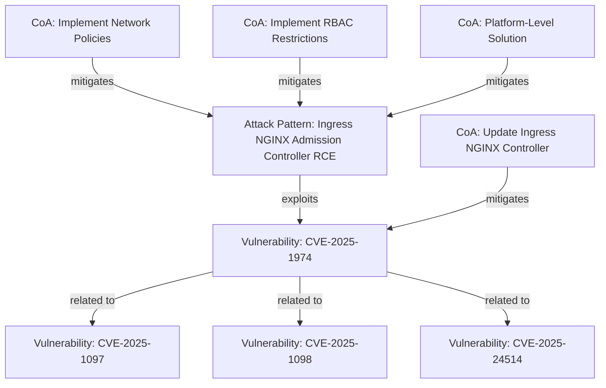

# IngressNightmare: Cross-Cloud Kubernetes Vulnerability

## Executive Summary

This report documents a critical cross-cloud vulnerability affecting Kubernetes deployments across all major cloud service providers (AWS, Azure, and GCP). Nicknamed "IngressNightmare," this vulnerability (primarily tracked as CVE-2025-1974) affects the widely used Ingress NGINX Controller and allows unauthenticated remote code execution with elevated privileges, potentially leading to complete cluster compromise.

The vulnerability was publicly disclosed in March 2025 and affects over 40% of Kubernetes deployments worldwide. This report provides detailed analysis of the vulnerability, its impact across cloud providers, mitigation strategies, and platform-level architectural solutions to prevent similar issues in the future.

## Vulnerability Details

### Primary Vulnerability

**CVE-2025-1974**: Unauthenticated Remote Code Execution in Kubernetes Ingress NGINX Controller

- **Severity**: Critical
- **CVSS**: 9.8 (Critical)
- **Vulnerability Type**: Missing Authentication for Critical Function
- **Affected Component**: Ingress NGINX Controller for Kubernetes
- **Affected Versions**: All versions up to and including 1.9.4

### Technical Description

The vulnerability stems from admission controllers in the Kubernetes Ingress NGINX Controller being network-accessible without proper authentication. The admission controller webhook endpoints, which are designed to validate and modify requests to the Kubernetes API server, can be accessed by unauthenticated attackers.

By exploiting this vulnerability, attackers can execute arbitrary code with the privileges of the Ingress NGINX Controller, which typically has elevated permissions within the Kubernetes cluster. This can lead to:

1. Access to secrets across the entire cluster
2. Service account token exposure
3. Potential complete cluster compromise
4. Lateral movement within the Kubernetes environment

### Related Vulnerabilities

The IngressNightmare vulnerability set includes several related CVEs that work together to enable the attack:

- **CVE-2025-1097**: Contributing vulnerability in the Ingress NGINX Controller
- **CVE-2025-1098**: Additional vulnerability in the attack chain
- **CVE-2025-24514**: Vulnerability enabling access to cluster secrets

## Cross-Provider Analysis

This vulnerability affects Kubernetes deployments across all major cloud providers, as detailed below:

### AWS Impact

Amazon Elastic Kubernetes Service (EKS) clusters using the vulnerable Ingress NGINX Controller versions are affected. This includes:

- Managed EKS clusters where users have deployed the Ingress NGINX Controller
- Self-managed Kubernetes clusters running on EC2 instances
- AWS Fargate for EKS when using the vulnerable controller

AWS does not modify the Ingress NGINX Controller code, so standard versions deployed on AWS are vulnerable without additional protections.

### Azure Impact

Azure Kubernetes Service (AKS) deployments using the affected Ingress NGINX Controller versions are vulnerable. This impacts:

- AKS clusters with user-deployed Ingress NGINX Controller
- Certain application gateway integrations that use the controller
- Azure Arc-enabled Kubernetes clusters with the vulnerable component

Microsoft's default Kubernetes networking components in AKS may include the vulnerable controller if deployed by users.

### GCP Impact

Google Kubernetes Engine (GKE) clusters with the vulnerable Ingress NGINX Controller are affected, including:

- Standard GKE clusters with the controller deployed
- Autopilot GKE clusters with the controller deployed
- Anthos clusters running on-premises or on other clouds

While Google Cloud provides its own Cloud Load Balancing solution, many GKE users deploy the Ingress NGINX Controller for additional features or specific use cases.

## Risk Assessment

This vulnerability poses a severe risk to cloud-based Kubernetes deployments for several reasons:

1. **Attack Vector**: The vulnerability allows unauthenticated remote code execution - one of the most dangerous vulnerability types
2. **Widespread Usage**: The vulnerable component (Ingress NGINX) is extremely popular, used in over 40% of Kubernetes deployments
3. **Cross-Cloud Impact**: It affects all major cloud providers who offer Kubernetes services
4. **Access to Secrets**: It potentially provides access to secrets across the entire cluster
5. **Elevated Privileges**: The affected component is typically deployed with elevated permissions

## Mitigation Strategies

### Update Ingress NGINX Controller

The primary mitigation is to update the Ingress NGINX Controller to a patched version (v1.9.5 or later) that addresses the vulnerabilities.

#### AWS Implementation

**Web Console:**
1. Log in to the AWS Management Console
2. Navigate to Amazon EKS
3. Select the affected cluster
4. Use kubectl with proper credentials to update the Ingress NGINX deployment

**CLI Commands:**
```bash
aws eks update-kubeconfig --name <cluster-name> --region <region>
kubectl get pods -n ingress-nginx -o wide
kubectl set image deployment/ingress-nginx-controller controller=registry.k8s.io/ingress-nginx/controller:v1.9.5 -n ingress-nginx
```

#### Azure Implementation

**Web Console:**
1. Log in to the Azure Portal
2. Navigate to Azure Kubernetes Service
3. Select the affected AKS cluster
4. Connect to the cluster using Cloud Shell or kubectl
5. Update the Ingress NGINX deployment to a patched version

**CLI Commands:**
```bash
az aks get-credentials --resource-group <resource-group> --name <aks-cluster-name>
kubectl get pods -n ingress-nginx -o wide
kubectl set image deployment/ingress-nginx-controller controller=registry.k8s.io/ingress-nginx/controller:v1.9.5 -n ingress-nginx
```

#### GCP Implementation

**Web Console:**
1. Log in to the Google Cloud Console
2. Navigate to Google Kubernetes Engine
3. Select the affected GKE cluster
4. Open Cloud Shell or use kubectl to update the Ingress NGINX deployment

**CLI Commands:**
```bash
gcloud container clusters get-credentials <cluster-name> --zone <zone>
kubectl get pods -n ingress-nginx -o wide
kubectl set image deployment/ingress-nginx-controller controller=registry.k8s.io/ingress-nginx/controller:v1.9.5 -n ingress-nginx
```

### Implement Network Policies

Applying Kubernetes Network Policies to restrict access to the admission controllers can prevent unauthorized access even if the vulnerability is present.

**Example Network Policy:**
```yaml
apiVersion: networking.k8s.io/v1
kind: NetworkPolicy
metadata:
  name: ingress-nginx-webhook-protection
  namespace: ingress-nginx
spec:
  podSelector:
    matchLabels:
      app.kubernetes.io/name: ingress-nginx
  ingress:
    - from:
      - namespaceSelector:
          matchLabels:
            kubernetes.io/metadata.name: kube-system
      ports:
        - port: 8443
          protocol: TCP
```

### Implement RBAC Restrictions

Implementing more restrictive Role-Based Access Control (RBAC) for the Ingress NGINX Controller limits the potential damage if the controller is compromised.

**Example RBAC Restrictions:**
```yaml
apiVersion: rbac.authorization.k8s.io/v1
kind: ClusterRole
metadata:
  name: ingress-nginx-restricted
rules:
  - apiGroups: [""]
    resources: ["services", "endpoints", "configmaps"]
    verbs: ["get", "list", "watch"]
  - apiGroups: ["networking.k8s.io"]
    resources: ["ingresses"]
    verbs: ["get", "list", "watch"]
```

## Platform-Level Architectural Solutions

To address the root causes of this vulnerability and prevent similar issues in the future, the following platform-level architectural changes are recommended:

### Enhanced Admission Controller Security

Implement additional authentication requirements for admission controller access, such as:
- Mutual TLS authentication for all admission controller interactions
- Strict certificate validation and rotation policies
- Internal-only networking for admission controllers

### Default Network Policies

Automatically deploy restrictive network policies for sensitive Kubernetes components:
- Create platform-level templates that apply restrictive network policies by default
- Ensure that new deployments of components like Ingress controllers include proper isolation
- Implement network segmentation for control plane components

### Zero-Trust Control Plane

Require authentication and authorization for all control plane interactions:
- Implement a zero-trust architecture for Kubernetes control plane access
- Eliminate implicit trust between components
- Require proper authentication and authorization for all interactions

### Automated Vulnerability Scanning

Implement continual scanning for vulnerable components in managed Kubernetes offerings:
- Deploy automated scanning tools that regularly check for known vulnerabilities
- Integrate vulnerability scanning into CI/CD pipelines
- Implement automated alerts for vulnerable components

## Relationship Diagram



## How to Use This Data

### STIX Objects

This report is accompanied by STIX 2.1 format files that document the vulnerability in a standardized format. The following files are included:

- `ingress-nightmare-attack-pattern.json`: Documents the attack pattern for the IngressNightmare vulnerability
- `ingress-nightmare-vulnerabilities.json`: Contains detailed information about the CVEs
- `ingress-nightmare-courses-of-action.json`: Provides mitigation strategies for different cloud platforms
- `ingress-nightmare-relationships.json`: Shows the relationships between the STIX objects

### Recommended STIX Tools

To work with the STIX data, the following tools are recommended:

- **STIX Visualization**: [OASIS STIX Visualizer](https://oasis-open.github.io/cti-stix-visualization/)
- **STIX Validation**: [STIX Validator](https://github.com/oasis-open/cti-stix-validator)
- **Integration Tools**: [STIX Python Library](https://github.com/oasis-open/cti-python-stix2)

### Interpreting STIX Objects

For users less familiar with STIX, here's a brief explanation of the key object types:

- **Attack Pattern**: Describes the technique used by threat actors (IngressNightmare RCE)
- **Vulnerability**: Documents specific security weaknesses (CVE-2025-1974 and related CVEs)
- **Course of Action**: Provides detailed mitigation strategies for different platforms
- **Relationship**: Shows how the objects are connected, such as which course of action mitigates which vulnerability

## References

1. Wiz Research disclosure of IngressNightmare vulnerabilities
   - URL: https://www.wiz.io/blog/ingress-nginx-kubernetes-vulnerabilities

2. Official Kubernetes blog post on CVE-2025-1974
   - URL: https://kubernetes.io/blog/2025/03/24/ingress-nginx-cve-2025-1974/

3. Sysdig blog on detecting and mitigating IngressNightmare
   - URL: https://sysdig.com/blog/detecting-and-mitigating-ingressnightmare-cve-2025-1974/

4. Datadog Security Labs article on Ingress NGINX Controller vulnerabilities
   - URL: https://securitylabs.datadoghq.com/articles/ingress-nightmare-vulnerabilities-overview-and-remediation/

5. CrowdStrike blog on Kubernetes IngressNightmare Vulnerabilities
   - URL: https://www.crowdstrike.com/en-us/blog/kubernetes-ingressnightmare-vulnerabilities-key-details/

## Research Methodology

This report was compiled using information from:
- Security advisories from major cloud providers (AWS, Azure, GCP)
- Security research publications from Wiz, Sysdig, and other security firms
- Official Kubernetes documentation and security bulletins
- CVE entries and technical descriptions of the vulnerabilities
- Analysis of the Ingress NGINX Controller codebase

## Conclusion

The IngressNightmare vulnerability (CVE-2025-1974 and related CVEs) represents a critical security risk to Kubernetes deployments across all major cloud providers. Organizations using the Ingress NGINX Controller should immediately update to patched versions and implement the additional security measures outlined in this report.

This vulnerability highlights the importance of container isolation, proper authentication mechanisms, and the principle of least privilege in cloud-native applications. By implementing the recommended mitigations and platform-level architectural changes, organizations can significantly improve their security posture against similar vulnerabilities in the future.

---

*Report Generated: April 25, 2025*  
*CAVEaT Working Group - Cloud Security Alliance*