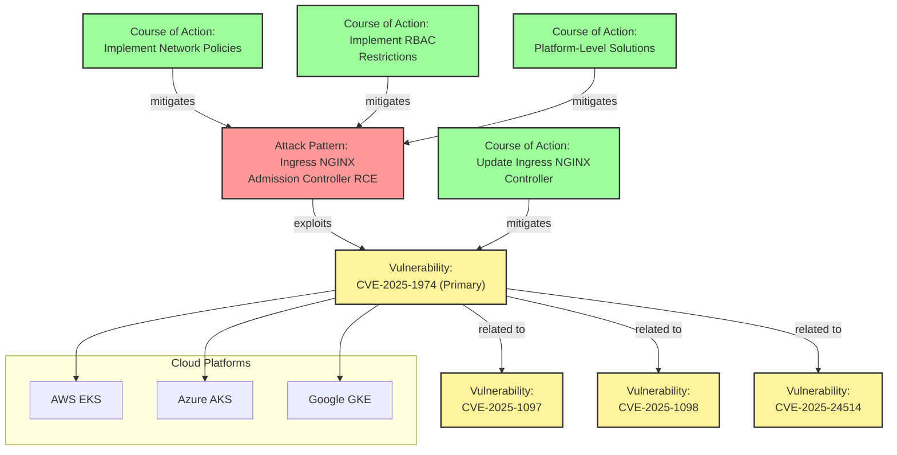

# IngressNightmare Vulnerability Visualization

This diagram visualizes the relationships between the STIX objects documenting the IngressNightmare vulnerability.

## Cross-Cloud Impact

The IngressNightmare vulnerability affects Kubernetes deployments across all major cloud providers:

- **AWS**: Amazon Elastic Kubernetes Service (EKS)
- **Azure**: Azure Kubernetes Service (AKS)
- **GCP**: Google Kubernetes Engine (GKE)

This visualization shows how the vulnerability chain works and the relationships between the different mitigation strategies.

## Key Points

1. The primary vulnerability (CVE-2025-1974) is exploited by the attack pattern
2. Three related vulnerabilities contribute to the attack chain
3. Four different courses of action are available to mitigate the risk
4. All major cloud platforms are affected by this vulnerability