# ML Model Security Relationship Diagram

The following diagram illustrates the relationships between attack patterns, vulnerabilities, and courses of action for ML model security in cloud environments.

```mermaid
flowchart TD
    classDef attackPattern fill:#FF5733,color:white
    classDef vulnerability fill:#FFC300,color:black
    classDef courseOfAction fill:#33FF57,color:black
    
    %% Attack Patterns
    AT1["ML Model Tampering"]:::attackPattern
    AT2["ML Model Injection"]:::attackPattern
    AT3["ML Model Checkpoint Hijacking"]:::attackPattern
    AT4["ML Registry Manipulation"]:::attackPattern
    AT5["ML Training Data Poisoning"]:::attackPattern
    AT6["ML Model Extraction"]:::attackPattern
    AT7["ML Inference Data Exfiltration"]:::attackPattern
    AT8["ML Adversarial Example Attacks"]:::attackPattern
    AT9["ML Pipeline Compromise"]:::attackPattern
    AT10["ML Framework Exploitation"]:::attackPattern
    
    %% Vulnerabilities
    VUL1["Unsigned ML Models"]:::vulnerability
    VUL2["Inadequate ML Provenance"]:::vulnerability
    VUL3["Unversioned Model Assets"]:::vulnerability
    VUL4["Insecure Model Serialization"]:::vulnerability
    VUL5["Inadequate Access Controls"]:::vulnerability
    VUL6["Unencrypted Model Transfer"]:::vulnerability
    VUL7["Weak ML Pipeline Authentication"]:::vulnerability
    VUL8["Exposed Model Endpoints"]:::vulnerability
    VUL9["Shared Tenancy Risks"]:::vulnerability
    VUL10["Excessive Model Permissions"]:::vulnerability
    
    %% Courses of Action
    COA1["Implement ML Model Signing with Sigstore"]:::courseOfAction
    COA2["Establish Model Provenance Framework"]:::courseOfAction
    COA3["Implement Immutable Model Versioning"]:::courseOfAction
    COA4["Deploy ML-Specific Access Controls"]:::courseOfAction
    COA5["Enable End-to-End Model Encryption"]:::courseOfAction
    COA6["Deploy ML-Specific Monitoring"]:::courseOfAction
    COA7["Create Secure Model Deployment Pipelines"]:::courseOfAction
    COA8["Implement Model Verification Testing"]:::courseOfAction
    COA9["Implement ML Runtime Security"]:::courseOfAction
    
    %% Exploits Relationships
    AT1 -- "exploits" --> VUL1
    AT2 -- "exploits" --> VUL5
    AT3 -- "exploits" --> VUL3
    AT4 -- "exploits" --> VUL5
    AT5 -- "exploits" --> VUL2
    AT6 -- "exploits" --> VUL6
    AT7 -- "exploits" --> VUL8
    AT8 -- "exploits" --> VUL8
    AT9 -- "exploits" --> VUL7
    AT10 -- "exploits" --> VUL10
    
    %% Mitigates Relationships
    COA1 -- "mitigates" --> AT1
    COA1 -- "mitigates" --> AT2
    COA1 -- "mitigates" --> AT3
    COA1 -- "mitigates" --> AT4
    
    COA2 -- "mitigates" --> AT5
    
    COA3 -- "mitigates" --> AT3
    
    COA4 -- "mitigates" --> AT4
    
    COA5 -- "mitigates" --> AT6
    
    COA6 -- "mitigates" --> AT7
    COA6 -- "mitigates" --> AT8
    
    COA7 -- "mitigates" --> AT9
    
    COA8 -- "mitigates" --> AT5
    COA8 -- "mitigates" --> AT8
    
    COA9 -- "mitigates" --> AT10
    
    %% Addresses Relationships
    COA1 -- "addresses" --> VUL1
    COA2 -- "addresses" --> VUL2
    COA3 -- "addresses" --> VUL3
    COA4 -- "addresses" --> VUL5
    COA5 -- "addresses" --> VUL6
    COA7 -- "addresses" --> VUL7
    COA9 -- "addresses" --> VUL8
    COA9 -- "addresses" --> VUL9
    COA9 -- "addresses" --> VUL10
```

