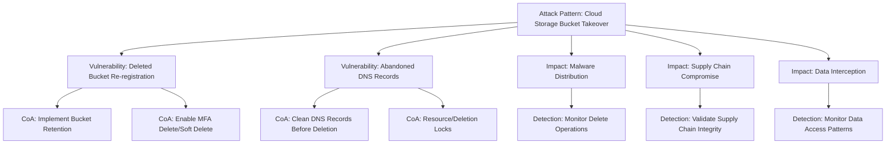

# Cloud Storage Bucket Re-registration Attack: CAVEaT Research Report

## Executive Summary

This report documents a significant cloud security threat where attackers exploit the deletion and re-registration of cloud storage resources (like AWS S3 buckets, Azure Blob Storage containers, or Google Cloud Storage buckets). The attack vector allows threat actors to take control of previously trusted distribution points, potentially leading to supply chain attacks, malware distribution, data interception, and phishing campaigns.

Recent research (February 2025) by watchTowr Labs demonstrated that this vulnerability could potentially lead to "the largest supply chain attack in history" with the ability to compromise widely-used software and infrastructure components. The severity is such that AWS has taken steps to block specific high-risk buckets from being re-created.

## Threat Description

The attack exploits a fundamental cloud service design where object storage resource names become available for re-registration shortly after deletion. When an organization deletes a storage bucket but leaves DNS records, application references, or distribution configurations (like AWS CloudFront) pointing to that resource, an attacker can:

1. Identify the deleted but still-referenced storage bucket
2. Register the same bucket name under their control
3. Serve malicious content through what appears to be a legitimate and trusted source

This attack is particularly dangerous in the context of software distribution, infrastructure-as-code templates, and update mechanisms, where compromising a single distribution point can affect thousands of downstream systems.

## Impact Analysis Across Major Cloud Providers

### Amazon Web Services (AWS)

**Affected Services:**
- Amazon S3 buckets
- CloudFront distributions referencing S3 buckets
- CodeBuild, CodePipeline, and other services that pull from S3

**Notable Findings:**
- Multiple instances of major vendors storing deployment templates and software in S3 buckets that could be re-registered
- CloudFormation templates often reference S3 buckets that could be compromised
- AWS has implemented backend protections for some high-risk buckets after researcher notification

**Impact Level:** High - Potential for widespread supply chain attacks through trusted distribution points

### Microsoft Azure

**Affected Services:**
- Azure Blob Storage containers
- Azure CDN endpoints
- Azure DevOps Pipelines referring to storage

**Notable Findings:**
- Azure has implemented "soft delete" features to help prevent accidental deletion
- Resource locks provide additional protection against unauthorized deletion
- Azure Monitor can detect and alert on unexpected deletion operations

**Impact Level:** High - Similar fundamental vulnerability exists, though fewer documented examples

### Google Cloud Platform (GCP)

**Affected Services:**
- Google Cloud Storage buckets
- Cloud CDN configurations
- CI/CD pipelines using Cloud Storage

**Notable Findings:**
- Object versioning and retention features available but must be explicitly enabled
- Similar vulnerability profile to other providers
- Fewer documented examples of exploitation in GCP environments

**Impact Level:** Medium to High - Same fundamental vulnerability exists

## Key Research Findings

1. **Supply Chain Risk Amplification:** The reuse of cloud storage buckets represents a significant amplification factor for supply chain attacks, potentially affecting thousands of downstream systems through a single compromised distribution point.

2. **Inadequate Lifecycle Management:** Most organizations lack proper cloud resource lifecycle management procedures, particularly around DNS and reference cleanup when decommissioning storage resources.

3. **Defense in Depth Lacking:** Few organizations implement available protections like MFA Delete (AWS), soft delete (Azure), or retention policies (all providers).

4. **Detection Challenges:** This attack vector often goes undetected until malicious activity is already underway, as legitimate references are simply redirected to attacker-controlled resources with identical names.

5. **Cross-Cloud Vulnerability:** This vulnerability pattern exists across all major cloud providers, creating a consistent attack surface in multi-cloud environments.

## Comprehensive Courses of Action

### Universal Mitigations (All Cloud Providers)

1. **Implement Resource Lifecycle Management Procedures**
   - Document all references to storage resources (DNS, CDN, applications)
   - Require verification of reference removal before resource deletion
   - Implement "cooldown periods" between reference removal and resource deletion

2. **Deploy Comprehensive Monitoring**
   - Monitor for deletion operations on storage resources
   - Alert on unexpected traffic patterns to storage resources
   - Implement integrity validation for software and updates distributed via cloud storage

### AWS-Specific Mitigations

1. **Enable MFA Delete on Critical S3 Buckets**
   - Requires multi-factor authentication for deletion operations
   - Implementation requires root credentials and CLI/API use
   - Provides strong protection against accidental or malicious deletion

2. **Implement S3 Object Lock and Versioning**
   - Prevents object deletion for specified periods
   - Maintains previous versions even if current objects are deleted
   - Enables recovery of deleted content

3. **Deploy CloudTrail Monitoring for Bucket Lifecycle Events**
   - Create alerts for bucket deletion operations
   - Monitor for bucket creation with previously used names
   - Implement automated response procedures

### Azure-Specific Mitigations

1. **Enable Soft Delete for Azure Blob Storage**
   - Allows recovery of deleted containers and blobs within retention period
   - Configure appropriate retention period (minimum 7 days recommended)
   - Test recovery procedures regularly

2. **Implement Azure Resource Locks**
   - Prevent accidental storage account or container deletion
   - Apply delete locks on production resources
   - Implement proper review procedures for lock removal

3. **Configure Azure Monitor Alerts**
   - Create alerts for delete operations on storage resources
   - Monitor for unexpected resource creation
   - Integrate with security response workflows

### GCP-Specific Mitigations

1. **Enable Object Versioning and Retention**
   - Preserve previous object versions
   - Set appropriate retention periods
   - Test recovery procedures

2. **Implement Cloud Audit Logs**
   - Track all deletion operations
   - Configure alerts for suspicious activity
   - Maintain logs for post-incident analysis

3. **Deploy Custom Retention Policies**
   - Prevent deletion of critical objects
   - Set appropriate retention periods
   - Document exceptions and override procedures

## Relationship Visualization

## References

1. The Register (2025-02-04) - "Reused AWS S3 buckets a weak link in supply chain security" - https://www.theregister.com/2025/02/04/abandoned_aws_s3
2. ITPro - "Abandoned S3 buckets could have caused a catastrophic supply chain attack" - https://www.itpro.com/security/cyber-attacks/s3-bucket-supply-chain-attack-solarwinds
3. CyberSecurityNews - "Abandoned AWS S3 Buckets Can be Reused to Hijack Global Software Supply Chain" - https://cybersecuritynews.com/abandoned-aws-s3-buckets/
4. Microsoft Learn - "Prevent subdomain takeovers with Azure DNS alias records" - https://learn.microsoft.com/en-us/azure/security/fundamentals/subdomain-takeover
5. Microsoft Learn - "Soft delete for blobs - Azure Storage" - https://learn.microsoft.com/en-us/azure/storage/blobs/soft-delete-blob-overview
6. Check Point - "Top 3 S3 Bucket Security Issues" - https://www.checkpoint.com/cyber-hub/cloud-security/what-is-aws-security/s3-bucket-security/top-3-s3-bucket-security-issues/
7. MITRE ATT&CK - "Data from Cloud Storage, Technique T1530" - https://attack.mitre.org/techniques/T1530/
