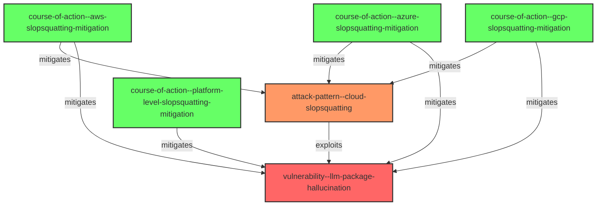

# CAVEaT Research Report: Slopsquatting - A New Cloud Software Supply Chain Attack Vector

**Date**: April 10, 2025  
**Author**: Cloud Adversarial Vectors, Exploits, and Threats (CAVEaT) Working Group  
**Version**: 1.0

## Executive Summary

This report documents a new software supply chain attack pattern called "Slopsquatting," which exploits Large Language Model (LLM) hallucinations to compromise cloud software deployments. Unlike traditional typosquatting which relies on human typing errors, slopsquatting targets AI-generated code recommendations. The attack works by identifying package names consistently hallucinated by LLMs, registering these non-existent packages in public repositories with malicious code, and waiting for developers to install them based on AI tool recommendations.

Research shows that slopsquatting represents a significant threat to cloud environments where LLM-assisted code generation is increasingly common in rapid development cycles. Commercial LLMs hallucinate non-existent package names at a rate of approximately 5.2%, while open-source models have significantly higher rates averaging 21.7%.

This report provides a comprehensive analysis of the threat, including STIX-formatted documentation, impact assessments across major cloud providers, detailed mitigation strategies, and architectural recommendations to address this vulnerability.

## 1. Threat Overview

### 1.1 Definition and Concept

Slopsquatting, a term coined by PSF Developer-in-Residence Seth Larson and popularized by Andrew Nesbitt, refers to the practice of registering non-existent package names that have been hallucinated by LLMs. When developers use AI-assisted coding tools like GitHub Copilot, ChatGPT, or Cursor to generate code, these tools sometimes reference packages that don't actually exist. Attackers can register these hallucinated package names in package repositories, injecting malicious code that will be downloaded by unsuspecting developers.

### 1.2 Technical Mechanism

The attack follows this general pattern:

1. **AI Hallucination**: An LLM consistently generates references to a non-existent package
2. **Package Registration**: An attacker observes this pattern and registers the hallucinated package name in a public repository
3. **Malicious Code Injection**: The attacker includes malicious code in the registered package
4. **Victim Installation**: Developers following AI-generated code recommendations install the package
5. **Compromise**: The malicious code executes in the victim's environment, which may be a development, CI/CD, or production cloud environment

### 1.3 Prevalence and Scale

Recent research by Spracklen et al. (2025) provides extensive evidence of the scale of this problem:

- 576,000 code samples were generated across 16 different LLMs
- 19.7% of all recommended packages didn't exist in official repositories
- Over 205,000 unique hallucinated package names were identified
- 58% of hallucinated packages were consistently repeated when the same prompt was reused
- Both commercial (GPT-4, Claude) and open-source models (CodeLlama, DeepSeek, Mistral) exhibit this vulnerability

### 1.4 Distinction from Traditional Package Confusion Attacks

Slopsquatting differs from traditional package confusion techniques in several key ways:

| Attack Type | Target Vector | Exploitation Method | Scale |
|-------------|---------------|---------------------|-------|
| Typosquatting | Human typing errors | Register packages with similar names to popular ones | Limited by human error patterns |
| Combosquatting | Domain combinations | Combine popular package names with descriptive terms | Limited by plausible combinations |
| Slopsquatting | AI hallucinations | Register packages that LLMs consistently hallucinate | Potentially vast due to systematic AI errors |

## 2. Impact Analysis Across Cloud Providers

### 2.1 AWS Impact

**Affected Services:**
- AWS Lambda: Functions using package dependencies vulnerable to slopsquatting
- AWS CodeBuild/CodePipeline: CI/CD pipelines using LLM-assisted code generation
- AWS CloudFormation: Templates referencing compromised packages
- Amazon ECS/EKS: Container images built with compromised dependencies

**Specific Concerns:**
- Serverless application security compromised through malicious function dependencies
- Infrastructure-as-Code templates with compromised package references 
- Container supply chain attacks via compromised dependencies
- High degree of automation in AWS environments may accelerate the spread of compromised packages

### 2.2 Microsoft Azure Impact

**Affected Services:**
- Azure Functions: Vulnerable to compromised package dependencies
- Azure DevOps: CI/CD pipelines using LLM code generation
- Azure Kubernetes Service: Container images with compromised dependencies
- Azure App Service: Web applications with compromised package references

**Specific Concerns:**
- Tight integration of GitHub Copilot with Azure DevOps increases exposure
- Microsoft's LLM deployments in development tools may propagate hallucinated packages
- Enterprise-wide compromise possible through shared artifacts and pipelines

### 2.3 Google Cloud Platform Impact

**Affected Services:**
- Cloud Functions: Vulnerable to compromised dependencies
- Cloud Build: CI/CD pipelines using LLM code generation
- Google Kubernetes Engine: Container images with compromised dependencies
- Cloud Run: Serverless containers with compromised package references

**Specific Concerns:**
- Integration of AI coding assistants in Google Cloud services
- Container-based architectures provide pathways for compromise
- Potential for compromise of multiple microservices through shared dependencies

### 2.4 Cross-Provider Considerations

- Multi-cloud environments may spread compromised packages across providers
- Container registries and artifact repositories often shared between environments
- CI/CD pipelines that span multiple cloud providers can accelerate proliferation

## 3. Key Research Findings

### 3.1 Package Hallucination Patterns

Research by Spracklen et al. (2025) identified several key patterns in package hallucinations:

- Temperature settings in LLMs significantly affect hallucination rates
- Higher temperature (more randomness) leads to more hallucinations
- "Verbose" models that generate many unique package references have higher hallucination rates
- Only 13% of hallucinated packages were simple typos of legitimate packages
- Nearly half of hallucinated packages had high Levenshtein distances from existing packages, indicating they were entirely fictional rather than minor errors

### 3.2 Cross-Language Confusion

The research also found evidence of cross-language confusion:
- 8.7% of hallucinated Python packages were actually valid JavaScript (npm) packages
- This confusion between language ecosystems creates additional attack opportunities
- The problem was negligible for other language combinations

### 3.3 Model Self-Awareness

Some LLMs demonstrated an ability to detect their own hallucinations:
- GPT-4 Turbo and DeepSeek could identify their hallucinated packages with >75% accuracy
- This suggests potential for self-verification as a mitigation strategy
- However, some models (like CodeLlama) showed poor self-verification capabilities

## 4. STIX Documentation

The threat has been documented using the following STIX (Structured Threat Information Expression) objects:

### 4.1 Attack Pattern

- **ID**: `attack-pattern--cloud-slopsquatting`
- **Name**: Slopsquatting
- **Description**: A supply chain attack technique exploiting LLM package hallucinations
- **Kill Chain Phases**: Initial Access, Persistence

### 4.2 Vulnerability

- **ID**: `vulnerability--llm-package-hallucination`
- **Name**: LLM Package Hallucination Vulnerability
- **Description**: LLMs' tendency to hallucinate non-existent package names during code generation

### 4.3 Courses of Action

Four comprehensive courses of action have been documented:

1. **AWS Slopsquatting Mitigation** (`course-of-action--aws-slopsquatting-mitigation`)
   - AWS-specific tools and configurations to prevent and detect slopsquatting attacks

2. **Azure Slopsquatting Mitigation** (`course-of-action--azure-slopsquatting-mitigation`)
   - Azure-specific approaches for mitigating slopsquatting vulnerabilities

3. **GCP Slopsquatting Mitigation** (`course-of-action--gcp-slopsquatting-mitigation`)
   - Google Cloud Platform techniques to address slopsquatting risks

4. **Platform-Level Architectural Solutions** (`course-of-action--platform-level-slopsquatting-mitigation`)
   - Fundamental architectural changes needed across the software ecosystem

### 4.4 Relationships

The following diagram illustrates the relationships between the STIX objects:

## 5. Mitigation Strategies

### 5.1 AWS-Specific Mitigations

**Key AWS services for mitigation:**

1. **AWS CodeGuru Security**
   - Configure to scan all package installations in your codebase
   - Create custom detectors for package hallucination patterns

2. **AWS CodeArtifact as Private Repository Proxy**
   - Configure as proxy for public repositories with additional validation
   - Implement repository policies restricting package installations to verified packages
   - Enable package origin control and tracking

3. **AWS Config Rules**
   - Create custom rules evaluating resources for compliance with package management policies
   - Implement rules to detect suspicious package installations

4. **Amazon Inspector**
   - Scan for vulnerable or suspicious packages
   - Create custom findings for packages with unusual provenance or popularity metrics

See the full course of action (`course-of-action--aws-slopsquatting-mitigation`) for detailed implementation instructions including Console, CLI, and API implementations.

### 5.2 Azure-Specific Mitigations

**Key Azure services for mitigation:**

1. **Azure Artifact Feed with Package Validation**
   - Configure upstream sources with package validation rules
   - Enable package locking and immutability
   - Set appropriate retention policies

2. **Azure DevOps Pipelines Security**
   - Configure pipeline settings for security scanning
   - Create custom tasks for package validation
   - Implement branch policies requiring verification

3. **Microsoft Defender for Cloud**
   - Enable protection for containers, registries, and app services
   - Configure alerts for suspicious package installations
   - Monitor for newly published packages with low download counts

4. **Azure Policy for Package Management**
   - Create and enforce package management standards
   - Assign policies to subscriptions and resource groups
   - Configure automatic remediation

See the full course of action (`course-of-action--azure-slopsquatting-mitigation`) for detailed implementation instructions.

### 5.3 GCP-Specific Mitigations

**Key GCP services for mitigation:**

1. **Artifact Registry with Package Validation**
   - Configure repository proxies for public repositories
   - Enable package scanning with Artifact Analysis
   - Implement upstream validation rules

2. **Cloud Build with Security Scanning**
   - Add verification steps to build configurations
   - Configure build triggers enforcing package validation
   - Implement custom security scanning

3. **Binary Authorization**
   - Create attestation policies for containers
   - Configure required attestors for your images
   - Enforce proper attestation requirements

4. **Security Command Center**
   - Enable premium tier for enhanced detection
   - Configure Container Threat Detection
   - Create custom findings for suspicious packages

5. **Organization Policies**
   - Create custom constraints for package management
   - Enforce policies across organization hierarchy

See the full course of action (`course-of-action--gcp-slopsquatting-mitigation`) for detailed implementation instructions.

### 5.4 Platform-Level Architectural Solutions

Beyond provider-specific mitigations, fundamental architectural changes are needed to address the root causes:

1. **Enhanced Package Registry Protections**
   - Implement tiered verification for package registries
   - Require higher verification tiers for packages with names similar to popular ones
   - Implement waiting periods for packages matching hallucination patterns

2. **LLM Package Recommendation Safety**
   - Create authenticated APIs for package existence verification
   - Implement standardized package verification protocols
   - Build centralized hallucination reporting systems

3. **Tenant Namespacing and Isolation**
   - Implement advanced namespace reservation policies
   - Allow legitimate maintainers to reserve similar namespaces
   - Create cross-repository namespace protection

4. **Resource Name Reservation**
   - Protect commonly hallucinated resource names
   - Implement naming pattern reservations
   - Create cross-cloud registration systems

5. **Strong Identity Binding**
   - Require cryptographic identity verification
   - Implement immutable audit chains for package updates
   - Require multi-factor authentication for package publications

6. **Enhanced Lifecycle Management**
   - Implement cooling-off periods for name reuse
   - Create notification systems for deprecation
   - Develop secure archival and resurrection protocols

7. **Abstraction Layer Architectures**
   - Develop verification middleware for package managers
   - Create standardized verification APIs
   - Implement pre-installation hooks

8. **Cross-Ecosystem Coordination**
   - Establish unified package intelligence sharing
   - Develop standardized threat intelligence formats
   - Create coordinated response mechanisms

See the full course of action (`course-of-action--platform-level-slopsquatting-mitigation`) for comprehensive details.

## 6. Conclusions and Recommendations

### 6.1 Key Takeaways

1. Slopsquatting represents a novel and significant threat to cloud environments leveraging AI-assisted code generation.

2. The vulnerability is systemic, affecting all major LLMs with varying degrees of prevalence.

3. The increasing adoption of "vibe coding" practices (where developers rely on LLMs to generate entire implementations) amplifies the risk.

4. Effective mitigation requires a multi-layered approach spanning cloud providers, package repositories, LLM developers, and the broader software ecosystem.

### 6.2 Recommendations for Organizations

1. **Immediate Actions:**
   - Implement provider-specific mitigations relevant to your cloud environment
   - Configure private package repositories as proxies with enhanced validation
   - Integrate package verification into CI/CD pipelines
   - Train developers to verify package legitimacy before installation

2. **Medium-term Actions:**
   - Develop organization-specific policies for package management
   - Implement comprehensive monitoring for suspicious package installations
   - Create centralized package approval workflows
   - Establish secure development practices for AI-assisted coding

3. **Long-term Initiatives:**
   - Advocate for platform-level architectural changes
   - Contribute to cross-ecosystem coordination efforts
   - Develop internal expertise in LLM security implications
   - Monitor and adapt to evolving threat landscape

### 6.3 Future Research Directions

1. Development of detection mechanisms for hallucinated packages
2. Creation of standardized verification protocols for LLMs
3. Investigation of potential defensive uses of LLMs in identifying suspicious packages
4. Development of automated mitigation techniques that balance security with developer productivity

## 7. How to Use This Data

### 7.1 Understanding the STIX Objects

The STIX objects provided in this report follow the STIX 2.1 specification:

- **Attack Pattern**: Describes the slopsquatting technique
- **Vulnerability**: Describes the underlying LLM package hallucination vulnerability
- **Courses of Action**: Detail mitigations for AWS, Azure, GCP, and platform-level solutions
- **Relationships**: Connect the objects to show how they interact

### 7.2 Working with the STIX Data

The STIX objects can be:
- Imported into STIX-compatible threat intelligence platforms
- Used with security automation tools supporting STIX
- Integrated into security information and event management (SIEM) systems
- Shared with security teams and researchers

### 7.3 Implementing Mitigations

The courses of action include detailed implementation instructions for:
- Web Console/Management Portal interfaces
- Command Line Interface (CLI) commands
- API calls with example code
- Verification steps for each mitigation

### 7.4 Further Resources

Organizations should consult these additional resources:
- Cloud provider security documentation
- Package repository security guidelines
- LLM developer documentation for security best practices
- OASIS STIX documentation for working with the provided objects

## 8. References

1. Spracklen, J., Sakib, A. H. M. N., Wijewickrama, R., Maiti, A., Viswanath, B., & Jadliwala, M. (2025). "We Have a Package for You! A Comprehensive Analysis of Package Hallucinations by Code Generating LLMs." arXiv preprint: 2406.10279.

2. Socket.dev. (2025). "The Rise of Slopsquatting: How AI Hallucinations Are Fueling a New Class of Supply Chain Attacks." https://socket.dev/blog/slopsquatting-how-ai-hallucinations-are-fueling-a-new-class-of-supply-chain-attacks

3. Lanyado, B. (2023). "Diving Deeper into AI Package Hallucinations." Vulcan Security. https://vulcan.io/blog/ai-hallucinations-package-risk

4. Cloud Security Alliance. (2023). "Understanding Cloud Attack Vectors." https://cloudsecurityalliance.org/artifacts/understanding-cloud-attack-vectors

5. MITRE ATT&CK. (2024). "Software Supply Chain Compromises." https://attack.mitre.org/techniques/T1195/

6. Neupane, S., Holmes, G., Wyss, E., Davidson, D., & De Carli, L. (2023). "Beyond typosquatting: an in-depth look at package confusion." USENIX Security Symposium.

7. OASIS. (2021). "STIX 2.1 Specification." https://docs.oasis-open.org/cti/stix/v2.1/stix-v2.1.html

## Appendix: STIX Objects

The full STIX objects are available in the following files:

1. `attack-pattern--cloud-slopsquatting.json`
2. `vulnerability--llm-package-hallucination.json`
3. `course-of-action--aws-slopsquatting-mitigation.json`
4. `course-of-action--azure-slopsquatting-mitigation.json`
5. `course-of-action--gcp-slopsquatting-mitigation.json`
6. `course-of-action--platform-level-slopsquatting-mitigation.json`
7. `relationship-objects.json`
8. `slopsquatting-relationships.mmd`
