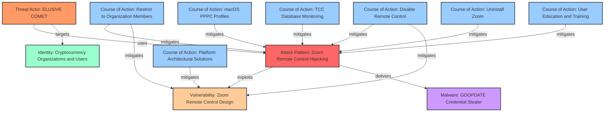

# ELUSIVE COMET: Zoom Remote Control Hijacking Attack

**CAVEaT Threat Research Report**  
**Date:** April 22, 2025  
**Version:** 1.0  
**Classification:** Public  

## Executive Summary

This report documents a sophisticated social engineering attack leveraging Zoom's remote control feature to target cryptocurrency organizations and individuals. The threat actor, identified as "ELUSIVE COMET," exploits Zoom's legitimate remote control functionality to gain unauthorized access to victims' systems, install malware, and steal cryptocurrency assets. The attack combines social engineering with exploitation of design vulnerabilities in Zoom's user interface, creating a particularly effective attack vector that has resulted in significant financial losses.

The research presented here provides a comprehensive analysis of the attack methodology, documents the threat using standardized STIX format, and outlines multiple mitigation strategies ranging from immediate tactical responses to long-term architectural solutions. This report is intended for security professionals, cryptocurrency organizations, and individual users who wish to protect themselves against this attack vector.

## Key Findings

- **Targeted Attack**: ELUSIVE COMET specifically targets cryptocurrency users and organizations with social engineering tactics designed to exploit business contexts.
- **Legitimate Feature Abuse**: The attack leverages Zoom's legitimate remote control functionality rather than exploiting a traditional code vulnerability.
- **Cross-Platform Threat**: The attack methodology affects all platforms where Zoom's desktop client is used (Windows, macOS, Linux).
- **Multiple Mitigation Options**: Several effective countermeasures exist, ranging from simple configuration changes to comprehensive architectural solutions.
- **Organizational Controls**: Paid Zoom accounts (Enterprise, Business, Education) can restrict remote control to organization members only, significantly reducing the attack surface.

## Threat Actor Profile: ELUSIVE COMET

ELUSIVE COMET is a sophisticated threat actor specializing in cryptocurrency theft through social engineering tactics. Based on publicly available information, the group:

- Demonstrates advanced social engineering capabilities
- Possesses detailed knowledge of cryptocurrency operations and business contexts
- Uses legitimate media and industry networking pretexts to establish trust
- Creates convincing fake personas and communication channels
- Shows patience and methodical planning in target selection
- Has been linked to the theft of millions in cryptocurrency assets

While definitive attribution is challenging, some reports have linked this activity to North Korean-affiliated threat actors based on targeting patterns and tactics.

## Attack Methodology

The ELUSIVE COMET attack follows a consistent methodology:

1. **Initial Contact**: Attackers approach targets via social media (primarily Twitter/X), posing as representatives from media organizations like "Bloomberg Crypto" and inviting them to interviews or networking opportunities.

2. **Trust Establishment**: The attackers create convincing pretexts using fake social media profiles, Calendly pages, and meeting invitations that mimic legitimate business communications.

3. **Meeting Setup**: Victims are directed to schedule Zoom meetings through fake Calendly pages (e.g., calendly.com/bloombergseries, calendly.com/cryptobloomberg).

4. **Remote Control Exploitation**: During the Zoom call, the attacker:
   - Engages in seemingly normal business conversation
   - Requests remote control of the victim's screen
   - Changes their display name to "Zoom" to make the request appear as a system notification rather than a participant action
   - When granted permission, installs malware (identified as "GOOPDATE") that steals credentials and accesses cryptocurrency wallets

5. **Theft and Exfiltration**: With access to the victim's system, the attackers steal private keys, wallet data, and ultimately transfer cryptocurrency assets to attacker-controlled addresses.

This attack is particularly effective because it:
- Exploits users' trust in the Zoom platform
- Operates within what appears to be a legitimate business context
- Takes advantage of UI ambiguity in permission requests
- Leverages habit patterns of approving Zoom prompts
- Divides the victim's attention between the business conversation and security decisions

## Vulnerability Analysis

The vulnerability exploited in this attack is fundamentally a design vulnerability in Zoom's remote control feature, rather than a traditional code vulnerability. The feature allows any meeting participant to request control of another participant's screen and computer with the target's permission. Several design weaknesses contribute to the vulnerability:

1. **Interface Ambiguity**: The user interface does not clearly distinguish between system notifications and participant actions, allowing attackers to rename themselves as "Zoom" to make control requests appear as system prompts.

2. **Inadequate Permission Communication**: The permission dialog does not effectively communicate the security implications of granting remote control access.

3. **Default Permissiveness**: By default, any meeting participant can request remote control, without restrictions based on organizational boundaries.

4. **Excessive System Access**: The remote control feature grants extensive system-level access beyond what would typically be expected in a collaboration tool.

These design weaknesses collectively create an exploitable vulnerability when combined with social engineering tactics.

## Cross-Provider Analysis

While this specific attack targets Zoom's implementation of remote control functionality, similar features exist across various video conferencing and collaboration platforms:

### Zoom Cloud Services
- **Affected Service**: Zoom Meetings
- **Vulnerable Feature**: Remote control during screen sharing
- **Default Configuration**: Any participant can request remote control
- **Enterprise Controls**: Organizational restrictions available in paid plans
- **Impact Level**: Critical - direct system access and control

### Microsoft Azure (Microsoft Teams)
- **Affected Service**: Microsoft Teams
- **Similar Feature**: Give control during screen sharing
- **Default Configuration**: More restrictive than Zoom, limited to desktop sharing only
- **Enterprise Controls**: Strong organizational boundaries by default
- **Impact Level**: Medium - more limited access, stronger default protections

### Google Cloud Platform (Google Meet)
- **Affected Service**: Google Meet
- **Similar Feature**: Remote control functionality (more limited than Zoom)
- **Default Configuration**: Restricted to organizational users by default
- **Enterprise Controls**: Strong organization-aware security model
- **Impact Level**: Low - limited functionality with stronger default restrictions

This comparison highlights that Zoom's implementation presents the highest risk due to its combination of powerful functionality, permissive defaults, and interface ambiguity. However, the core concept of remote control in video conferencing presents inherent security risks across all platforms.

## Courses of Action

Multiple effective mitigation strategies are available, ranging from immediate tactical responses to long-term architectural solutions:

### 1. Restrict Remote Control to Organization Members Only

For organizations using paid Zoom accounts (Enterprise, Business, Education), administrators can configure settings to restrict the remote control feature to only be used between members of the same organization.

**Implementation Instructions:**
- **Web Console**: 
  1. Log in to the Zoom Admin Portal at https://admin.zoom.us
  2. Navigate to 'Account Management' > 'Account Settings'
  3. Select the 'Meeting' tab
  4. Locate the 'Remote control' option under 'In Meeting (Basic)'
  5. Ensure the setting is enabled (toggle switch is blue)
  6. Click on the lock icon to make this setting mandatory for all users
  7. Check the option 'Only allow remote control between users in the same organization'
  8. Click 'Save' to apply the changes

- **Effectiveness**: High - Prevents external attackers from requesting remote control
- **Implementation Complexity**: Low - Simple configuration change
- **Limitations**: Requires a paid Zoom account; restricts legitimate external collaboration

### 2. Disable Zoom Remote Control Feature Entirely

The simplest and most effective mitigation is to completely disable the remote control feature in Zoom settings at either the organizational or individual user level.

**Implementation Instructions:**
- **Administrator Settings**: 
  1. Log in to the Zoom Admin Portal
  2. Navigate to 'Account Management' > 'Account Settings'
  3. Select the 'Meeting' tab
  4. Locate the 'Remote control' option
  5. Toggle the switch to disable the setting
  6. Lock the setting to make it mandatory for all users

- **Individual User Settings**:
  1. Log in to the Zoom web portal
  2. Navigate to 'Settings' > 'Meeting'
  3. Locate the 'Remote control' option and disable it

- **Effectiveness**: High - Completely eliminates the attack vector
- **Implementation Complexity**: Low - Simple configuration change
- **Limitations**: Removes functionality that may be needed for legitimate purposes

### 3. Implement macOS PPPC Profiles (macOS-specific)

For macOS environments, Privacy Preferences Policy Control (PPPC) profiles can prevent Zoom from requesting or receiving the accessibility permissions necessary for remote control.

**Implementation Instructions:**
- Deploy PPPC profiles via MDM solutions or manually using the provided script examples
- Profiles should explicitly deny accessibility permissions to Zoom

- **Effectiveness**: High - Prevents remote control at the OS level
- **Implementation Complexity**: Medium - Requires understanding of macOS security mechanisms
- **Limitations**: macOS-specific; requires administrative access

### 4. Implement Active TCC Database Monitoring (macOS-specific)

For macOS systems, implementing scripts that regularly check for and remove Zoom accessibility permissions ensures that even previously granted permissions cannot be exploited.

**Implementation Instructions:**
- Deploy the provided script to check and clear Zoom entries from the TCC database
- Set up a LaunchDaemon to run the script at regular intervals (e.g., every 15 minutes)

- **Effectiveness**: High - Addresses previously granted permissions
- **Implementation Complexity**: Medium - Requires understanding of macOS TCC system
- **Limitations**: macOS-specific; requires administrative access

### 5. Completely Remove Zoom Client

For high-security environments or individuals handling cryptocurrency, completely removing the Zoom desktop client and using browser-based alternatives provides the strongest protection.

**Implementation Instructions:**
- Uninstall the Zoom desktop client using the provided scripts or manual methods
- Configure systems to prevent reinstallation
- Use browser-based meeting participation instead

- **Effectiveness**: Very High - Completely eliminates the attack vector
- **Implementation Complexity**: Low - Standard software removal
- **Limitations**: Loss of some Zoom functionality; potential user resistance

### 6. User Education and Training

While technical controls provide the strongest protection, user awareness forms a critical secondary defense layer.

**Implementation Instructions:**
- Train users to recognize social engineering tactics in video calls
- Establish a protocol requiring secondary verification before granting remote control
- Create clear policies for media appearances and external communications
- Implement a security alert system for sharing information about attack attempts

- **Effectiveness**: Medium (as sole control), High (as part of defense-in-depth)
- **Implementation Complexity**: Low
- **Limitations**: Susceptible to human error, stress, and social pressure

### 7. Platform-Level Architectural Solutions

These represent fundamental changes that Zoom could implement to address the vulnerability at its source.

**Recommended Architectural Changes:**
- Enhanced Permission UX Design: Clear distinction between system and participant actions
- Tiered Authentication for Remote Control: Additional verification for high-risk permission grants
- Context-Aware Security Boundaries: Granular permissions and behavior monitoring
- Organization-Aware Trust Model: Build organizational boundaries into the core security model
- Browser-Based Remote Assistance Model: Leverage browser sandboxing for stronger isolation

- **Effectiveness**: Very High - Addresses root causes
- **Implementation Complexity**: High - Requires vendor action
- **Limitations**: Dependent on Zoom implementing changes

## Platform-Level Architectural Solutions in Detail

Beyond the immediate mitigations available to users and organizations, this research identified several fundamental architectural changes that Zoom could implement to address this vulnerability class at a platform level:

### 1. Enhanced Permission UX Design

The current Zoom interface does not adequately distinguish between system notifications and participant actions, creating opportunities for social engineering. A redesigned interface should:

- Use distinct visual styling for system vs. participant actions (colors, icons, positioning)
- Prevent participants from using display names that could be confused with system components
- Explicitly communicate security implications in permission dialogs
- Implement cooling periods before high-risk permissions can be granted
- Include full requester information in permission dialogs
- Add persistent visual indicators when remote control is active

### 2. Tiered Authentication for Remote Control

Remote control grants powerful access privileges and should require proportional authentication:

- Require additional authentication factors before remote control can be granted
- Implement risk-based authentication considering factors like meeting history and organizational relationship
- Allow administrators to require approval from security contacts for high-risk requests
- Create trusted partner lists for legitimate technical support use cases
- Implement verification callbacks via alternative channels

### 3. Context-Aware Security Boundaries

The current implementation grants overly broad access when remote control is approved:

- Implement application sandboxing that limits access to only the shared application
- Create granular permission categories (mouse-only, keyboard limitations)
- Develop behavioral analysis to detect suspicious activities during remote control
- Implement real-time alerts for potentially malicious actions
- Create comprehensive audit logs of all actions during remote control sessions
- Provide emergency disconnect mechanisms always visible to users

### 4. Organization-Aware Trust Model

Instead of treating organizational boundaries as an optional setting, Zoom should incorporate organizational context into its core security model:

- Make organizational boundaries a fundamental part of the security model
- Visually distinguish internal vs. external participants in all interfaces
- Automatically apply stricter security policies for cross-organizational interactions
- Require explicit opt-in for enabling high-risk features with external participants
- Implement domain verification to prevent organizational identity spoofing

### 5. Browser-Based Remote Assistance Model

Moving to a browser-based implementation would leverage the stronger security model of modern browsers:

- Implement remote control via WebRTC in browser contexts
- Leverage browser sandboxing to limit system access
- Create clear visual indicators for browser-based remote control
- Integrate with browser permission models for resource access
- Separate technical support use cases from collaborative use cases

## Real-World Impact

The impact of this attack has been significant, with documented cryptocurrency losses in the hundreds of thousands of dollars. In one notable case, Emblem Vault CEO Jake Gallen reportedly lost over $100,000 in cryptocurrency after being targeted by ELUSIVE COMET through this attack vector. The true scale of losses is likely larger, as many victims may not publicly disclose such incidents.

Beyond the immediate financial impact, this attack demonstrates the continued evolution of threats targeting operational security rather than technical vulnerabilities. As security controls around traditional attack vectors improve, adversaries are increasingly focusing on exploiting legitimate features through social engineering and interface manipulation.

## Relationship Visualization

The following diagram illustrates the relationships between the threat actor, attack patterns, vulnerabilities, and mitigations documented in this research:

## How to Use This Data

The STIX data generated as part of this research is designed to be machine-readable threat intelligence that can be integrated into security systems and shared with other organizations. Here's guidance on using this data effectively:

### Understanding STIX Objects

The STIX files in this repository contain several types of objects:

- **Attack Pattern**: Documents the Zoom remote control hijacking technique
- **Threat Actor**: Describes the ELUSIVE COMET threat actor
- **Vulnerability**: Details the design vulnerability in Zoom's remote control feature
- **Malware**: Documents the GOOPDATE credential stealer
- **Courses of Action**: Outlines various mitigation strategies
- **Relationships**: Shows connections between objects

### Recommended Tools

To view and work with this STIX data, the following tools are recommended:

- **OASIS STIX Viewer**: https://oasis-open.github.io/ctii-stix-visualization/
- **STIX 2.0 Validator**: https://github.com/oasis-open/cti-stix-validator
- **OpenCTI**: https://www.opencti.io/ (For organizations managing multiple threat intelligence sources)
- **MISP**: https://www.misp-project.org/ (For sharing with trusted communities)

### Integration with Security Systems

The STIX data can be integrated with security systems in several ways:

1. **SIEM Integration**: Import the STIX data into SIEM systems that support STIX format
2. **Threat Intelligence Platforms**: Load the data into TIPs that can correlate it with other intelligence
3. **Security Automation**: Use the courses of action to drive automated response workflows
4. **Policy Development**: Use the documented attack patterns to inform security policies and controls

### Sharing with Others

The STIX format is designed for sharing threat intelligence between organizations:

1. **Information Sharing Groups**: Share with ISACs, ISAOs, or other trusted communities
2. **Vendor Engagement**: Share with security vendors to improve detection capabilities
3. **Internal Teams**: Share across security, IT, and business teams within your organization

## Conclusion and Recommendations

The ELUSIVE COMET Zoom remote control hijacking attack represents a sophisticated blend of social engineering and legitimate feature abuse that poses a significant threat, particularly to cryptocurrency organizations and users. Unlike traditional vulnerabilities, this attack exploits expected functionality and user trust, making it particularly challenging to defend against with technical controls alone.

Based on this research, we recommend a defense-in-depth approach combining multiple protective measures:

1. **For All Zoom Users**:
   - Consider disabling the remote control feature entirely if not required
   - Never grant remote control to individuals outside your organization
   - Verify all remote control requests through a separate communication channel
   - Be especially cautious of unexpected media or networking opportunities

2. **For Organizations**:
   - Implement organizational restrictions for remote control in Zoom settings
   - Deploy technical controls appropriate for your environment (PPPC profiles, uninstallation)
   - Conduct user awareness training focused on this attack vector
   - Establish clear policies for external communications and media interactions
   - Consider browser-based alternatives to the Zoom desktop client

3. **For High-Risk Individuals (Cryptocurrency Users)**:
   - Completely remove the Zoom desktop client
   - Use browser-based meeting participation only
   - Maintain separate devices for cryptocurrency operations and general business
   - Implement strict verification protocols for any external communications

4. **For Platform Vendors**:
   - Redesign remote control interfaces to clearly communicate security implications
   - Implement additional authentication for high-risk permission grants
   - Create granular control over what remote control can access
   - Build organizational context into security models by default

By implementing these recommendations, organizations and individuals can significantly reduce their exposure to this attack vector while maintaining necessary business functionality.

## References

1. Trail of Bits. (2025, April 17). Mitigating ELUSIVE COMET Zoom remote control attacks. https://blog.trailofbits.com/2025/04/17/mitigating-elusive-comet-zoom-remote-control-attacks/

2. Bleeping Computer. (2025). Hackers abuse Zoom remote control feature for crypto-theft attacks. https://www.bleepingcomputer.com/news/security/hackers-abuse-zoom-remote-control-feature-for-crypto-theft-attacks/

3. SecurityWeek. (2025). North Korean Cryptocurrency Thieves Caught Hijacking Zoom 'Remote Control' Feature. https://www.securityweek.com/north-korean-cryptocurrency-thieves-caught-hijacking-zoom-remote-control-feature/

4. Coinfomania. (2025). Crypto CEO Loses $100K in Zoom Call Hack by 'ELUSIVE COMET'. https://coinfomania.com/crypto-ceo-loses-100k-in-zoom-call-hack-by-elusive-comet/

5. Cointelegraph. (2025). Crypto exec warns of 'ELUSIVE COMET' threat after losing 75% of assets. https://cointelegraph.com/news/emblem-vault-ceo-loses-75-assets-in-elusive-comet-scam

6. Zoom Support. (2025). Requesting or giving remote control. https://support.zoom.com/hc/en/article?id=zm_kb&sysparm_article=KB0065790

## Appendix: STIX Files

The following STIX files have been generated as part of this research:

1. `attack-pattern-zoom-remote-control-hijacking.json` - Documents the attack technique
2. `threat-actor-elusive-comet.json` - Describes the threat actor
3. `vulnerability-zoom-remote-control-design.json` - Details the design vulnerability
4. `malware-goopdate.json` - Documents the malware used in the attack
5. `course-of-action-org-restrictions.json` - Restricting to organization members
6. `course-of-action-disable-remote-control.json` - Disabling remote control
7. `course-of-action-macos-pppc-profile.json` - macOS PPPC profiles
8. `course-of-action-macos-tcc-monitoring.json` - TCC database monitoring
9. `course-of-action-uninstall-zoom.json` - Removing Zoom completely
10. `course-of-action-platform-architectural-solutions.json` - Platform-level solutions
11. `course-of-action-user-education.json` - User education and training
12. `relationships.json` - Relationships between STIX objects
13. `relationship-diagram.mmd` - Mermaid diagram visualizing relationships
