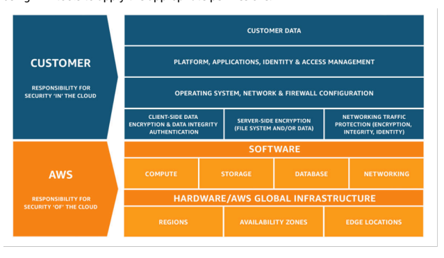
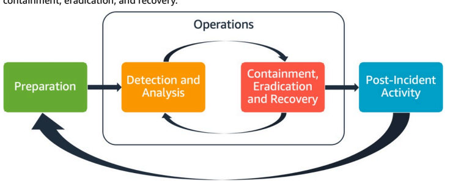
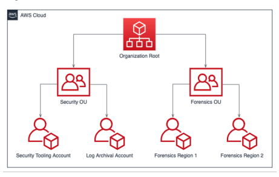

AWS  

# 

Copyright © 2024 Amazon Web Services, Inc. and/or its affiliates. All rights reserved.

# Pillar: Aws

Copyright © 2024 Amazon Web Services, Inc. and/or its affiliates. All rights reserved. Amazon's trademarks and trade dress may not be used in connection with any product or service that is not Amazon's, in any manner that is likely to cause confusion among customers, or in any manner that disparages or discredits Amazon. All other trademarks not owned by Amazon are the property of their respective owners, who may or may not be affiliated with, connected to, or sponsored by Amazon.

## Table Of Contents

| Abstract and introduction 1       |                                                                                                                                                                                                                                                                                                                                                                                                                                                                                                                                                                                                                                                                                                                                                                          |
|-----------------------------------|--------------------------------------------------------------------------------------------------------------------------------------------------------------------------------------------------------------------------------------------------------------------------------------------------------------------------------------------------------------------------------------------------------------------------------------------------------------------------------------------------------------------------------------------------------------------------------------------------------------------------------------------------------------------------------------------------------------------------------------------------------------------------|
|                                   | Introduction 1                                                                                                                                                                                                                                                                                                                                                                                                                                                                                                                                                                                                                                                                                                                                                           |
| Security foundations 2            |                                                                                                                                                                                                                                                                                                                                                                                                                                                                                                                                                                                                                                                                                                                                                                          |
|                                   | Design principles 2 Definition 3 Shared responsibility 3 Governance 5 AWS account management and separation 7 SEC01-BP01 Separate workloads using accounts 8 SEC01-BP02 Secure account root user and properties 11 Operating your workloads securely 16 SEC01-BP03 Identify and validate control objectives 17 SEC01-BP04 Stay up to date with security threats and recommendations 20 SEC01-BP05 Reduce security management scope 21 SEC01-BP06 Automate deployment of standard security controls 24 SEC01-BP07 Identify threats and prioritize mitigations using a threat model 27 SEC01-BP08 Evaluate and implement new security services and features regularly 31                                                                                                   |
| Identity and access management 34 |                                                                                                                                                                                                                                                                                                                                                                                                                                                                                                                                                                                                                                                                                                                                                                          |
|                                   | Identity management 34 SEC02-BP01 Use strong sign-in mechanisms 35 SEC02-BP02 Use temporary credentials 38 SEC02-BP03 Store and use secrets securely 41 SEC02-BP04 Rely on a centralized identity provider 46 SEC02-BP05 Audit and rotate credentials periodically 50 SEC02-BP06 Employ user groups and attributes 53 Permissions management 55 SEC03-BP01 Define access requirements 57 SEC03-BP02 Grant least privilege access 61 SEC03-BP03 Establish emergency access process 65 SEC03-BP04 Reduce permissions continuously 72 SEC03-BP05 Define permission guardrails for your organization 74 SEC03-BP06 Manage access based on lifecycle 77 SEC03-BP07 Analyze public and cross-account access 79 SEC03-BP08 Share resources securely within your organization 82 |

| Security Pillar                                                            | AWS Well-Architected Framework                                      |
|----------------------------------------------------------------------------|---------------------------------------------------------------------|
|                                                                            | SEC03-BP09 Share resources securely with a third party .            |
| Detection                                                                  |                                                                     |
| SEC04-BP01 Configure service and application logging .                     |                                                                     |
|                                                                            | Implementation guidance                                             |
|                                                                            | Resources                                                           |
| SEC04-BP02 Capture logs, findings, and metrics in standardized locations . |                                                                     |
|                                                                            | Implementation guidance                                             |
|                                                                            | Implementation steps .                                              |
|                                                                            | Resources                                                           |
| SEC04-BP03 Correlate and enrich security alerts                            |                                                                     |
|                                                                            | Implementation guidance                                             |
|                                                                            | Resources                                                           |
| SEC04-BP04 Initiate remediation for non-compliant resources                |                                                                     |
|                                                                            | Implementation guidance                                             |
|                                                                            | Resources                                                           |
| Infrastructure protection                                                  |                                                                     |
| Protecting networks                                                        |                                                                     |
|                                                                            | SEC05-BP01 Create network layers .                                  |
|                                                                            | SEC05-BP02 Control traffic flow within your network layers .        |
|                                                                            | SEC05-BP03 Implement inspection-based protection .                  |
|                                                                            | SEC05-BP04 Automate network protection .                            |
| Protecting compute .                                                       |                                                                     |
|                                                                            | SEC06-BP01 Perform vulnerability management                         |
|                                                                            | SEC06-BP02 Provision compute from hardened images                   |
|                                                                            | SEC06-BP03 Reduce manual management and interactive access .        |
|                                                                            | SEC06-BP04 Validate software integrity .                            |
|                                                                            | SEC06-BP05 Automate compute protection .                            |
| Data protection                                                            |                                                                     |
| Data classification                                                        |                                                                     |
|                                                                            | SEC07-BP01 Understand your data classification scheme               |
|                                                                            | SEC07-BP02 Apply data protection controls based on data sensitivity |
|                                                                            | SEC07-BP03 Automate identification and classification               |
|                                                                            | SEC07-BP04 Define scalable data lifecycle management .              |
| Protecting data at rest                                                    |                                                                     |
|                                                                            | SEC08-BP01 Implement secure key management .                        |
|                                                                            | SEC08-BP02 Enforce encryption at rest                               |

 iv

| Security Pillar                                                                                          | AWS Well-Architected Framework                                     |
|----------------------------------------------------------------------------------------------------------|--------------------------------------------------------------------|
|                                                                                                          | SEC08-BP03 Automate data at rest protection                        |
|                                                                                                          | SEC08-BP04 Enforce access control                                  |
| Protecting data in transit .                                                                             |                                                                    |
|                                                                                                          | SEC09-BP01 Implement secure key and certificate management .       |
|                                                                                                          | SEC09-BP02 Enforce encryption in transit .                         |
|                                                                                                          | SEC09-BP03 Authenticate network communications .                   |
| Incident response                                                                                        |                                                                    |
| AWS incident response                                                                                    |                                                                    |
| Design goals of cloud response .                                                                         |                                                                    |
| Preparation                                                                                              |                                                                    |
|                                                                                                          | SEC10-BP01 Identify key personnel and external resources .         |
|                                                                                                          | SEC10-BP02 Develop incident management plans .                     |
|                                                                                                          | SEC10-BP03 Prepare forensic capabilities .                         |
|                                                                                                          | SEC10-BP04 Develop and test security incident response playbooks . |
|                                                                                                          | SEC10-BP05 Pre-provision access                                    |
|                                                                                                          | SEC10-BP06 Pre-deploy tools                                        |
|                                                                                                          | SEC10-BP07 Run simulations .                                       |
| Operations .                                                                                             |                                                                    |
| Post-incident activity .                                                                                 |                                                                    |
|                                                                                                          | SEC10-BP08 Establish a framework for learning from incidents .     |
| Application security .                                                                                   |                                                                    |
| SEC11-BP01 Train for application security                                                                |                                                                    |
|                                                                                                          | Implementation guidance                                            |
|                                                                                                          | Resources                                                          |
| SEC11-BP02 Automate testing throughout the development and release lifecycle ....................... 200 |                                                                    |
|                                                                                                          | ……                                                                 |
|                                                                                                          | ……                                                                 |
|                                                                                                          | Implementation guidance                                            |
|                                                                                                          | Resources                                                          |
| SEC11-BP03 Perform regular penetration testing .                                                         |                                                                    |
|                                                                                                          | Implementation guidance                                            |
|                                                                                                          | Resources                                                          |
| SEC11-BP04 Manual code reviews .                                                                         |                                                                    |
|                                                                                                          | Implementation guidance                                            |
|                                                                                                          | Resources                                                          |
| SEC11-BP05 Centralize services for packages and dependencies .                                           |                                                                    |

 v

| Security Pillar                                                                                                                                | AWS Well-Architected Framework   |
|------------------------------------------------------------------------------------------------------------------------------------------------|----------------------------------|
|                                                                                                                                                | Implementation guidance          |
|                                                                                                                                                | Resources                        |
| SEC11-BP06 Deploy software programmatically                                                                                                    |                                  |
|                                                                                                                                                | Implementation guidance          |
|                                                                                                                                                | Resources                        |
| SEC11-BP07 Regularly assess security properties of the pipelines .                                                                             |                                  |
|                                                                                                                                                | Implementation guidance          |
|                                                                                                                                                | Resources                        |
| SEC11-BP08 Build a program that embeds security ownership in workload teams .............................................................. 214 |                                  |
|                                                                                                                                                | Implementation guidance          |
|                                                                                                                                                | Resources                        |
| Conclusion .                                                                                                                                   |                                  |
| Contributors .                                                                                                                                 |                                  |
| Further reading                                                                                                                                |                                  |
| Document revisions .                                                                                                                           |                                  |
| Notices                                                                                                                                        |                                  |
| AWS Glossary .                                                                                                                                 |                                  |

# - Aws

Publication date: **June 27, 2024** (*Document revisions*) The focus of this paper is the security pillar of the AWS Well-Architected Framework. It provides guidance to help you apply best practices, current recommendations in the design, delivery, and maintenance of secure AWS workloads.

## Introduction

The AWS Well-Architected Framework helps you understand trade-offs for decisions you make while building workloads on AWS. By using the Framework, you will learn current architectural best practices for designing and operating reliable, secure, efficient, cost-effective, and sustainable workloads in the cloud. It provides a way for you to consistently measure your workload against best practices and identify areas for improvement. We believe that having well-architected workloads greatly increases the likelihood of business success. The framework is based on six pillars: - Operational Excellence - Security - Reliability - Performance Efficiency - Cost Optimization - Sustainability This paper focuses on the security pillar. This will help you meet your business and regulatory requirements by following current AWS recommendations. It's intended for those in technology roles, such as chief technology officers (CTOs), chief information security officers (CSOs/CISOs), architects, developers, and operations team members. After reading this paper, you will understand AWS current recommendations and strategies to use when designing cloud architectures with security in mind. This paper doesn't provide implementation details or architectural patterns but does include references to appropriate resources for this information. By adopting the practices in this paper, you can build architectures that protect your data and systems, control access, and respond automatically to security events.

## Foundations

The security pillar describes how to take advantage of cloud technologies to protect data, systems, and assets in a way that can improve your security posture. This paper provides in-depth, bestpractice guidance for architecting secure workloads on AWS.

## Design Principles

In the cloud, there are a number of principles that can help you strengthen your workload security: - Implement a strong identity **foundation:** Implement the principle of least privilege and enforce separation of duties with appropriate authorization for each interaction with your AWS resources. Centralize identity management, and aim to eliminate reliance on long-term static credentials.

- Maintain **traceability:** Monitor, alert, and audit actions and changes to your environment in real time. Integrate log and metric collection with systems to automatically investigate and take action.

- Apply security at all **layers:** Apply a defense in depth approach with multiple security controls.

Apply to all layers (for example, edge of network, VPC, load balancing, every instance and compute service, operating system, application, and code).

- Automate security best **practices:** Automated software-based security mechanisms improve your ability to securely scale more rapidly and cost-effectively. Create secure architectures, including the implementation of controls that are defined and managed as code in versioncontrolled templates.

- Protect data in transit and at **rest**: Classify your data into sensitivity levels and use mechanisms, such as encryption, tokenization, and access control where appropriate.

- Keep people away from **data:** Use mechanisms and tools to reduce or eliminate the need for direct access or manual processing of data. This reduces the risk of mishandling or modification and human error when handling sensitive data.

- Prepare for security **events:** Prepare for an incident by having incident management and investigation policy and processes that align to your organizational requirements. Run incident response simulations and use tools with automation to increase your speed for detection, investigation, and recovery.

## Definition

Security in the cloud is composed of seven areas: - Security foundations - Identity and access management - Detection - Infrastructure protection - Data protection - Incident response - Application security

## Shared Responsibility

Security and Compliance is a shared responsibility between AWS and the customer. This shared model can help relieve the customer's operational burden as AWS operates, manages, and controls the components from the host operating system and virtualization layer down to the physical security of the facilities in which the service operates. The customer assumes responsibility and management of the guest operating system (including updates and security patches), and other associated application software in addition to the configuration of the AWS provided security group firewall. Customers should carefully consider the services they choose as their responsibilities vary depending on the services used, the integration of those services into their IT environment, and applicable laws and regulations. The nature of this shared responsibility also provides the flexibility and customer control that permits the deployment. As shown in the following chart, this differentiation of responsibility is commonly referred to as Security "of" the Cloud versus Security "in" the Cloud. AWS responsibility "Security of the **Cloud"** - AWS is responsible for protecting the infrastructure that runs all of the services offered in the AWS Cloud. This infrastructure is composed of the hardware, software, networking, and facilities that run AWS Cloud services. Customer responsibility "Security in the **Cloud"** - Customer responsibility will be determined by the AWS Cloud services that a customer selects. This determines the amount of configuration work the customer must perform as part of their security responsibilities. For example, a service such as Amazon Elastic Compute Cloud (Amazon EC2) is categorized as Infrastructure as a Service (IaaS) and, as such, requires the customer to perform all of the necessary security configuration and management tasks. Customers that deploy an Amazon EC2 instance are responsible for

 management of the guest operating system (including updates and security patches), any application software or utilities installed by the customer on the instances, and the configuration of the AWS-provided firewall (called a security group) on each instance. For abstracted services, such as Amazon S3 and Amazon DynamoDB, AWS operates the infrastructure layer, the operating system, and platforms, and customers access the endpoints to store and retrieve data. Customers are responsible for managing their data (including encryption options), classifying their assets, and using IAM tools to apply the appropriate permissions. Figure 1: AWS Shared Responsibility *Model.*
This customer/AWS shared responsibility model also extends to IT controls. Just as the responsibility to operate the IT environment is shared between AWS and its customers, so is the management, operation, and verification of IT controls shared. AWS can help relieve customer burden of operating controls by managing those controls associated with the physical infrastructure deployed in the AWS environment that may previously have been managed by the customer. As every customer is deployed differently in AWS, customers can take advantage of shifting management of certain IT controls to AWS, which results in a (new) distributed control environment. Customers can then use the AWS control and compliance documentation available to them to perform their control evaluation and verification procedures as required. The following are examples of controls that are managed by AWS, AWS customers, or both. Inherited Controls - Controls that a customer fully inherits from AWS. - Physical and Environmental controls Shared Controls - Controls that apply to both the infrastructure layer and customer layers, but in separate contexts or perspectives. In a shared control, AWS provides the requirements for the infrastructure and the customer must provide their own control implementation within their use of AWS services. Examples include: - Patch Management - AWS is responsible for patching and fixing flaws within the infrastructure, but customers are responsible for patching their guest operating system and applications.

- Configuration Management - AWS maintains the configuration of its infrastructure devices, but customers are responsible for configuring their own guest operating systems, databases, and applications.

- Awareness and Training - AWS trains AWS employees, but customers must train their own employees.

Customer Specific - Controls that are solely the responsibility of the customer based on the application they are deploying within AWS services. Examples include: - Service and Communications Protection or Zone Security, which might require a customer to route or zone data within specific security environments.

## Governance

Security governance, as a subset of the overall approach, is meant to support business objectives by defining policies and control objectives to help manage risk. Achieve risk management by following a layered approach to security control objectives–each layer builds upon the previous one. Understanding the AWS Shared Responsibility Model is your foundational layer. This knowledge provides clarity on what you are responsible for on the customer side and what you inherit from AWS. A beneficial resource is AWS Artifact, which gives you on-demand access to AWS' security and compliance reports and select online agreements. Meet most of your control objectives at the next layer. This is where the platform-wide capability lives. For example, this layer includes the AWS account vending process, integration with an identity provider such as AWS IAM Identity Center, and the common detective controls. Some of the output of the platform governance process is here too. When you want to start using a new AWS service, update service control policies (SCPs) in the AWS Organizations service to provide the guardrails for initial use of the service. You can use other SCPs to implement common security control objectives, often referred to as security invariants. These are control objectives or configuration that you apply to multiple accounts, organization units, or the whole AWS
organization. Typical examples are limiting the Regions that infrastructure runs in or preventing the deactivation of detective controls. This middle layer also contains codified policies such as config rules or checks in pipelines.

The top layer is where the product teams meet control objectives. This is because the implementation is done in the applications that the product teams control. This could be implementing input validation in an application or ensuring that identity passes between microservices correctly. Even though the product team owns the configuration, they can still inherit some capability from the middle layer.

Wherever you implement the control, the goal is the same: manage risk. A range of risk management frameworks apply to specific industries, regions, or technologies. Your main objective: highlight the risk based on likelihood and consequence. This is the inherent risk. You can then define a control objective that reduces either the likelihood, consequence, or both. Then, with a control in place, you can see what the resulting risk is likely to be. This is the residual risk. Control objectives can apply to one or many workloads. The following diagram shows a typical risk matrix. The likelihood is based on frequency of previous occurrences and the consequence is based on the financial, reputational and time cost of the event.

| Likelihood    | Risk Level   |        |        |          |          |
|---------------|--------------|--------|--------|----------|----------|
| Very Likely   | Low          | Medium | High   | Critical | Critical |
| Likely        | Low          | Medium | Medium | High     | Critical |
| Possible      | Low          | Low    | Medium | Medium   | High     |
| Unlikely      | Low          | Low    | Medium | Medium   | High     |
| Very unlikely | Low          | Low    |        | Medium   | High     |
| Consequence   | Minimal      |        | Medium |          |          |
|               | Low          |        |        | High     | Severe   |

 6 Figure 2: Risk level likelihood matrix

## Aws Account Management And Separation

We recommend that you organize workloads in separate accounts and group accounts based on function, compliance requirements, or a common set of controls rather than mirroring your organization's reporting structure. In AWS, accounts are a hard boundary. For example, accountlevel separation is strongly recommended for isolating production workloads from development and test workloads.

Manage accounts **centrally:** AWS Organizations automates AWS account creation and management, and control of those accounts after they are created. When you create an account through AWS Organizations, it is important to consider the email address you use, as this will be the root user that allows the password to be reset. Organizations allows you to group accounts into organizational units (OUs), which can represent different environments based on the workload's requirements and purpose.

Set controls **centrally:** Control what your AWS accounts can do by only allowing specific services, Regions, and service actions at the appropriate level. AWS Organizations allows you to use service control policies (SCPs) to apply permission guardrails at the organization, organizational unit, or account level, which apply to all AWS Identity and Access Management (IAM) users and roles. For example, you can apply an SCP that restricts users from launching resources in Regions that you have not explicitly allowed. AWS Control Tower offers a simplified way to set up and govern multiple accounts. It automates the setup of accounts in your AWS Organization, automates provisioning, applies guardrails (which include prevention and detection), and provides you with a dashboard for visibility. Configure services and resources **centrally:** AWS Organizations helps you configure AWS services that apply to all of your accounts. For example, you can configure central logging of all actions performed across your organization using AWS CloudTrail, and prevent member accounts from deactivating logging. You can also centrally aggregate data for rules that you've defined using AWS Config, allowing you to audit your workloads for compliance and react quickly to changes. AWS CloudFormation StackSets allow you to centrally manage AWS CloudFormation stacks across accounts and OUs in your organization. This allows you to automatically provision a new account to meet your security requirements. Use the delegated administration feature of security services to separate the accounts used for management from the organizational billing (management) account. Several AWS services, such as GuardDuty,  Hub, and AWS Config, support integrations with AWS Organizations including designating a specific account for administrative functions. Best **practices** - SEC01-BP01 Separate workloads using accounts - SEC01-BP02 Secure account root user and properties

## Sec01-Bp01 Separate Workloads Using Accounts

Establish common guardrails and isolation between environments (such as production, development, and test) and workloads through a multi-account strategy. Account-level separation is strongly recommended, as it provides a strong isolation boundary for security, billing, and access. Desired **outcome:** An account structure that isolates cloud operations, unrelated workloads, and environments into separate accounts, increasing security across the cloud infrastructure. Common **anti-patterns:** - Placing multiple unrelated workloads with different data sensitivity levels into the same account. - Poorly defined organizational unit (OU) structure. Benefits of establishing this best **practice:** - Decreased scope of impact if a workload is inadvertently accessed. - Central governance of access to AWS services, resources, and Regions.

- Maintain security of the cloud infrastructure with policies and centralized administration of security services.

- Automated account creation and maintenance process. - Centralized auditing of your infrastructure for compliance and regulatory requirements. Level of risk exposed if this best practice is not **established**: High

AWS accounts provide a security isolation boundary between workloads or resources that operate at different sensitivity levels. AWS provides tools to manage your cloud workloads at scale through a multi-account strategy to leverage this isolation boundary. For guidance on the concepts, patterns, and implementation of a multi-account strategy on AWS, see Organizing Your AWS Environment Using Multiple Accounts. When you have multiple AWS accounts under central management, your accounts should be organized into a hierarchy defined by layers of organizational units (OUs). Security controls can then be organized and applied to the OUs and member accounts, establishing consistent preventative controls on member accounts in the organization. The security controls are inherited, allowing you to filter permissions available to member accounts located at lower levels of an OU hierarchy. A good design takes advantage of this inheritance to reduce the number and complexity of security policies required to achieve the desired security controls for each member account. AWS Organizations and AWS Control Tower are two services that you can use to implement and manage this multi-account structure in your AWS environment. AWS Organizations allows you to organize accounts into a hierarchy defined by one or more layers of OUs, with each OU containing a number of member accounts. Service control policies (SCPs) allow the organization administrator to establish granular preventative controls on member accounts, and AWS Config can be used to establish proactive and detective controls on member accounts. Many AWS services integrate with AWS Organizations to provide delegated administrative controls and performing service-specific tasks across all member accounts in the organization. Layered on top of AWS Organizations, AWS Control Tower provides a one-click best practices setup for a multi-account AWS environment with a landing zone. The landing zone is the entry point to the multi-account environment established by Control Tower. Control Tower provides several benefits over AWS Organizations. Three benefits that provide improved account governance are: - Integrated mandatory security controls that are automatically applied to accounts admitted into the organization.

- Optional controls that can be turned on or off for a given set of OUs. - AWS Control Tower Account Factory provides automated deployment of accounts containing pre-approved baselines and configuration options inside your organization.

1. Design an organizational unit **structure:** A properly designed organizational unit structure reduces the management burden required to create and maintain service control policies and other security controls. Your organizational unit structure should be aligned with your business needs, data sensitivity, and workload structure.

2. Create a landing zone for your multi-account **environment:** A landing zone provides a consistent security and infrastructure foundation from which your organization can quickly develop, launch, and deploy workloads. You can use a custom-built landing zone or AWS Control Tower to orchestrate your environment.

3. **Establish guardrails:** Implement consistent security guardrails for your environment through your landing zone. AWS Control Tower provides a list of mandatory and optional controls that can be deployed. Mandatory controls are automatically deployed when implementing Control Tower. Review the list of highly recommended and optional controls, and implement controls that are appropriate to your needs.

4. Restrict access to newly added **Regions**: For new AWS Regions, IAM resources such as users and roles are only propagated to the Regions that you specify. This action can be performed through the console when using Control Tower, or by adjusting IAM permission policies in AWS Organizations.

5. Consider AWS CloudFormation **StackSets**: StackSets help you deploy resources including IAM
policies, roles, and groups into different AWS accounts and Regions from an approved template.

Related best **practices:** - SEC02-BP04 Rely on a centralized identity provider Related **documents:** - AWS Control Tower - AWS Security Audit Guidelines - IAM Best Practices - Use CloudFormation StackSets to provision resources across multiple AWS accounts and regions - Organizations FAQ - AWS Organizations terminology and concepts - Best Practices for Service Control Policies in an AWS Organizations Multi-Account Environment - AWS Account Management Reference Guide - Organizing Your AWS Environment Using Multiple Accounts Related **videos:** - Enable AWS adoption at scale with automation and governance - Security Best Practices the Well-Architected Way - Building and Governing Multiple Accounts using AWS Control Tower - Enable Control Tower for Existing Organizations Related **workshops:** - Control Tower Immersion Day

## Sec01-Bp02 Secure Account Root User And Properties

The root user is the most privileged user in an AWS account, with full administrative access to all resources within the account, and in some cases cannot be constrained by security policies. Deactivating programmatic access to the root user, establishing appropriate controls for the root user, and avoiding routine use of the root user helps reduce the risk of inadvertent exposure of the root credentials and subsequent compromise of the cloud environment. Desired **outcome:** Securing the root user helps reduce the chance that accidental or intentional damage can occur through the misuse of root user credentials. Establishing detective controls can also alert the appropriate personnel when actions are taken using the root user. Common **anti-patterns:** - Using the root user for tasks other than the few that require root user credentials. - Neglecting to test contingency plans on a regular basis to verify the functioning of critical infrastructure, processes, and personnel during an emergency.

- Only considering the typical account login flow and neglecting to consider or test alternate account recovery methods.

- Not handling DNS, email servers, and telephone providers as part of the critical security perimeter, as these are used in the account recovery flow.

Benefits of establishing this best **practice:** Securing access to the root user builds confidence that actions in your account are controlled and audited. Level of risk exposed if this best practice is not **established**: High

AWS offers many tools to help secure your account. However, because some of these measures are not turned on by default, you must take direct action to implement them. Consider these recommendations as foundational steps to securing your AWS account. As you implement these steps it's important that you build a process to continuously assess and monitor the security controls. When you first create an AWS account, you begin with one identity that has complete access to all AWS services and resources in the account. This identity is called the AWS account root user. You can sign in as the root user using the email address and password that you used to create the account. Due to the elevated access granted to the AWS root user, you must limit use of the AWS root user to perform tasks that specifically require it. The root user login credentials must be closely guarded, and multi-factor authentication (MFA) should always be used for the AWS account root user. In addition to the normal authentication flow to log into your root user using a username, password, and multi-factor authentication (MFA) device, there are account recovery flows to log into your AWS account root user given access to the email address and phone number associated with your account. Therefore, it is equally important to secure the root user email account where the recovery email is sent and the phone number associated with the account. Also consider potential circular dependencies where the email address associated with the root user is hosted on email servers or domain name service (DNS) resources from the same AWS account. When using AWS Organizations, there are multiple AWS accounts each of which have a root user. One account is designated as the management account and several layers of member accounts can then be added underneath the management account. Prioritize securing your management account's root user, then address your member account root users. The strategy for securing your management account's root user can differ from your member account root users, and you can place preventative security controls on your member account root users.

The following implementation steps are recommended to establish controls for the root user. Where applicable, recommendations are cross-referenced to CIS AWS Foundations benchmark version 1.4.0. In addition to these steps, consult AWS best practice guidelines for securing your AWS account and resources. Preventative **controls** 1. Set up accurate contact information for the account.

a. This information is used for the lost password recovery flow, lost MFA device account recovery flow, and for critical security-related communications with your team.

b. Use an email address hosted by your corporate domain, preferably a distribution list, as the root user's email address. Using a distribution list rather than an individual's email account provides additional redundancy and continuity for access to the root account over long periods of time.

c. The phone number listed on the contact information should be a dedicated, secure phone for this purpose. The phone number should not be listed or shared with anyone.

2. Do not create access keys for the root user. If access keys exist, remove them (CIS 1.4).

a. Eliminate any long-lived programmatic credentials (access and secret keys) for the root user. b. If root user access keys already exist, you should transition processes using those keys to use temporary access keys from an AWS Identity and Access Management (IAM) role, then delete the root user access keys.

3. Determine if you need to store credentials for the root user.

a. If you are using AWS Organizations to create new member accounts, the initial password for the root user on new member accounts is set to a random value that is not exposed to you. Consider using the password reset flow from your AWS Organization management account to gain access to the member account if needed.

b. For standalone AWS accounts or the management AWS Organization account, consider creating and securely storing credentials for the root user. Use MFA for the root user.

4. Use preventative controls for member account root users in AWS multi-account environments.

a. Consider using the Disallow Creation of Root Access Keys for the Root User preventative guard rail for member accounts.

b. Consider using the Disallow Actions as a Root User preventative guard rail for member accounts.

5. If you need credentials for the root user:
a. Use a complex password. b. Turn on multi-factor authentication (MFA) for the root user, especially for AWS Organizations management (payer) accounts (CIS 1.5).

c. Consider hardware MFA devices for resiliency and security, as single use devices can reduce the chances that the devices containing your MFA codes might be reused for other purposes. Verify that hardware MFA devices powered by a battery are replaced regularly. (CIS 1.6)
SEC01-BP02 Secure account root user and properties 13
- To configure MFA for the root user, follow the instructions for creating either a virtual MFA or hardware MFA device.

d. Consider enrolling multiple MFA devices for backup. Up to 8 MFA devices are allowed per account. - Note that enrolling more than one MFA device for the root user automatically turns off the flow for recovering your account if the MFA device is lost.

e. Store the password securely, and consider circular dependencies if storing the password electronically. Don't store the password in such a way that would require access to the same AWS account to obtain it.

6. Optional: Consider establishing a periodic password rotation schedule for the root user.

- Credential management best practices depend on your regulatory and policy requirements.

Root users protected by MFA are not reliant on the password as a single factor of authentication.

- Changing the root user password on a periodic basis reduces the risk that an inadvertently exposed password can be misused.

## Detective Controls

- Create alarms to detect use of the root credentials (CIS 1.7). Amazon GuardDuty can monitor and alert on root user API credential usage through the RootCredentialUsage finding.

- Evaluate and implement the detective controls included in the AWS Well-Architected Security Pillar conformance pack for AWS Config, or if using AWS Control Tower, the strongly recommended controls available inside Control Tower.

## Operational Guidance

- Determine who in the organization should have access to the root user credentials.

- Use a two-person rule so that no one individual has access to all necessary credentials and MFA
to obtain root user access.

- Verify that the organization, and not a single individual, maintains control over the phone number and email alias associated with the account (which are used for password reset and MFA reset flow).

- Use root user only by exception (CIS 1.7).

- The AWS root user must not be used for everyday tasks, even administrative ones. Only log in as the root user to perform AWS tasks that require root user. All other actions should be performed by other users assuming appropriate roles.

- Periodically check that access to the root user is functioning so that procedures are tested prior to an emergency situation requiring the use of the root user credentials.

- Periodically check that the email address associated with the account and those listed under Alternate Contacts work. Monitor these email inboxes for security notifications you might receive from <abuse@amazon.com>. Also ensure any phone numbers associated with the account are working.

- Prepare incident response procedures to respond to root account misuse. Refer to the AWS
Security Incident Response Guide and the best practices in the Incident Response section of the Security Pillar whitepaper for more information on building an incident response strategy for your AWS account.

Related best **practices:** - SEC01-BP01 Separate workloads using accounts - SEC02-BP01 Use strong sign-in mechanisms - SEC03-BP02 Grant least privilege access - SEC03-BP03 Establish emergency access process - SEC10-BP05 Pre-provision access

## Related Documents:

- AWS Control Tower - AWS Security Audit Guidelines - IAM Best Practices - Amazon GuardDuty - root credential usage alert - Step-by-step guidance on monitoring for root credential use through CloudTrail - MFA tokens approved for use with AWS - Implementing break glass access on AWS - Top 10 security items to improve in your AWS account - What do I do if I notice unauthorized activity in my AWS account? Related **videos:** - Enable AWS adoption at scale with automation and governance - Security Best Practices the Well-Architected Way - Limiting use of AWS root credentials from AWS re:inforce 2022 - Security best practices with AWS IAM
Related examples and **labs:** - Lab: AWS account setup and root user

## Operating Your Workloads Securely

Operating workloads securely covers the whole lifecycle of a workload from design, to build, to run, and to ongoing improvement. One of the ways to improve your ability to operate securely in the cloud is by taking an organizational approach to governance. Governance is the way that decisions are guided consistently without depending solely on the good judgment of the people involved. Your governance model and process are the way you answer the question "How do I know that the control objectives for a given workload are met and are appropriate for that workload?" Having a consistent approach to making decisions speeds up the deployment of workloads and helps raise the bar for the security capability in your organization. To operate your workload securely, you must apply overarching best practices to every area of security. Take requirements and processes that you have defined in operational excellence at an organizational and workload level, and apply them to all areas. Staying up to date with AWS and industry recommendations and threat intelligence helps you evolve your threat model and control objectives. Automating security processes, testing, and validation help you scale your security operations. Automation allows consistency and repeatability of processes. People are good at many things, but consistently doing the same thing repeatedly without mistakes is not one of them. Even with well-written runbooks, you run the risk that people won't consistently carry out repetitive tasks. This is especially true when people have diverse responsibilities and then have to respond to unfamiliar alerts. Automation, however, responds the same way each time. The best way to deploy applications is through automation. The code that runs the deployment can be tested and then used to perform the deployment. This increases confidence in the change process and reduces the risk of a failed change. To verify that the configuration meets your control objectives, test the automation and the deployed application in a non-production environment first. This way, you can test the automation to prove that it performed all the steps correctly. You also get early feedback in the development and deployment cycle, reducing rework. To reduce the chance of deployment errors, make configuration changes by code not by people. If you need to re-deploy an application, automation makes this much easier. As you define additional control objectives, you can easily add them to the automation for all workloads. Instead of having individual workload owners invest in security specific to their workloads, save time by using common capabilities and shared components. Some examples of services that multiple teams can consume include the AWS account creation process, centralized identity for people, common logging configuration, and AMI and container base image creation. This approach can help builders improve workload cycle times and consistently meet security control objectives. When teams are more consistent, you can validate control objectives and better report your control posture and risk position to stakeholders. Best **practices** - SEC01-BP03 Identify and validate control objectives - SEC01-BP04 Stay up to date with security threats and recommendations - SEC01-BP05 Reduce security management scope - SEC01-BP06 Automate deployment of standard security controls - SEC01-BP07 Identify threats and prioritize mitigations using a threat model - SEC01-BP08 Evaluate and implement new security services and features regularly

## Sec01-Bp03 Identify And Validate Control Objectives

Based on your compliance requirements and risks identified from your threat model, derive and validate the control objectives and controls that you need to apply to your workload. Ongoing validation of control objectives and controls help you measure the effectiveness of risk mitigation. Desired **outcome:** The security control objectives of your business are well-defined and aligned to your compliance requirements. Controls are implemented and enforced through automation and policy and are continually evaluated for their effectiveness in achieving your objectives. Evidence of effectiveness at both a point in time and over a period of time are readily reportable to auditors.

- Regulatory requirements, market expectations, and industry standards for assurable security are not well-understood for your business
- Your cybersecurity frameworks and control objectives are misaligned to the requirements of your business
- The implementation of controls does not strongly align to your control objectives in a measurable way
- You do not use automation to report on the effectiveness of your controls Level of risk exposed if this best practice is not **established:** High

There are many common cybersecurity frameworks that can form the basis for your security control objectives. Consider the regulatory requirements, market expectations, and industry standards for your business to determine which frameworks best supports your needs. Examples include AICPA SOC 2, HITRUST, PCI-DSS, ISO 27001, and NIST SP 800-53. For the control objectives you identify, understand how AWS services you consume help you to achieve those objectives. Use AWS Artifact to find documentation and reports aligned to your target frameworks that describe the scope of responsibility covered by AWS and guidance for the remaining scope that is your responsibility. For further service-specific guidance as they align to various framework control statements, see AWS Customer Compliance Guides. As you define the controls that achieve your objectives, codify enforcement using preventative controls, and automate mitigations using detective controls. Help prevent non-compliant resource configurations and actions across your AWS Organizations using service control policies (SCP). Implement rules in AWS Config to monitor and report on non-compliant resources, then switch rules to an enforcement model once confident in their behavior. To deploy sets of pre-defined and managed rules that align to your cybersecurity frameworks, evaluate the use of AWS Security Hub standards as your first option. The AWS Foundational Service Best Practices (FSBP) standard and the CIS AWS Foundations Benchmark are good starting points with controls that align to many objectives that are shared across multiple standard frameworks. Where Security Hub does not intrinsically have the control detections desired, it can be complemented using AWS Config conformance packs. Use APN Partner Bundles recommended by the AWS Global Security and Compliance Acceleration (GSCA) team to get assistance from security advisors, consulting agencies, evidence collection and reporting systems, auditors, and other complementary services when required.

1. Evaluate common cybersecurity frameworks, and align your control objectives to the ones chosen.

2. Obtain relevant documentation on guidance and responsibilities for your framework using AWS
Artifact. Understand which parts of compliance fall on the AWS side of the shared responsibility model and which parts are your responsibility.

3. Use SCPs, resource policies, role trust policies, and other guardrails to prevent non-compliant resource configurations and actions.

4. Evaluate deploying Security Hub standards and AWS Config conformance packs that align to your control objectives.

Related best **practices:** - SEC03-BP01 Define access requirements - SEC04-BP01 Configure service and application logging - SEC07-BP01 Understand your data classification scheme - OPS01-BP03 Evaluate governance requirements - OPS01-BP04 Evaluate compliance requirements - PERF01-BP05 Use policies and reference architectures - COST02-BP01 Develop policies based on your organization requirements Related **documents:** - AWS Customer Compliance Guides Related **tools:** - AWS Artifact

## Sec01-Bp04 Stay Up To Date With Security Threats And Recommendations

Stay up to date with the latest threats and mitigations by monitoring industry threat intelligence publications and data feeds for updates. Evaluate managed service offerings that automatically update based on the latest threat data. Desired **outcome:** You stay informed as industry publications are updated with the latest threats and recommendations. You use automation to detect potential vulnerabilities and exposures as you identify new threats. You take mitigating action against these threats. You adopt AWS services that automatically update with the latest threat intelligence.

- Not having a reliable and repeatable mechanism to stay informed of the latest threat intelligence.

- Maintaining manual inventory of your technology portfolio, workloads, and dependencies that require human review for potential vulnerabilities and exposures.

- Not having mechanisms in place to update your workloads and dependencies to the latest versions available that provide known threat mitigations.

Benefits of establishing this best **practice:** Using threat intelligence sources to stay up to date reduces the risk of missing out on important changes to the threat landscape that can impact your business. Having automation in place to scan, detect, and remediate where potential vulnerabilities or exposures exist in your workloads and their dependencies can help you mitigate risks quickly and predictably, compared to manual alternatives. This helps control time and costs related to vulnerability mitigation. Level of risk exposed if this best practice is not **established:** High

Review trusted threat intelligence publications to stay on top of the threat landscape. Consult the MITRE ATT&CK knowledge base for documentation on known adversarial tactics, techniques, and procedures (TTPs). Review MITRE's Common Vulnerabilities and Exposures (CVE) list to stay informed on known vulnerabilities in products you rely on. Understand critical risks to web applications with the Open Worldwide Application  Project (OWASP)'s popular OWASP Top 10 project. Stay up to date on AWS security events and recommended remediation steps with AWS Security Bulletins for CVEs. To reduce your overall effort and overhead of staying up to date, consider using AWS services that automatically incorporate new threat intelligence over time. For example, Amazon GuardDuty stays up to date with industry threat intelligence for detecting anomalous behaviors and threat signatures within your accounts. Amazon Inspector automatically keeps a database of the CVEs it uses for its continuous scanning features up to date. Both AWS WAF and AWS Shield Advanced provide managed rule groups that are updated automatically as new threats emerge. Review the Well-Architected operational excellence pillar for automated fleet management and patching.

- Subscribe to updates for threat intelligence publications that are relevant to your business and industry. Subscribe to the AWS Security Bulletins.

- Consider adopting services that incorporate new threat intelligence automatically, such as Amazon GuardDuty and Amazon Inspector.

- Deploy a fleet management and patching strategy that aligns with the best practices of the WellArchitected Operational Excellence Pillar.

Related best **practices:** - SEC01-BP07 Identify threats and prioritize mitigations using a threat model - OPS01-BP05 Evaluate threat landscape - OPS11-BP01 Have a process for continuous improvement

## Sec01-Bp05 Reduce Security Management Scope

Determine if you can reduce your security scope by using AWS services that shift management of certain controls to AWS (managed *services*). These services can help reduce your security maintenance tasks, such as infrastructure provisioning, software setup, patching, or backups. Desired **outcome:** You consider the scope of your security management when selecting AWS services for your workload. The cost of management overhead and maintenance tasks (the total cost of ownership, or TCO) is weighed against the cost of the services you select, in addition to other Well-Architected considerations. You incorporate AWS control and compliance documentation into your control evaluation and verification procedures.

- Deploying workloads without thoroughly understanding the shared responsibility model for the services you select.

- Hosting databases and other technologies on virtual machines without having evaluated a managed service equivalent.

- Not including security management tasks into the total cost of ownership of hosting technologies on virtual machines when compared to managed service options.

Benefits of establishing this best **practice:** Using managed services can reduce your overall burden of managing operational security controls, which can reduce your security risks and total cost of ownership. Time that would otherwise be spent on certain security tasks can be reinvested into tasks that provide more value to your business. Managed services can also reduce the scope of your compliance requirements by shifting some control requirements to AWS.

Level of risk exposed if this best practice is not **established:** Medium

There are multiple ways you can integrate the components of your workload on AWS. Installing and running technologies on Amazon EC2 instances often requires you to take on the largest share of the overall security responsibility. To help reduce the burden of operating certain controls, identify AWS managed services that reduce the scope of your side of the shared responsibility model and understand how you can use them in your existing architecture. Examples include using the Amazon Relational Database Service (Amazon RDS) for deploying databases, Amazon Elastic Kubernetes Service (Amazon EKS) or Amazon Elastic Container Service (Amazon ECS) for orchestrating containers, or using serverless options. When building new applications, think through which services can help reduce time and cost when it comes to implementing and managing security controls. Compliance requirements can also be a factor when selecting services. Managed services can shift the compliance of some requirements to AWS. Discuss with your compliance team about their degree of comfort with auditing the aspects of services you operate and manage and accepting control statements in relevant AWS audit reports. You can provide the audit artifacts found in AWS Artifact to your auditors or regulators as evidence of AWS security controls. You can also use the responsibility guidance provided by some of the AWS audit artifacts to design your architecture, along with the AWS Customer Compliance Guides. This guidance helps determine the additional security controls you should put in place in order to support the specific use cases of your system. When using managed services, be familiar with the process of updating their resources to newer versions (for example, updating the version of a database managed by Amazon RDS, or a programming language runtime for an AWS Lambda function). While the managed service may perform this operation for you, configuring the timing of the update and understanding the impact on your operations remains your responsibility. Tools like AWS Health can help you track and manage these updates throughout your environments.

1. Evaluate the components of your workload that can be replaced with a managed service.

a. If you are migrating a workload to AWS, consider the reduced management (time and expense) and reduction of risk when you assess if you should rehost, refactor, replatform, rebuild, or replace your workload. Sometimes additional investment at the start of a migration can have significant savings in the long run.

2. Consider implementing managed services, like Amazon RDS, instead of installing and managing your own technology deployments.

3. Use the responsibility guidance in AWS Artifact to help determine the security controls you should put in place for your workload.

4. Keep an inventory of resources in use, and stay up-to-date with new services and approaches to identify new opportunities to reduce scope.

Related best **practices:** - PERF02-BP01 Select the best compute options for your workload - PERF03-BP01 Use a purpose-built data store that best supports your data access and storage requirements
- SUS05-BP03 Use managed services Related **documents:** - Planned lifecycle events for AWS Health Related **tools:** - AWS Health - AWS Artifact - AWS Customer Compliance Guides Related **videos:** - How do I migrate to an Amazon RDS or Aurora MySQL DB instance using AWS DMS? - AWS re:Invent 2023 - Manage resource lifecycle events at scale with AWS Health

## Sec01-Bp06 Automate Deployment Of Standard Security Controls

Apply modern DevOps practices as you develop and deploy security controls that are standard across your AWS environments. Define standard security controls and configurations using Infrastructure as Code (IaC) templates, capture changes in a version control system, test changes as part of a CI/CD pipeline, and automate the deployment of changes to your AWS environments. Desired **outcome:** IaC templates capture standardized security controls and commit them to a version control system. CI/CD pipelines are in places that detect changes and automate testing and deploying your AWS environments. Guardrails are in place to detect and alert on misconfigurations in templates before proceeding to deployment. Workloads are deployed into environments where standard controls are in place. Teams have access to deploy approved service configurations through a self-service mechanism. Secure backup and recovery strategies are in place for control configurations, scripts, and related data.

- Making changes to your standard security controls manually, through a web console or command-line interface.

- Relying on individual workload teams to manually implement the controls a central team defines.

- Relying on a central security team to deploy workload-level controls at the request of a workload team.

- Allowing the same individuals or teams to develop, test, and deploy security control automation scripts without proper separation of duties or checks and balances.

Benefits of establishing this best **practice:** Using templates to define your standard security controls allows you to track and compare changes over time using a version control system. Using automation to test and deploy changes creates standardization and predictability, increasing the chances of a successful deployment and reducing manual repetitive tasks. Providing a selfserve mechanism for workload teams to deploy approved services and configurations reduces the risk of misconfiguration and misuse. This also helps them to incorporate controls earlier in the development process.

Level of risk exposed if this best practice is not **established:** Medium

When following the practices described in SEC01-BP01 Separate workloads using accounts, you will end up with multiple AWS accounts for different environments that you manage using AWS Organizations. While each of these environments and workloads may need distinct security controls, you can standardize some security controls across your organization. Examples include integrating centralized identity providers, defining networks and firewalls, and configuring standard locations for storing and analyzing logs. In the same way you can use infrastructure as code (IaC) to apply the same rigor of application code development to infrastructure provisioning, you can use IaC to define and deploy your standard security controls as well. Wherever possible, define your security controls in a declarative way, such as in AWS CloudFormation, and store them in a source control system. Use DevOps practices to automate the deploying your controls for more predictable releases, automated testing using tools like AWS CloudFormation Guard, and detecting drift between your deployed controls and your desired configuration. You can use services such as AWS CodePipeline, AWS CodeBuild, and AWS CodeDeploy to construct a CI/CD pipeline. Consider the guidance in Organizing Your AWS Environment Using Multiple Accounts to configure these services in their own accounts that are separate from other deployment pipelines. You can also define templates to standardize defining and deploying AWS accounts, services, and configurations. This technique allows a central security team to manage these definitions and provide them to workload teams through a self-service approach. One way to achieve this is by using Service Catalog, where you can publish templates as *products* that workload teams can incorporate into their own pipeline deployments. If you are using AWS Control Tower, some templates and controls are available as a starting point. Control Tower also provides the Account Factory capability, allowing workload teams to create new AWS accounts using the standards you define. This capability helps remove dependencies on a central team to approve and create new accounts when they are identified as needed by your workload teams. You may need these accounts to isolate different workload components based on reasons such as the function they serve, the sensitivity of data being processed, or their behavior.

1. Determine how you will store and maintain your templates in a version control system. 2. Create CI/CD pipelines to test and deploy your templates. Define tests to check for misconfigurations and that templates adhere to your company standards.

3. Build a catalog of standardized templates for workload teams to deploy AWS accounts and services according to your requirements.

4. Implement secure backup and recovery strategies for your control configurations, scripts, and related data.

Related best **practices:** - OPS05-BP01 Use version control - OPS05-BP04 Use build and deployment management systems - REL08-BP05 Deploy changes with automation - SUS06-BP01 Adopt methods that can rapidly introduce sustainability improvements Related **documents:** - Organizing Your AWS Environment Using Multiple Accounts Related **examples:** - Automate account creation, and resource provisioning using Service Catalog, AWS Organizations, and AWS Lambda
- Strengthen the DevOps pipeline and protect data with AWS Secrets Manager, AWS KMS, and AWS Certificate Manager Related **tools:** - AWS CloudFormation Guard - Landing Zone Accelerator on AWS

## Sec01-Bp07 Identify Threats And Prioritize Mitigations Using A Threat Model

Perform threat modeling to identify and maintain an up-to-date register of potential threats and associated mitigations for your workload. Prioritize your threats and adapt your security control mitigations to prevent, detect, and respond. Revisit and maintain this in the context of your workload, and the evolving security landscape. Level of risk exposed if this best practice is not **established:** High Implementation guidance What is threat modeling? "Threat modeling works to identify, communicate, and understand threats and mitigations within the context of protecting something of value." - The Open Web Application Security Project (OWASP) Application Threat Modeling

## Why Should You Threat Model?

Systems are complex, and are becoming increasingly more complex and capable over time, delivering more business value and increased customer satisfaction and engagement. This means that IT design decisions need to account for an ever-increasing number of use cases. This complexity and number of use-case permutations typically makes unstructured approaches ineffective for finding and mitigating threats. Instead, you need a systematic approach to enumerate the potential threats to the system, and to devise mitigations and prioritize these mitigations to make sure that the limited resources of your organization have the maximum impact in improving the overall security posture of the system. Threat modeling is designed to provide this systematic approach, with the aim of finding and addressing issues early in the design process, when the mitigations have a low relative cost and effort compared to later in the lifecycle. This approach aligns with the industry principle of *shiftleft* security. Ultimately, threat modeling integrates with an organization's risk management process and helps drive decisions on which controls to implement by using a threat driven approach.

## When Should Threat Modeling Be Performed?

Start threat modeling as early as possible in the lifecycle of your workload, this gives you better flexibility on what to do with the threats you have identified. Much like software bugs, the earlier you identify threats, the more cost effective it is to address them. A threat model is a living document and should continue to evolve as your workloads change. Revisit your threat models over time, including when there is a major change, a change in the threat landscape, or when you adopt a new feature or service.

## Implementation Steps How Can We Perform Threat Modeling?

There are many different ways to perform threat modeling. Much like programming languages, there are advantages and disadvantages to each, and you should choose the way that works best for you. One approach is to start with Shostack's 4 Question Frame for Threat Modeling, which poses open-ended questions to provide structure to your threat modeling exercise:

## 1. What Are Working On?

The purpose of this question is to help you understand and agree upon the system you are building and the details about that system that are relevant to security. Creating a model or diagram is the most popular way to answer this question, as it helps you to visualize what you are building, for example, using a data flow diagram. Writing down assumptions and important details about your system also helps you define what is in scope. This allows everyone contributing to the threat model to focus on the same thing, and avoid time-consuming detours into out-of-scope topics (including out of date versions of your system). For example, if you are building a web application, it is probably not worth your time threat modeling the operating system trusted boot sequence for browser clients, as you have no ability to affect this with your design.

## 2. What Can Go Wrong?

This is where you identify threats to your system. Threats are accidental or intentional actions or events that have unwanted impacts and could affect the security of your system. Without a clear understanding of what could go wrong, you have no way of doing anything about it. There is no canonical list of what can go wrong. Creating this list requires brainstorming and collaboration between all of the individuals within your team and relevant personas involved in the threat modeling exercise. You can aid your brainstorming by using a model for identifying threats, such as STRIDE, which suggests different categories to evaluate: Spoofing, Tampering, Repudiation, Information Disclosure, Denial of Service, and Elevation of privilege. In addition, you might want to aid the brainstorming by reviewing existing lists and research for inspiration, including the OWASP Top 10, HiTrust Threat Catalog, and your organization's own threat catalog.

## 3. What Are We Going To Do About It?

As was the case with the previous question, there is no canonical list of all possible mitigations. The inputs into this step are the identified threats, actors, and areas of improvement from the previous step. Security and compliance is a shared responsibility between you and AWS. It's important to understand that when you ask "What are we going to do about it?", that you are also asking "Who is responsible for doing something about it?". Understanding the balance of responsibilities between you and AWS helps you scope your threat modeling exercise to the mitigations that are under your control, which are typically a combination of AWS service configuration options and your own system-specific mitigations. For the AWS portion of the shared responsibility, you will find that AWS services are in-scope of many compliance programs. These programs help you to understand the robust controls in place at AWS to maintain security and compliance of the cloud. The audit reports from these programs are available for download for AWS customers from AWS Artifact. Regardless of which AWS services you are using, there's always an element of customer responsibility, and mitigations aligned to these responsibilities should be included in your threat model. For security control mitigations for the AWS services themselves, you want to consider implementing security controls across domains, including domains such as identity and access management (authentication and authorization), data protection (at rest and in transit), infrastructure security, logging, and monitoring. The documentation for each AWS service has a dedicated security chapter that provides guidance on the security controls to consider as mitigations. Importantly, consider the code that you are writing and its code dependencies, and think about the controls that you could put in place to address those threats. These controls could be things such as input validation, session handling, and bounds handling. Often, the majority of vulnerabilities are introduced in custom code, so focus on this area.

## 4. Did We Do A Good Job?

The aim is for your team and organization to improve both the quality of threat models and the velocity at which you are performing threat modeling over time. These improvements come from a combination of practice, learning, teaching, and reviewing. To go deeper and get hands on, it's recommended that you and your team complete the Threat modeling the right way for builders training course or workshop. In addition, if you are looking for guidance on how to integrate threat modeling into your organization's application development lifecycle, see How to approach threat modeling post on the AWS Security Blog.

## Threat Composer

To aid and guide you in performing threat modeling, consider using the Threat Composer tool, which aims to your reduce time-to-value when threat modeling. The tool helps you do the following: - Write useful threat statements aligned to threat grammar that work in a natural non-linear workflow
- Generate a human-readable threat model - Generate a machine-readable threat model to allow you treat threat models as code - Help you to quickly identify areas of quality and coverage improvement using the Insights Dashboard For further reference, visit Threat Composer and switch to the system-defined **Example** Workspace.

Related best **practices:** - SEC01-BP03 Identify and validate control objectives - SEC01-BP04 Stay up to date with security threats and recommendations - SEC01-BP05 Reduce security management scope - SEC01-BP08 Evaluate and implement new security services and features regularly Related **documents:** - How to approach threat modeling (AWS  Blog) - NIST: Guide to Data-Centric System Threat Modelling Related **videos:** - AWS Summit ANZ 2021 - How to approach threat modelling - AWS Summit ANZ 2022 - Scaling security - Optimise for fast and secure delivery

## Related Training:

- Threat modeling the right way for builders - AWS Skill Builder virtual self-paced training - Threat modeling the right way for builders - AWS Workshop Related **tools:** - Threat Composer

## Sec01-Bp08 Evaluate And Implement New Security Services And Features Regularly

Evaluate and implement security services and features from AWS and AWS Partners that help you evolve the security posture of your workload. Desired **outcome:** You have a standard practice in place that informs you of new features and services released by AWS and AWS Partners. You evaluate how these new capabilities influence the design of current and new controls for your environments and workloads. Common **anti-patterns:** - You don't subscribe to AWS blogs and RSS feeds to learn of relevant new features and services quickly
- You rely on news and updates about security services and features from second-hand sources - You don't encourage AWS users in your organization to stay informed on the latest updates Benefits of establishing this best **practice:** When you stay on top of new security services and features, you can make informed decisions about the implementation of controls in your cloud environments and workloads. These sources help raise awareness of the evolving security landscape and how AWS services can be used to protect against new and emerging threats. Level of risk exposed if this best practice is not **established:** Low

AWS informs customers of new security services and features through several channels: - AWS What's New - AWS News Blog - AWS Security Blog - AWS Security Bulletins - AWS documentation overview You can subscribe to an AWS Daily Feature Updates topic using Amazon Simple Notification Service (Amazon SNS) for a comprehensive daily summary of updates. Some security services, such as Amazon GuardDuty and AWS Security Hub, provide their own SNS topics to stay informed about new standards, findings, and other updates for those particular services. New services and features are also announced and described in detail during conferences, events, and webinars conducted around the globe each year. Of particular note is the annual AWS
re:Inforce security conference and the more general AWS re:Invent conference. The previouslymentioned AWS news channels share these conference announcements about security and other services, and you can view deep dive educational breakout sessions online at the AWS Events channel on YouTube. You can also ask your AWS account team about the latest security service updates and recommendations. You can reach out to your team through the Sales Support form if you do not have their direct contact information. Similarly, if you subscribed to AWS Enterprise Support, you will receive weekly updates from your Technical Account Manager (TAM) and can schedule a regular review meeting with them.

1. Subscribe to the various blogs and bulletins with your favorite RSS reader or to the Daily Features Updates SNS topic.

2. Evaluate which AWS events to attend to learn first-hand about new features and services. 3. Set up meetings with your AWS account team for any questions about updating security services and features.

4. Consider subscribing to Enterprise Support to have regular consultations with a Technical Account Manager (TAM).

Related best **practices:** - PERF01-BP01 Learn about and understand available cloud services and features - COST01-BP07 Keep up-to-date with new service releases

## Identity And Access Management

To use AWS services, you must grant your users and applications access to resources in your AWS accounts. As you run more workloads on AWS, you need robust identity management and permissions in place to ensure that the right people have access to the right resources under the right conditions. AWS offers a large selection of capabilities to help you manage your human and machine identities and their permissions. The best practices for these capabilities fall into two main areas. Topics
- Identity management
- Permissions management

## Identity Management

There are two types of identities you need to manage when approaching operating secure AWS workloads. - **Human identities:** The administrators, developers, operators, and consumers of your applications require an identity to access your AWS environments and applications. These can be members of your organization, or external users with whom you collaborate, and who interact with your AWS resources via a web browser, client application, mobile app, or interactive command-line tools.

- **Machine identities:** Your workload applications, operational tools, and components require an identity to make requests to AWS services, for example, to read data. These identities include machines running in your AWS environment, such as Amazon EC2 instances or AWS Lambda functions. You can also manage machine identities for external parties who need access. Additionally, you might also have machines outside of AWS that need access to your AWS environment.

## Best Practices

- SEC02-BP01 Use strong sign-in mechanisms - SEC02-BP02 Use temporary credentials - SEC02-BP03 Store and use secrets securely - SEC02-BP04 Rely on a centralized identity provider - SEC02-BP05 Audit and rotate credentials periodically - SEC02-BP06 Employ user groups and attributes

## Sec02-Bp01 Use Strong Sign-In Mechanisms

Sign-ins (authentication using sign-in credentials) can present risks when not using mechanisms like multi-factor authentication (MFA), especially in situations where sign-in credentials have been inadvertently disclosed or are easily guessed. Use strong sign-in mechanisms to reduce these risks by requiring MFA and strong password policies. Desired **outcome:** Reduce the risks of unintended access to credentials in AWS by using strong sign-in mechanisms for AWS Identity and Access Management (IAM) users, the AWS account root user, AWS IAM Identity Center (successor to AWS Single Sign-On), and third-party identity providers. This means requiring MFA, enforcing strong password policies, and detecting anomalous login behavior.

- Not enforcing a strong password policy for your identities including complex passwords and MFA.

- Sharing the same credentials among different users. - Not using detective controls for suspicious sign-ins. Level of risk exposed if this best practice is not **established:** High

There are many ways for human identities to sign-in to AWS. It is an AWS best practice to rely on a centralized identity provider using federation (direct federation or using AWS IAM Identity Center) when authenticating to AWS. In that case, you should establish a secure sign-in process with your identity provider or Microsoft Active Directory. When you first open an AWS account, you begin with an AWS account root user. You should only use the account root user to set up access for your users (and for tasks that require the root user). It's important to turn on MFA for the account root user immediately after opening your AWS account and to secure the root user using the AWS best practice guide. If you create users in AWS IAM Identity Center, then secure the sign-in process in that service. For consumer identities, you can use Amazon Cognito user pools and secure the sign-in process in that service, or by using one of the identity providers that Amazon Cognito user pools supports.

If you are using AWS Identity and Access Management (IAM) users, you would secure the sign-in process using IAM. Regardless of the sign-in method, it's critical to enforce a strong sign-in policy.

The following are general strong sign-in recommendations. The actual settings you configure should be set by your company policy or use a standard like NIST 800-63. - Require MFA. It's an IAM best practice to require MFA for human identities and workloads.

Turning on MFA provides an additional layer of security requiring that users provide sign-in credentials and a one-time password (OTP) or a cryptographically verified and generated string from a hardware device.

- Enforce a minimum password length, which is a primary factor in password strength. - Enforce password complexity to make passwords more difficult to guess. - Allow users to change their own passwords. - Create individual identities instead of shared credentials. By creating individual identities, you can give each user a unique set of security credentials. Individual users provide the ability to audit each user's activity.

IAM Identity Center recommendations: - IAM Identity Center provides a predefined password policy when using the default directory that establishes password length, complexity, and reuse requirements.

- Turn on MFA and configure the context-aware or always-on setting for MFA when the identity source is the default directory, AWS Managed Microsoft AD, or AD Connector.

- Allow users to register their own MFA devices. Amazon Cognito user pools directory recommendations: - Configure the Password strength settings. - Require MFA for users. - Use the Amazon Cognito user pools advanced security settings for features like adaptive authentication which can block suspicious sign-ins.

IAM user recommendations: - Ideally you are using IAM Identity Center or direct federation. However, you might have the need for IAM users. In that case, set a password policy for IAM users. You can use the password policy to define requirements such as minimum length or whether the password requires nonalphabetic characters.

- Create an IAM policy to enforce MFA sign-in so that users are allowed to manage their own passwords and MFA devices.

Related best **practices:** - SEC02-BP03 Store and use secrets securely - SEC02-BP04 Rely on a centralized identity provider - SEC03-BP08 Share resources securely within your organization

## Related Documents:

- AWS IAM Identity Center Password Policy - IAM user password policy
- Setting the AWS account root user password
- Amazon Cognito password policy - AWS credentials - IAM security best practices

## Related Videos:

- Managing user permissions at scale with AWS IAM Identity Center - Mastering identity at every layer of the cake

## Sec02-Bp02 Use Temporary Credentials

When doing any type of authentication, it's best to use temporary credentials instead of long-term credentials to reduce or eliminate risks, such as credentials being inadvertently disclosed, shared, or stolen.

Desired **outcome:** To reduce the risk of long-term credentials, use temporary credentials wherever possible for both human and machine identities. Long-term credentials create many risks, for example, they can be uploaded in code to public GitHub repositories. By using temporary credentials, you significantly reduce the chances of credentials becoming compromised.

- Developers using long-term access keys from IAM users rather than obtaining temporary credentials from the CLI using federation.

- Developers embedding long-term access keys in their code and uploading that code to public Git repositories.

- Developers embedding long-term access keys in mobile apps that are then made available in app stores.

- Users sharing long-term access keys with other users, or employees leaving the company with long-term access keys still in their possession.

- Using long-term access keys for machine identities when temporary credentials could be used. Level of risk exposed if this best practice is not **established:** High

Use temporary security credentials instead of long-term credentials for all AWS API and CLI requests. API and CLI requests to AWS services must, in nearly every case, be signed using AWS access keys. These requests can be signed with either temporary or long-term credentials. The only time you should use long-term credentials, also known as long-term access keys, is if you are using an IAM user or the AWS account root user. When you federate to AWS or assume an IAM role through other methods, temporary credentials are generated. Even when you access the AWS Management Console using sign-in credentials, temporary credentials are generated for you to make calls to AWS services. There are few situations where you need long-term credentials and you can accomplish nearly all tasks using temporary credentials. Avoiding the use of long-term credentials in favor of temporary credentials should go hand in hand with a strategy of reducing the usage of IAM users in favor of federation and IAM roles. While IAM users have been used for both human and machine identities in the past, we now recommend not using them to avoid the risks in using long-term access keys.

For human identities like employees, administrators, developers, operators, and customers: - You should rely on a centralized identity provider and require human users to use federation with an identity provider to access AWS using temporary credentials. Federation for your users can be done either with direct federation to each AWS account or using AWS IAM Identity Center and the identity provider of your choice. Federation provides a number of advantages over using IAM users in addition to eliminating long-term credentials. Your users can also request temporary credentials from the command line for direct federation or by using IAM Identity Center. This means that there are few uses cases that require IAM users or long-term credentials for your users. 

- When granting third parties, such as software as a service (SaaS) providers, access to resources in your AWS account, you can use cross-account roles and resource-based policies.

- If you need to grant applications for consumers or customers access to your AWS resources, you can use Amazon Cognito identity pools or Amazon Cognito user pools to provide temporary credentials. The permissions for the credentials are configured through IAM roles. You can also define a separate IAM role with limited permissions for guest users who are not authenticated.

For machine identities, you might need to use long-term credentials. In these cases, you should require workloads to use temporary credentials with IAM roles to access AWS.

- For Amazon Elastic Compute Cloud (Amazon EC2), you can use roles for Amazon EC2. - AWS Lambda allows you to configure a Lambda execution role to grant the service permissions to perform AWS actions using temporary credentials. There are many other similar models for AWS services to grant temporary credentials using IAM roles.

- For IoT devices, you can use the AWS IoT Core credential provider to request temporary credentials.

- For on-premises systems or systems that run outside of AWS that need access to AWS resources, you can use IAM Roles Anywhere.

There are scenarios where temporary credentials are not an option and you might need to use long-term credentials. In these situations, audit and rotate credentials periodically and rotate access keys regularly for use cases that require long-term credentials. Some examples that might require long-term credentials include WordPress plugins and third-party AWS clients. In situations where you must use long-term credentials, or for credentials other than AWS access keys, such as database logins, you can use a service that is designed to handle the management of secrets, such as AWS Secrets Manager. Secrets Manager makes it simple to manage, rotate, and securely store encrypted secrets using supported services. For more information about rotating long-term credentials, see rotating access keys.

Related best **practices:** - SEC02-BP03 Store and use secrets securely - SEC02-BP04 Rely on a centralized identity provider - SEC03-BP08 Share resources securely within your organization Related **documents:** - Temporary Security Credentials - AWS Credentials - IAM Security Best Practices - IAM Roles
- IAM Identity Center
- Identity Providers and Federation - Rotating Access Keys - Security Partner Solutions: Access and Access Control - The AWS Account Root User

## Related Videos:

- Managing user permissions at scale with AWS IAM Identity Center - Mastering identity at every layer of the cake

## Sec02-Bp03 Store And Use Secrets Securely

A workload requires an automated capability to prove its identity to databases, resources, and third-party services. This is accomplished using secret access credentials, such as API access keys, passwords, and OAuth tokens. Using a purpose-built service to store, manage, and rotate these credentials helps reduce the likelihood that those credentials become compromised. Desired **outcome:** Implementing a mechanism for securely managing application credentials that achieves the following goals: - Identifying what secrets are required for the workload. - Reducing the number of long-term credentials required by replacing them with short-term credentials when possible.

- Establishing secure storage and automated rotation of remaining long-term credentials. - Auditing access to secrets that exist in the workload. - Continual monitoring to verify that no secrets are embedded in source code during the development process.

- Reduce the likelihood of credentials being inadvertently disclosed.

- Not rotating credentials. - Storing long-term credentials in source code or configuration files. - Storing credentials at rest unencrypted.

## Benefits Of Establishing This Best Practice:

- Secrets are stored encrypted at rest and in transit. - Access to credentials is gated through an API (think of it as a *credential vending machine*). - Access to a credential (both read and write) is audited and logged. - Separation of concerns: credential rotation is performed by a separate component, which can be segregated from the rest of the architecture.

- Secrets are automatically distributed on-demand to software components and rotation occurs in a central location.

- Access to credentials can be controlled in a fine-grained manner. Level of risk exposed if this best practice is not **established**: High

In the past, credentials used to authenticate to databases, third-party APIs, tokens, and other secrets might have been embedded in source code or in environment files. AWS provides several mechanisms to store these credentials securely, automatically rotate them, and audit their usage. The best way to approach secrets management is to follow the guidance of remove, replace, and rotate. The most secure credential is one that you do not have to store, manage, or handle. There might be credentials that are no longer necessary to the functioning of the workload that can be safely removed. For credentials that are still required for the proper functioning of the workload, there might be an opportunity to replace a long-term credential with a temporary or short-term credential. For example, instead of hard-coding an AWS secret access key, consider replacing that long-term credential with a temporary credential using IAM roles. Some long-lived secrets might not be able to be removed or replaced. These secrets can be stored in a service such as AWS Secrets Manager, where they can be centrally stored, managed, and rotated on a regular basis.

| Credential type   | Description                                                                  | Suggested strategy                                                                                                                                                                                                                                                                                                               |
|-------------------|------------------------------------------------------------------------------|----------------------------------------------------------------------------------------------------------------------------------------------------------------------------------------------------------------------------------------------------------------------------------------------------------------------------------|
| IAM access keys   | AWS IAM access and secret keys used to assume IAM roles inside of a workload | Replace: Use IAM roles assigned to the compute instances (such as Amazon EC2 or AWS Lambda) instead.  For interoperability with third parties that require access to resources in your AWS account, ask if they support AWS cross-account access.  For mobile apps, consider using temporary credentia ls through Amazon Cognito |

SEC02-BP03 Store and use secrets securely 42

An audit of the workload's source code and configuration files can reveal many types of credentials. The following table summarizes strategies for handling common types of credentials:

| Security Pillar                                  |                                                                                                             | AWS Well-Architected Framework                                                                                                                                                                                                      |
|--------------------------------------------------|-------------------------------------------------------------------------------------------------------------|-------------------------------------------------------------------------------------------------------------------------------------------------------------------------------------------------------------------------------------|
| Credential type                                  | Description                                                                                                 | Suggested strategy identity pools (federated identities). For workloads running outside of AWS, consider IAM Roles Anywhere or AWS Systems Manager Hybrid Activations.                                                              |
| SSH keys                                         | Secure Shell private keys used to log into Linux EC2 instances, manually or as part of an automated process | Replace: Use AWS Systems Manager or EC2 Instance Connect to provide programmatic and human access to EC2 instances using IAM roles.                                                                                                 |
| Application and database  credentials            | Passwords - plain text string                                                                               | Rotate: Store credentials in AWS Secrets Manager and  establish automated rotation if possible.                                                                                                                                     |
| Amazon RDS and Aurora Admin Database credentials | Passwords - plain text string                                                                               | Replace: Use the Secrets Manager integration with  Amazon RDS or Amazon Aurora. In addition, some RDS database types can use IAM roles instead of passwords for some use cases (for more detail, see IAM database  authentication). |
| OAuth tokens                                     | Secret tokens - plain text string                                                                           | Rotate: Store tokens in AWS Secrets Manager and  configure automated rotation.                                                                                                                                                      |

| Credential type     | Description                       | Suggested strategy                                                                  |
|---------------------|-----------------------------------|-------------------------------------------------------------------------------------|
| API tokens and keys | Secret tokens - plain text string | Rotate: Store in AWS Secrets Manager and establish  automated rotation if possible. |

A common anti-pattern is embedding IAM access keys inside source code, configuration files, or mobile apps. When an IAM access key is required to communicate with an AWS service, use temporary (short-term) security credentials. These short-term credentials can be provided through IAM roles for EC2 instances, execution roles for Lambda functions, Cognito IAM roles for mobile user access, and IoT Core policies for IoT devices. When interfacing with third parties, prefer delegating access to an IAM role with the necessary access to your account's resources rather than configuring an IAM user and sending the third party the secret access key for that user. There are many cases where the workload requires the storage of secrets necessary to interoperate with other services and resources. AWS Secrets Manager is purpose built to securely manage these credentials, as well as the storage, use, and rotation of API tokens, passwords, and other credentials. AWS Secrets Manager provides five key capabilities to ensure the secure storage and handling of sensitive credentials: encryption at rest, encryption in transit, comprehensive auditing, fine-grained access control, and extensible credential rotation. Other secret management services from AWS Partners or locally developed solutions that provide similar capabilities and assurances are also acceptable.

1. Identify code paths containing hard-coded credentials using automated tools such as Amazon CodeGuru. a. Use Amazon CodeGuru to scan your code repositories. Once the review is complete, filter on Type=Secrets in CodeGuru to find problematic lines of code.

2. Identify credentials that can be removed or replaced.

a. Identify credentials no longer needed and mark for removal. b. For AWS Secret Keys that are embedded in source code, replace them with IAM roles associated with the necessary resources. If part of your workload is outside AWS but requires IAM credentials to access AWS resources, consider IAM Roles Anywhere or AWS Systems Manager Hybrid Activations.

3. For other third-party, long-lived secrets that require the use of the rotate strategy, integrate Secrets Manager into your code to retrieve third-party secrets at runtime. a. The CodeGuru console can automatically create a secret in Secrets Manager using the discovered credentials.

b. Integrate secret retrieval from Secrets Manager into your application code.

i. Serverless Lambda functions can use a language-agnostic Lambda extension. ii. For EC2 instances or containers, AWS provides example client-side code for retrieving secrets from Secrets Manager in several popular programming languages.

4. Periodically review your code base and re-scan to verify no new secrets have been added to the code. a. Consider using a tool such as git-secrets to prevent committing new secrets to your source code repository.

5. Monitor Secrets Manager activity for indications of unexpected usage, inappropriate secret access, or attempts to delete secrets.

6. Reduce human exposure to credentials. Restrict access to read, write, and modify credentials to an IAM role dedicated for this purpose, and only provide access to assume the role to a small subset of operational users.

Related best **practices:** - SEC02-BP02 Use temporary credentials - SEC02-BP05 Audit and rotate credentials periodically

## Related Documents:

- Getting Started with AWS Secrets Manager - Identity Providers and Federation - Amazon CodeGuru Introduces Secrets Detector - How AWS Secrets Manager uses AWS Key Management Service - Secret encryption and decryption in Secrets Manager - Secrets Manager blog entries - Amazon RDS announces integration with AWS Secrets Manager

## Related Videos:

- Best Practices for Managing, Retrieving, and Rotating Secrets at Scale - Find Hard-Coded Secrets Using Amazon CodeGuru Secrets Detector - Securing Secrets for Hybrid Workloads Using AWS Secrets Manager Related **workshops:** - Store, retrieve, and manage sensitive credentials in AWS Secrets Manager - AWS Systems Manager Hybrid Activations

## Sec02-Bp04 Rely On A Centralized Identity Provider

For workforce identities (employees and contractors), rely on an identity provider that allows you to manage identities in a centralized place. This makes it easier to manage access across multiple applications and systems, because you are creating, assigning, managing, revoking, and auditing access from a single location.

Desired **outcome:** You have a centralized identity provider where you centrally manage workforce users, authentication policies (such as requiring multi-factor authentication (MFA)), and authorization to systems and applications (such as assigning access based on a user's group membership or attributes). Your workforce users sign in to the central identity provider and federate (single sign-on) to internal and external applications, removing the need for users to remember multiple credentials. Your identity provider is integrated with your human resources (HR) systems so that personnel changes are automatically synchronized to your identity provider. For example, if someone leaves your organization, you can automatically revoke access to federated applications and systems (including AWS). You have enabled detailed audit logging in your identity provider and are monitoring these logs for unusual user behavior.

- You do not use federation and single-sign on. Your workforce users create separate user accounts and credentials in multiple applications and systems.

- You have not automated the lifecycle of identities for workforce users, such as by integrating your identity provider with your HR systems. When a user leaves your organization or changes roles, you follow a manual process to delete or update their records in multiple applications and systems.

Benefits of establishing this best **practice:** By using a centralized identity provider, you have a single place to manage workforce user identities and policies, the ability to assign access to applications to users and groups, and the ability to monitor user sign-in activity. By integrating with your human resources (HR) systems, when a user changes roles, these changes are synchronized to the identity provider and automatically updates their assigned applications and permissions. When a user leaves your organization, their identity is automatically disabled in the identity provider, revoking their access to federated applications and systems.

Level of risk exposed if this best practice is not **established**: High

## Implementation Guidance Guidance For Workforce Users Accessing Aws

Workforce users like employees and contractors in your organization may require access to AWS using the AWS Management Console or AWS Command Line Interface (AWS CLI) to perform their job functions. You can grant AWS access to your workforce users by federating from your centralized identity provider to AWS at two levels: direct federation to each AWS account or federating to multiple accounts in your AWS organization. - To federate your workforce users directly with each AWS account, you can use a centralized identity provider to federate to AWS Identity and Access Management in that account. The flexibility of IAM allows you to enable a separate SAML 2.0 or an Open ID Connect (OIDC) Identity Provider for each AWS account and use federated user attributes for access control. Your workforce users will use their web browser to sign in to the identity provider by providing their credentials (such as passwords and MFA token codes). The identity provider issues a SAML assertion to their browser that is submitted to the AWS Management Console sign in URL to allow the user to single sign-on to the AWS Management Console by assuming an IAM Role. Your users can also obtain temporary AWS API credentials for use in the AWS CLI or AWS SDKs from AWS STS by assuming the IAM role using a SAML assertion from the identity provider.

- To federate your workforce users with multiple accounts in your AWS organization, you can use AWS IAM Identity Center to centrally manage access for your workforce users to AWS accounts and applications. You enable Identity Center for your organization and configure your identity source. IAM Identity Center provides a default identity source directory which you can use to manage your users and groups. Alternatively, you can choose an external identity source by connecting to your external identity provider using SAML 2.0 and automatically provisioning users and groups using SCIM, or connecting to your Microsoft AD Directory using AWS Directory Service. Once an identity source is configured, you can assign access to users and groups to AWS accounts by defining least-privilege policies in your permission sets. Your workforce users can authenticate through your central identity provider to sign in to the AWS access portal and single-sign on to the AWS accounts and cloud applications assigned to them. Your users can configure the AWS CLI v2 to authenticate with Identity Center and get credentials to run AWS CLI commands. Identity Center also allows single-sign on access to AWS applications such as Amazon SageMaker Studio and AWS IoT Sitewise Monitor portals.

After you follow the preceding guidance, your workforce users will no longer need to use IAM users and groups for normal operations when managing workloads on AWS. Instead, your users and groups are managed outside of AWS and users are able to access AWS resources as a *federated* identity. Federated identities use the groups defined by your centralized identity provider. You should identify and remove IAM groups, IAM users, and long-lived user credentials (passwords and access keys) that are no longer needed in your AWS accounts. You can find unused credentials using IAM credential reports, delete the corresponding IAM users and delete IAM groups. You can apply a Service Control Policy (SCP) to your organization that helps prevent the creation of new IAM users and groups, enforcing that access to AWS is via federated identities.

## Guidance For Users Of Your Applications

You can manage the identities of users of your applications, such as a mobile app, using Amazon Cognito as your centralized identity provider. Amazon Cognito enables authentication, authorization, and user management for your web and mobile apps. Amazon Cognito provides an identity store that scales to millions of users, supports social and enterprise identity federation, and offers advanced security features to help protect your users and business. You can integrate your custom web or mobile application with Amazon Cognito to add user authentication and access control to your applications in minutes. Built on open identity standards such as SAML and Open ID Connect (OIDC), Amazon Cognito supports various compliance regulations and integrates with frontend and backend development resources. Implementation **steps** Steps for workforce users accessing AWS - Federate your workforce users to AWS using a centralized identity provider using one of the following approaches: - Use IAM Identity Center to enable single sign-on to multiple AWS accounts in your AWS
organization by federating with your identity provider.

- Use IAM to connect your identity provider directly to each AWS account, enabling federated fine-grained access.

- Identify and remove IAM users and groups that are replaced by federated identities.

## Steps For Users Of Your Applications

- Use Amazon Cognito as a centralized identity provider towards your applications. - Integrate your custom applications with Amazon Cognito using OpenID Connect and OAuth. You can develop your custom applications using the Amplify libraries that provide simple interfaces to integrate with a variety of AWS services, such as Amazon Cognito for authentication.

Related Well-Architected best **practices:** - SEC02-BP06 Employ user groups and attributes - SEC03-BP02 Grant least privilege access - SEC03-BP06 Manage access based on lifecycle

## Related Documents:

- Identity federation in AWS - Security best practices in IAM - AWS Identity and Access Management Best practices - Getting started with IAM Identity Center delegated administration - How to use customer managed policies in IAM Identity Center for advanced use cases - AWS CLI v2: IAM Identity Center credential provider

## Related Videos:

- AWS re:Inforce 2022 - AWS Identity and Access Management (IAM) deep dive - AWS re:Invent 2022 - Simplify your existing workforce access with IAM Identity Center - AWS re:Invent 2018: Mastering Identity at Every Layer of the Cake Related **examples:** - Workshop: Using AWS IAM Identity Center to achieve strong identity management - Workshop: Serverless identity Related **tools:** - AWS Security Competency Partners: Identity and Access Management - AWS IAM Identity Center

## Sec02-Bp05 Audit And Rotate Credentials Periodically

Audit and rotate credentials periodically to limit how long the credentials can be used to access your resources. Long-term credentials create many risks, and these risks can be reduced by rotating long-term credentials regularly.

Desired **outcome:** Implement credential rotation to help reduce the risks associated with longterm credential usage. Regularly audit and remediate non-compliance with credential rotation policies. Common **anti-patterns:**
- Not auditing credential use.

- Using long-term credentials unnecessarily. - Using long-term credentials and not rotating them regularly. Level of risk exposed if this best practice is not **established:** High

When you cannot rely on temporary credentials and require long-term credentials, audit credentials to verify that defined controls like multi-factor authentication (MFA) are enforced, rotated regularly, and have the appropriate access level. Periodic validation, preferably through an automated tool, is necessary to verify that the correct controls are enforced. For human identities, you should require users to change their passwords periodically and retire access keys in favor of temporary credentials. As you move from AWS Identity and Access Management (IAM) users to centralized identities, you can generate a credential report to audit your users. We also recommend that you enforce and monitor MFA in your identity provider. You can set up AWS Config Rules, or use AWS Security Hub Security Standards, to monitor if users have configured MFA. Consider using IAM Roles Anywhere to provide temporary credentials for machine identities. In situations when using IAM roles and temporary credentials is not possible, frequent auditing and rotating access keys is necessary.

- Regularly audit **credentials:** Auditing the identities that are configured in your identity provider and IAM helps verify that only authorized identities have access to your workload. Such identities can include, but are not limited to, IAM users, AWS IAM Identity Center users, Active Directory users, or users in a different upstream identity provider. For example, remove people that leave the organization, and remove cross-account roles that are no longer required. Have a process in place to periodically audit permissions to the services accessed by an IAM entity. This helps you identify the policies you need to modify to remove any unused permissions. Use credential reports and AWS Identity and Access Management Access Analyzer to audit IAM credentials and permissions. You can use Amazon CloudWatch to set up alarms for specific API calls called within your AWS environment. Amazon GuardDuty can also alert you to unexpected activity, which might indicate overly permissive access or unintended access to IAM credentials.

- Rotate credentials **regularly:** When you are unable to use temporary credentials, rotate longterm IAM access keys regularly (maximum every 90 days). If an access key is unintentionally disclosed without your knowledge, this limits how long the credentials can be used to access your resources. For information about rotating access keys for IAM users, see Rotating access keys.

- Review IAM **permissions:** To improve the security of your AWS account, regularly review and monitor each of your IAM policies. Verify that policies adhere to the principle of least privilege.

- Consider automating IAM resource creation and **updates:** IAM Identity Center automates many IAM tasks, such as role and policy management. Alternatively, AWS CloudFormation can be used to automate the deployment of IAM resources, including roles and policies, to reduce the chance of human error because the templates can be verified and version controlled.

- Use IAM Roles Anywhere to replace IAM users for machine **identities:** IAM Roles Anywhere allows you to use roles in areas that you traditionally could not, such as on-premise servers. IAM Roles Anywhere uses a trusted X.509 certificate to authenticate to AWS and receive temporary credentials. Using IAM Roles Anywhere avoids the need to rotate these credentials, as long-term credentials are no longer stored in your on-premises environment. Please note that you will need to monitor and rotate the X.509 certificate as it approaches expiration.

Related best **practices:** - SEC02-BP02 Use temporary credentials - SEC02-BP03 Store and use secrets securely

## Related Documents:

- Getting Started with AWS Secrets Manager - IAM Best Practices - Identity Providers and Federation - Security Partner Solutions: Access and Access Control - Temporary Security Credentials - Getting credential reports for your AWS account

## Related Videos:

- Best Practices for Managing, Retrieving, and Rotating Secrets at Scale - Managing user permissions at scale with AWS IAM Identity Center - Mastering identity at every layer of the cake Related **examples:** - Well-Architected Lab - Automated IAM User Cleanup - Well-Architected Lab - Automated Deployment of IAM Groups and Roles

## Sec02-Bp06 Employ User Groups And Attributes

Defining permissions according to user groups and attributes helps reduce the number and complexity of policies, making it simpler to achieve the principle of least privilege. You can use user groups to manage the permissions for many people in one place based on the function they perform in your organization. Attributes, such as department or location, can provide an additional layer of permission scope when people perform a similar function but for different subsets of resources. Desired **outcome:** You can apply changes in permissions based on function to all users who perform that function. Group membership and attributes govern user permissions, reducing the need to manage permissions at the individual user level. The groups and attributes you define in your identity provider (IdP) are propagated automatically to your AWS environments.

- Managing permissions for individual users and duplicating across many users. - Defining groups at too high a level, granting overly-broad permissions. - Defining groups at too granular a level, creating duplication and confusion about membership. - Using groups with duplicate permissions across subsets of resources when attributes can be used instead.

- Not managing groups, attributes, and memberships through a standardized identity provider integrated with your AWS environments.

Level of risk exposed if this best practice is not **established:** Medium

AWS permissions are defined in documents called *policies* that are associated to a principal, such as a user, group, role, or resource. For your workforce, this allows you to define groups based on the function your users perform for your organization, rather than based on the resources being accessed. For example, a WebAppDeveloper group may have a policy attached for configuring a service such as Amazon CloudFront within a development account. An AutomationDeveloper group may have some CloudFront permissions in common with the WebAppDeveloper group.

These permissions can be captured in a separate policy and associated to both groups, rather than having users from both functions belong to a CloudFrontAccess group.

In addition to groups, you can use *attributes* to further scope access. For example, you may have a Project attribute for users in your WebAppDeveloper group to scope access to resources specific to their project. Using this technique removes the need to have different groups for application developers working on different projects if their permissions are otherwise the same. The way you refer to attributes in permission policies is based on their source, whether they are defined as part of your federation protocol (such as SAML, OIDC, or SCIM), as custom SAML assertions, or set within IAM Identity Center.

1. Establish where you will define groups and attributes.

a. Following the guidance in SEC02-BP04 Rely on a centralized identity provider, you can determine whether you need to define groups and attributes within your identity provider, within IAM Identity Center, or using IAM user groups in a specific account.

2. Define groups.

a. Determine your groups based on function and scope of access required. b. If defining within IAM Identity Center, create groups and associate the desired level of access using permission sets.

c. If defining within an external identity provider, determine if the provider supports the SCIM
protocol and consider enabling automatic provisioning within IAM Identity Center. This capability synchronizes the creation, membership, and deletion of groups between your provider and IAM Identity Center.

3. Define attributes.

a. If using an external identity provider, both the SCIM and SAML 2.0 protocols provide certain attributes by default. Additional attributes can be defined and passed using SAML assertions using the https://aws.amazon.com/SAML/Attributes/PrincipalTag attribute name.

b. If defining within IAM Identity Center, enable the *attribute-based access control* (ABAC)
feature and define attributes as desired.

4. Scope permissions based on groups and attributes.

a. Consider including conditions in your permission policies that compare the attributes of your principal with the attributes of the resources being accessed. For example, you can define a condition to allow access to a resource only if the value of a PrincipalTag condition key matches the value of a ResourceTag key of the same name.

Resources Related best **practices:** - SEC02-BP04 Rely on a centralized identity provider - SEC03-BP02 Grant least privilege access - COST02-BP04 Implement groups and roles Related **documents:** - IAM Best Practices - Manage Identities in IAM Identity Center - What Is ABAC for AWS? - ABAC In IAM Identity Center Related **videos:** - Managing user permissions at scale with AWS IAM Identity Center - Mastering identity at every layer of the cake

## Permissions Management

Manage permissions to control access to human and machine identities that require access to AWS and your workloads. Permissions control who can access what, and under what conditions. Set permissions to specific human and machine identities to grant access to specific service actions on specific resources. Additionally, specify conditions that must be true for access to be granted. For example, you can allow developers to create new Lambda functions, but only in a specific Region. When managing your AWS environments at scale, adhere to the following best practices to ensure that identities only have the access they need and nothing more. There are a number of ways to grant access to different types of resources. One way is by using different policy types. Identity-based policies in IAM are managed or *inline*, and attach to IAM identities, including users, groups, or roles. These policies let you specify what that identity can do (its permissions). Identitybased policies can be further categorized.

Managed policies - Standalone identity-based policies that you can attach to multiple users, groups, and roles in your AWS account. There are two types of managed policies: - AWS-managed **policies** - Managed policies that are created and managed by AWS.

- **Customer-managed policies** - Managed policies that you create and manage in your AWS
account. Customer-managed policies provide more precise control over your policies than AWSmanaged policies.

Managed polices are the preferred method for applying permissions. However, you also can use inline policies that you add directly to a single user, group, or role. Inline policies maintain a strict one-to-one relationship between a policy and an identity. Inline policies are deleted when you delete the identity. In most cases, you should create your own customer-managed policies following the principle of least privilege.

Resource-based policies are attached to a resource. For example, an S3 bucket policy is a resourcebased policy. These policies grant permission to a principal that can be in the same account as the resource or in another account. For a list of services that support resource-based policies, see AWS services that work with IAM. Permissions boundaries use a managed policy to set the maximum permissions that an administrator can set. This allows you to delegate the ability to create and manage permissions to developers, such as the creation of an IAM role, but limit the permissions they can grant so that they cannot escalate their permission using what they have created. Attribute-based access control (ABAC) allows you to grant permissions based on attributes. In AWS, these are called tags. Tags can be attached to IAM principals (users or roles) and to AWS resources. Using IAM policies, administrators can create a reusable policy that applies permissions based on the attributes of the IAM principal. For example, as an administrator you can use a single IAM policy that grants developers in your organization access to AWS resources that match the developers' project tags. As the team of developers adds resources to projects, permissions are automatically applied based on attributes. As a result, no policy update is required for each new resource. Organizations service control policies (SCP) define the maximum permissions for account members of an organization or organizational unit (OU). SCPs *limit* permissions that identity-based policies or resource-based policies grant to entities (users or roles) within the account, but *do not grant* permissions. Session policies assume a role or a federated user. Pass session policies when using the AWS CLI or AWS API Session policies to limit the permissions that the role or user's identity-based policies grant to the session. These policies *limit* permissions for a created session, but *do not grant* permissions. For more information, see Session Policies.

## Best Practices

- SEC03-BP01 Define access requirements - SEC03-BP02 Grant least privilege access - SEC03-BP03 Establish emergency access process - SEC03-BP04 Reduce permissions continuously - SEC03-BP05 Define permission guardrails for your organization - SEC03-BP06 Manage access based on lifecycle - SEC03-BP07 Analyze public and cross-account access - SEC03-BP08 Share resources securely within your organization - SEC03-BP09 Share resources securely with a third party

## Sec03-Bp01 Define Access Requirements

Each component or resource of your workload needs to be accessed by administrators, end users, or other components. Have a clear definition of who or what should have access to each component, choose the appropriate identity type and method of authentication and authorization.

- Hard-coding or storing secrets in your application.

- Granting custom permissions for each user. - Using long-lived credentials.

Level of risk exposed if this best practice is not **established:** High

Each component or resource of your workload needs to be accessed by administrators, end users, or other components. Have a clear definition of who or what should have access to each component, choose the appropriate identity type and method of authentication and authorization. Regular access to AWS accounts within the organization should be provided using federated access or a centralized identity provider. You should also centralize your identity management and ensure that there is an established practice to integrate AWS access to your employee access lifecycle. For example, when an employee changes to a job role with a different access level, their group membership should also change to reflect their new access requirements. When defining access requirements for non-human identities, determine which applications and components need access and how permissions are granted. Using IAM roles built with the least privilege access model is a recommended approach. AWS Managed policies provide predefined IAM policies that cover most common use cases. AWS services, such as AWS Secrets Manager and AWS Systems Manager Parameter Store, can help decouple secrets from the application or workload securely in cases where it's not feasible to use IAM roles. In Secrets Manager, you can establish automatic rotation for your credentials. You can use Systems Manager to reference parameters in your scripts, commands, SSM documents, configuration, and automation workflows by using the unique name that you specified when you created the parameter. You can use AWS Identity and Access Management Roles Anywhere to obtain temporary security credentials in IAM for workloads that run outside of AWS. Your workloads can use the same IAM policies and IAM roles that you use with AWS applications to access AWS resources. Where possible, prefer short-term temporary credentials over long-term static credentials. For scenarios in which you need users with programmatic access and long-term credentials, use access key last used information to rotate and remove access keys. Users need programmatic access if they want to interact with AWS outside of the AWS
Management Console. The way to grant programmatic access depends on the type of user that's accessing AWS. To grant users programmatic access, choose one of the following options.

| To                                                                                             | By                                                                 |
|------------------------------------------------------------------------------------------------|--------------------------------------------------------------------|
| Which user needs  programmatic access? Workforce identity                                      | Following the instructions for the interface that you want to use. |
| Use temporary credentials to sign programmatic requests to the AWS CLI, AWS SDKs, or AWS APIs. |                                                                    |
| (Users managed in IAM  Identity Center)                                                        |                                                                    |
| SEC03-BP01 Define access requirements                                                          | 58                                                                 |

| Security Pillar                        |                                                                                                | AWS Well-Architected Framework                                                                                            |
|----------------------------------------|------------------------------------------------------------------------------------------------|---------------------------------------------------------------------------------------------------------------------------|
| To                                     | By                                                                                             |                                                                                                                           |
| Which user needs  programmatic access? | -                                                                                              | For the AWS CLI, see Configuring the AWS CLI to use AWS IAM Identity Center in the AWS Command Line Interface User Guide. |
|                                        | -                                                                                              | For AWS SDKs, tools, and AWS APIs, see IAM Identity Center authentication in  the AWS SDKs and Tools Reference Guide.     |
| IAM                                    | Use temporary credentials to sign programmatic requests to the AWS CLI, AWS SDKs, or AWS APIs. | Following the instructions in Using temporary credentia ls with AWS resources in the IAM User Guide.                      |

| Security Pillar                        |                                                                                                                  |                                                                                                                   | AWS Well-Architected Framework                                                                                |
|----------------------------------------|------------------------------------------------------------------------------------------------------------------|-------------------------------------------------------------------------------------------------------------------|---------------------------------------------------------------------------------------------------------------|
|                                        | To                                                                                                               | By                                                                                                                |                                                                                                               |
| Which user needs  programmatic access? | Following the instructions for the interface that you want to use.                                               |                                                                                                                   |                                                                                                               |
| IAM                                    | (Not recommended) Use long-term credentials to sign programmatic requests to the AWS CLI, AWS SDKs, or AWS APIs. | -                                                                                                                 | For the AWS CLI, see Authenticating using IAM  user credentials in the AWS Command Line Interface User Guide. |
|                                        | -                                                                                                                | For AWS SDKs and tools, see Authenticate using  long-term credentials in  the AWS SDKs and Tools Reference Guide. |                                                                                                               |
|                                        | -                                                                                                                | For AWS APIs, see Managing access keys for IAM users in the IAM User  Guide.                                      |                                                                                                               |

Related **documents:** - Attribute-based access control (ABAC) - AWS IAM Identity Center - IAM Roles Anywhere - AWS Managed policies for IAM Identity Center - AWS IAM policy conditions - IAM use cases - Remove unnecessary credentials - Working with Policies - How to control access to AWS resources based on AWS account, OU, or organization - Identify, arrange, and manage secrets easily using enhanced search in AWS Secrets Manager Related **videos:** - Become an IAM Policy Master in 60 Minutes or Less - Separation of Duties, Least Privilege, Delegation, and CI/CD - Streamlining identity and access management for innovation

## Sec03-Bp02 Grant Least Privilege Access

It's a best practice to grant only the access that identities require to perform specific actions on specific resources under specific conditions. Use group and identity attributes to dynamically set permissions at scale, rather than defining permissions for individual users. For example, you can allow a group of developers access to manage only resources for their project. This way, if a developer leaves the project, the developer's access is automatically revoked without changing the underlying access policies. Desired **outcome:** Users should only have the permissions required to do their job. Users should only be given access to production environments to perform a specific task within a limited time period, and access should be revoked once that task is complete. Permissions should be revoked when no longer needed, including when a user moves onto a different project or job function. Administrator privileges should be given only to a small group of trusted administrators. Permissions should be reviewed regularly to avoid permission creep. Machine or system accounts should be given the smallest set of permissions needed to complete their tasks.

- Defaulting to granting users administrator permissions. - Using the root user for day-to-day activities. - Creating policies that are overly permissive, but without full administrator privileges. - Not reviewing permissions to understand whether they permit least privilege access. Level of risk exposed if this best practice is not **established:** High

The principle of least privilege states that identities should only be permitted to perform the smallest set of actions necessary to fulfill a specific task. This balances usability, efficiency, and security. Operating under this principle helps limit unintended access and helps track who has access to what resources. IAM users and roles have no permissions by default. The root user has full access by default and should be tightly controlled, monitored, and used only for tasks that require root access. IAM policies are used to explicitly grant permissions to IAM roles or specific resources. For example, identity-based policies can be attached to IAM groups, while S3 buckets can be controlled by resource-based policies. When creating an IAM policy, you can specify the service actions, resources, and conditions that must be true for AWS to allow or deny access. AWS supports a variety of conditions to help you scope down access. For example, by using the PrincipalOrgID condition key, you can deny actions if the requestor isn't a part of your AWS Organization. You can also control requests that AWS services make on your behalf, such as AWS CloudFormation creating an AWS Lambda function, using the CalledVia condition key. You should layer different policy types to establish defense-in-depth and limit the overall permissions of your users. You can also restrict what permissions can be granted and under what conditions. For example, you can allow your application teams to create their own IAM policies for systems they build, but must also apply a Permission Boundary to limit the maximum permissions the system can receive. Implementation **steps** - Implement least privilege **policies**: Assign access policies with least privilege to IAM groups and roles to reflect the user's role or function that you have defined. - **Base policies on API usage**: One way to determine the needed permissions is to review AWS
CloudTrail logs. This review allows you to create permissions tailored to the actions that the user actually performs within AWS. IAM Access Analyzer can automatically generate an IAM policy based on activity. You can use IAM Access Advisor at the organization or account level to track the last accessed information for a particular policy.

- Consider using AWS managed policies for job **functions.** When starting to create fine-grained permissions policies, it can be difficult to know where to start. AWS has managed policies for common job roles, for example billing, database administrators, and data scientists. These policies can help narrow the access that users have while determining how to implement the least privilege policies.

- Remove unnecessary **permissions:** Remove permissions that are not needed and trim back overly permissive policies. IAM Access Analyzer policy generation can help fine-tune permissions policies.

- Ensure that users have limited access to production **environments:** Users should only have access to production environments with a valid use case. After the user performs the specific tasks that required production access, access should be revoked. Limiting access to production environments helps prevent unintended production-impacting events and lowers the scope of impact of unintended access.

- **Consider permissions boundaries:** A permissions boundary is a feature for using a managed policy that sets the maximum permissions that an identity-based policy can grant to an IAM entity. An entity's permissions boundary allows it to perform only the actions that are allowed by both its identity-based policies and its permissions boundaries.

- Consider resource **tags for permissions:** An attribute-based access control model using resource tags allows you to grant access based on resource purpose, owner, environment, or other criteria. For example, you can use resource tags to differentiate between development and production environments. Using these tags, you can restrict developers to the development environment. By combining tagging and permissions policies, you can achieve fine-grained resource access without needing to define complicated, custom policies for every job function.

- Use service control policies for AWS **Organizations.** Service control policies centrally control the maximum available permissions for member accounts in your organization. Importantly, service control policies allow you to restrict root user permissions in member accounts. Also consider using AWS Control Tower, which provides prescriptive managed controls that enrich AWS Organizations. You can also define your own controls within Control Tower.

- Establish a user lifecycle policy for your **organization:** User lifecycle policies define tasks to perform when users are onboarded onto AWS, change job role or scope, or no longer need access to AWS. Permission reviews should be done during each step of a user's lifecycle to verify that permissions are properly restrictive and to avoid permissions creep.

- Establish a regular schedule to review permissions and remove any unneeded **permissions:**
You should regularly review user access to verify that users do not have overly permissive access. AWS Config and IAM Access Analyzer can help when auditing user permissions.

- Establish a job role **matrix:** A job role matrix visualizes the various roles and access levels required within your AWS footprint. Using a job role matrix, you can define and separate permissions based on user responsibilities within your organization. Use groups instead of applying permissions directly to individual users or roles.  

Related **documents:** - Grant least privilege - Permissions boundaries for IAM entities - Techniques for writing least privilege IAM policies - IAM Access Analyzer makes it easier to implement least privilege permissions by generating IAM
policies based on access activity
- Delegate permission management to developers by using IAM permissions boundaries - Refining Permissions using last accessed information - IAM policy types and when to use them - Testing IAM policies with the IAM policy simulator - Guardrails in AWS Control Tower - Zero Trust architectures: An AWS perspective - How to implement the principle of least privilege with CloudFormation StackSets - Attribute-based access control (ABAC) - Reducing policy scope by viewing user activity - View role access - Use Tagging to Organize Your Environment and Drive Accountability - AWS Tagging Strategies - Tagging AWS resources

## Related Videos:

- Next-generation permissions management - Zero Trust: An AWS perspective

## Related Examples:

- Lab: IAM permissions boundaries delegating role creation - Lab: IAM tag based access control for EC2

# Sec03-Bp03 Establish Emergency Access Process

Create a process that allows for emergency access to your workloads in the unlikely event of an issue with your centralized identity provider. You must design processes for different failure modes that may result in an emergency event. For example, under normal circumstances, your workforce users federate to the cloud using a centralized identity provider (SEC02-BP04) to manage their workloads. However, if your centralized identity provider fails, or the configuration for federation in the cloud is modified, then your workforce users may not be able to federate into the cloud. An emergency access process allows authorized administrators to access your cloud resources through alternate means (such as an alternate form of federation or direct user access) to fix issues with your federation configuration or your workloads. The emergency access process is used until the normal federation mechanism is restored.

## Desired Outcome:

- You have defined and documented the failure modes that count as an emergency: consider your normal circumstances and the systems your users depend on to manage their workloads. Consider how each of these dependencies can fail and cause an emergency situation. You may find the questions and best practices in the Reliability pillar useful to identify failure modes and architect more resilient systems to minimize the likelihood of failures.

- You have documented the steps that must be followed to confirm a failure as an emergency. For example, you can require your identity administrators to check the status of your primary and standby identity providers and, if both are unavailable, declare an emergency event for identity provider failure.

- You have defined an emergency access process specific to each type of emergency or failure mode. Being specific can reduce the temptation on the part of your users to overuse a general process for all types of emergencies. Your emergency access processes describe the circumstances under which each process should be used, and conversely situations where the process should not be used and points to alternate processes that may apply.

- Your processes are well-documented with detailed instructions and playbooks that can be followed quickly and efficiently. Remember that an emergency event can be a stressful time for your users and they may be under extreme time pressure, so design your process to be as simple as possible.

Common **anti-patterns:** - You do not have well-documented and well-tested emergency access processes. Your users are unprepared for an emergency and follow improvised processes when an emergency event arises.

- Your emergency access processes depend on the same systems (such as a centralized identity provider) as your normal access mechanisms. This means that the failure of such a system may impact both your normal and emergency access mechanisms and impair your ability to recover from the failure.

- Your emergency access processes are used in non-emergency situations. For example, your users frequently misuse emergency access processes as they find it easier to make changes directly than submit changes through a pipeline.

- Your emergency access processes do not generate sufficient logs to audit the processes, or the logs are not monitored to alert for potential misuse of the processes.

## Benefits Of Establishing This Best Practice:

- By having well-documented and well-tested emergency access processes, you can reduce the time taken by your users to respond to and resolve an emergency event. This can result in less downtime and higher availability of the services you provide to your customers.

- You can track each emergency access request and detect and alert on unauthorized attempts to misuse the process for non-emergency events.

## Level Of Risk Exposed If This Best Practice Is Not Established: Medium Implementation Guidance

This section provides guidance for creating emergency access processes for several failure modes related to workloads deployed on AWS, starting with common guidance that applies to all failure modes and followed by specific guidance based on the type of failure mode.

## Common Guidance For All Failure Modes

Consider the following as you design an emergency access process for a failure mode: - Document the pre-conditions and assumptions of the process: when the process should be used and when it should not be used. It helps to detail the failure mode and document assumptions, such as the state of other related systems. For example, the process for the Failure Mode 2 assumes that the identity provider is available, but the configuration on AWS is modified or has expired.

- Pre-create resources needed by the emergency access process (SEC10-BP05). For example, precreate the emergency access AWS account with IAM users and roles, and the cross-account IAM
roles in all the workload accounts. This verifies that these resources are ready and available when an emergency event happens. By pre-creating resources, you do not have a dependency on AWS control plane APIs (used to create and modify AWS resources) that may be unavailable in an emergency. Further, by pre-creating IAM resources, you do not need to account for potential delays due to eventual consistency.

- Include emergency access processes as part of your incident management plans (SEC10-BP02). 

Document how emergency events are tracked and communicated to others in your organization such as peer teams, your leadership, and, when applicable, externally to your customers and business partners.

- Define the emergency access request process in your existing service request workflow system if you have one. Typically, such workflow systems allow you to create intake forms to collect information about the request, track the request through each stage of the workflow, and add both automated and manual approval steps. Relate each request with a corresponding emergency event tracked in your incident management system. Having a uniform system for emergency accesses allows you to track those requests in a single system, analyze usage trends, and improve your processes.

- Verify that your emergency access processes can only be initiated by authorized users and require approvals from the user's peers or management as appropriate. The approval process should operate effectively both inside and outside business hours. Define how requests for approval allow secondary approvers if the primary approvers are unavailable and are escalated up your management chain until approved.

- Verify that the process generates detailed audit logs and events for both successful and failed attempts to gain emergency access. Monitor both the request process and the emergency access mechanism to detect misuse or unauthorized accesses. Correlate activity with ongoing emergency events from your incident management system and alert when actions happen outside of expected time periods. For example, you should monitor and alert on activity in the emergency access AWS account, as it should never be used in normal operations.

- Test emergency access processes periodically to verify that the steps are clear and grant the correct level of access quickly and efficiently. Your emergency access processes should be tested as part of incident response simulations (SEC10-BP07) and disaster recovery tests (REL13-BP03).

Failure Mode 1: Identity provider used to federate to AWS is **unavailable** As described in SEC02-BP04 Rely on a centralized identity provider, we recommend relying on a centralized identity provider to federate your workforce users to grant access to AWS accounts. You can federate to multiple AWS accounts in your AWS organization using IAM Identity Center, or you can federate to individual AWS accounts using IAM. In both cases, workforce users authenticate with your centralized identity provider before being redirected to an AWS sign-in endpoint to single sign-on. In the unlikely event that your centralized identity provider is unavailable, your workforce users can't federate to AWS accounts or manage their workloads. In this emergency event, you can provide an emergency access process for a small set of administrators to access AWS accounts to perform critical tasks that cannot wait until your centralized identity providers are back online. For example, your identity provider is unavailable for 4 hours and during that period you need to modify the upper limits of an Amazon EC2 Auto Scaling group in a Production account to handle an unexpected spike in customer traffic. Your emergency administrators should follow the emergency access process to gain access to the specific production AWS account and make the necessary changes. The emergency access process relies on a pre-created emergency access AWS account that is used solely for emergency access and has AWS resources (such as IAM roles and IAM users) to support the emergency access process. During normal operations, no one should access the emergency access account and you must monitor and alert on the misuse of this account (for more detail, see the preceding Common guidance section).

The emergency access account has emergency access IAM roles with permissions to assume crossaccount roles in the AWS accounts that require emergency access. These IAM roles are pre-created and configured with trust policies that trust the emergency account's IAM roles.

The emergency access process can use one of the following approaches:
- You can pre-create a set of IAM users for your emergency administrators in the emergency access account with associated strong passwords and MFA tokens. These IAM users have permissions to assume the IAM roles that then allow cross-account access to the AWS account where emergency access is required. We recommend creating as few such users as possible and assigning each user to a single emergency administrator. During an emergency, an emergency administrator user signs into the emergency access account using their password and MFA token code, switches to the emergency access IAM role in the emergency account, and finally switches to the emergency access IAM role in the workload account to perform the emergency change action. The advantage of this approach is that each IAM user is assigned to one emergency administrator and you can know which user signed-in by reviewing CloudTrail events. The disadvantage is that you have to maintain multiple IAM users with their associated long-lived passwords and MFA tokens.

- You can use the emergency access AWS account root user to sign into the emergency access account, assume the IAM role for emergency access, and assume the cross-account role in the workload account. We recommend setting a strong password and multiple MFA tokens for the root user. We also recommend storing the password and the MFA tokens in a secure enterprise credential vault that enforces strong authentication and authorization. You should secure the password and MFA token reset factors: set the email address for the account to an email distribution list that is monitored by your cloud security administrators, and the phone number of the account to a shared phone number that is also monitored by security administrators. The advantage of this approach is that there is one set of root user credentials to manage. The disadvantage is that since this is a shared user, multiple administrators have ability to sign in as the root user. You must audit your enterprise vault log events to identify which administrator checked out the root user password.

## Failure Mode 2: Identity Provider Configuration On Aws Is Modified Or Has Expired

To allow your workforce users to federate to AWS accounts, you can configure the IAM Identity Center with an external identity provider or create an IAM Identity Provider (SEC02-BP04). Typically, you configure these by importing a SAML meta-data XML document provided by your identity provider. The meta-data XML document includes a X.509 certificate corresponding to a private key that the identity provider uses to sign its SAML assertions. These configurations on the AWS-side may be modified or deleted by mistake by an administrator. In another scenario, the X.509 certificate imported into AWS may expire and a new meta-data XML with a new certificate has not yet been imported into AWS. Both scenarios can break federation to AWS for your workforce users, resulting in an emergency. In such an emergency event, you can provide your identity administrators access to AWS to fix the federation issues. For example, your identity administrator uses the emergency access process to sign into the emergency access AWS account, switches to a role in the Identity Center administrator account, and updates the external identity provider configuration by importing the latest SAML meta-data XML document from your identity provider to re-enable federation. Once federation is fixed, your workforce users continue to use the normal operating process to federate into their workload accounts. You can follow the approaches detailed in the previous Failure Mode 1 to create an emergency access process. You can grant least-privilege permissions to your identity administrators to access only the Identity Center administrator account and perform actions on Identity Center in that account.

## Failure Mode 3: Identity Center Disruption

In the unlikely event of an IAM Identity Center or AWS Region disruption, we recommend that you set up a configuration that you can use to provide temporary access to the AWS Management Console. The emergency access process uses direct federation from your identity provider to IAM in an emergency account. For detail on the process and design considerations, see Set up emergency access to the AWS Management Console. Implementation steps Common steps for all failure modes - Create an AWS account dedicated to emergency access processes. Pre-create the IAM resources needed in the account such as IAM roles or IAM users, and optionally IAM Identity Providers. Additionally, pre-create cross-account IAM roles in the workload AWS accounts with trust relationships with corresponding IAM roles in the emergency access account. You can use AWS CloudFormation StackSets with AWS Organizations to create such resources in the member accounts in your organization.

- Create AWS Organizations service control policies (SCPs) to deny the deletion and modification of the cross-account IAM roles in the member AWS accounts.

- Enable CloudTrail for the emergency access AWS account and send the trail events to a central S3 bucket in your log collection AWS account. If you are using AWS Control Tower to set up and govern your AWS multi-account environment, then every account you create using AWS Control Tower or enroll in AWS Control Tower has CloudTrail enabled by default and sent to an S3 bucket in a dedicated log archive AWS account.

- Monitor the emergency access account for activity by creating EventBridge rules that match on console login and API activity by the emergency IAM roles. Send notifications to your security operations center when activity happens outside of an ongoing emergency event tracked in your incident management system.

Additional steps for Failure Mode 1: Identity provider used to federate to AWS is **unavailable** and Failure Mode 2: Identity provider configuration on AWS is modified or has **expired** - Pre-create resources depending on the mechanism you choose for emergency access:
- **Using IAM users:** pre-create the IAM users with strong passwords and associated MFA devices.

- Using the emergency account root **user:** configure the root user with a strong password and store the password in your enterprise credential vault. Associate multiple physical MFA devices with the root user and store the devices in locations that can be accessed quickly by members of your emergency administrator team.

## Additional Steps For Failure Mode 3: Identity Center Disruption

- As detailed in Set up emergency access to the AWS Management Console, in the emergency access AWS account, create an IAM Identity Provider to enable direct SAML federation from your identity provider.

- Create emergency operations groups in your IdP with no members. - Create IAM roles corresponding to the emergency operations groups in the emergency access account.

Related Well-Architected best **practices:** - SEC02-BP04 Rely on a centralized identity provider - SEC03-BP02 Grant least privilege access - SEC10-BP02 Develop incident management plans - SEC10-BP07 Run game days

## Related Documents:

- Set up emergency access to the AWS Management Console - Enabling SAML 2.0 federated users to access the AWS Management Console - Break glass access

## Related Videos:

- AWS re:Invent 2022 - Simplify your existing workforce access with IAM Identity Center - AWS re:Inforce 2022 - AWS Identity and Access Management (IAM) deep dive Related **examples:** - AWS Break Glass Role - AWS customer playbook framework - AWS incident response playbook samples

## Sec03-Bp04 Reduce Permissions Continuously

As your teams determine what access is required, remove unneeded permissions and establish review processes to achieve least privilege permissions. Continually monitor and remove unused identities and permissions for both human and machine access. Desired **outcome:** Permission policies should adhere to the least privilege principle. As job duties and roles become better defined, your permission policies need to be reviewed to remove unnecessary permissions. This approach lessens the scope of impact should credentials be inadvertently exposed or otherwise accessed without authorization. Common **anti-patterns:** - Defaulting to granting users administrator permissions. - Creating policies that are overly permissive, but without full administrator privileges. - Keeping permission policies after they are no longer needed. Level of risk exposed if this best practice is not **established:** Medium

As teams and projects are just getting started, permissive permission policies might be used to inspire innovation and agility. For example, in a development or test environment, developers can be given access to a broad set of AWS services. We recommend that you evaluate access continuously and restrict access to only those services and service actions that are necessary to complete the current job. We recommend this evaluation for both human and machine identities. Machine identities, sometimes called system or service accounts, are identities that give AWS access to applications or servers. This access is especially important in a production environment, where overly permissive permissions can have a broad impact and potentially expose customer data. AWS provides multiple methods to help identify unused users, roles, permissions, and credentials. AWS can also help analyze access activity of IAM users and roles, including associated access keys, and access to AWS resources such as objects in Amazon S3 buckets. AWS Identity and Access Management Access Analyzer policy generation can assist you in creating restrictive permission policies based on the actual services and actions a principal interacts with. Attribute-based access control (ABAC) can help simplify permissions management, as you can provide permissions to users using their attributes instead of attaching permissions policies directly to each user.

- Use AWS Identity and Access Management Access **Analyzer:** IAM Access Analyzer helps identify resources in your organization and accounts, such as Amazon Simple Storage Service (Amazon S3) buckets or IAM roles that are shared with an external entity.

- Use IAM Access Analyzer policy **generation:** IAM Access Analyzer policy generation helps you create fine-grained permission policies based on an IAM user or role's access activity.

- Determine an acceptable timeframe and usage policy for IAM users and **roles:** Use the last accessed timestamp to identify unused users and roles and remove them. Review service and action last accessed information to identify and scope permissions for specific users and roles. For example, you can use last accessed information to identify the specific Amazon S3 actions that your application role requires and restrict the role's access to only those actions. Last accessed information features are available in the AWS Management Console and programmatically allow you to incorporate them into your infrastructure workflows and automated tools.

- Consider logging data events in AWS **CloudTrail:** By default, CloudTrail does not log data events such as Amazon S3 object-level activity (for example, GetObject and DeleteObject) 
or Amazon DynamoDB table activities (for example, PutItem and DeleteItem). Consider using logging for these events to determine what users and roles need access to specific Amazon S3 objects or DynamoDB table items.

Related **documents:** - Grant least privilege - Remove unnecessary credentials - What is AWS CloudTrail? - Working with Policies - Logging and monitoring DynamoDB - Using CloudTrail event logging for Amazon S3 buckets and objects - Getting credential reports for your AWS account

## Related Videos:

- Become an IAM Policy Master in 60 Minutes or Less - Separation of Duties, Least Privilege, Delegation, and CI/CD - AWS re:Inforce 2022 - AWS Identity and Access Management (IAM) deep dive

## Sec03-Bp05 Define Permission Guardrails For Your Organization

Use permission guardrails to reduce the scope of available permissions that can be granted to principals. The permission policy evaluation chain includes your guardrails to determine the effective permissions of a principal when making authorization decisions. You can define guardrails using a layer-based approach. Apply some guardrails broadly across your entire organization and apply others granularly to temporary access sessions. Desired **outcome:** You have clear isolation of environments using separate AWS accounts.

Service control policies (SCPs) are used to define organization-wide permission guardrails.

Broader guardrails are set at the hierarchy levels closest to your organization root, and more strict guardrails are set closer to the level of individual accounts. Where supported, resource policies define the conditions that a principal must satisfy to gain access to a resource. Resource policies also scope down the set of allowable actions, where appropriate. Permission boundaries are placed on principals that manage workload permissions, delegating permission management to individual workload owners.

- Creating member AWS accounts within an AWS Organization, but not using SCPs to restrict the use and permissions available to their root credentials.

- Assigning permissions based on least privilege, but not placing guardrails on the maximum set of permissions that can be granted.

- Relying on the implicit *deny* foundation of AWS IAM to restrict permissions, trusting that policies will not grant an undesired *explicit allow* permission.

- Running multiple workload environments in the same AWS account, and then relying on mechanisms such as VPCs, tags, or resource policies to enforce permission boundaries.

Benefits of establishing this best **practice:** Permission guardrails help build confidence that undesired permissions cannot be granted, even when a permission policy attempts to do so. This can simplify defining and managing permissions by reducing the maximum scope of permissions needing consideration. Level of risk exposed if this best practice is not **established:** Medium

We recommend you use a layer-based approach to define permission guardrails for your organization. This approach systematically reduces the maximum set of possible permissions as additional layers are applied. This helps you grant access based on the principle of least privilege, reducing the risk of unintended access due to policy misconfiguration. The first step to establish permission guardrails is to isolate your workloads and environments into separate AWS accounts. Principals from one account cannot access resources in another account without explicit permission to do so, even when both accounts are in the same AWS organization or under the same organizational unit (OU). You can use OUs to group accounts you want to administer as a single unit. The next step is to reduce the maximum set of permissions that you can grant to principals within the member accounts of your organization. You can use service control policies (SCPs) for this purpose, which you can apply to either an OU or an account. SCPs can enforce common access controls, such as restricting access to specific AWS Regions, help prevent resources from being deleted, or disabling potentially risky service actions. SCPs that you apply to the root of your organization only affect its member accounts, not the management account. SCPs only govern the principals within your organization. Your SCPs don't govern principals outside your organization that are accessing your resources. A further step is to use IAM resource policies to scope the available actions that you can take on the resources they govern, along with any conditions that the acting principal must meet. This can be as broad as allowing all actions so long as the principal is part of your organization (using the PrincipalOrgId condition key), or as granular as only allowing specific actions by a specific IAM role. You can take a similar approach with conditions in IAM role trust policies. If a resource or role trust policy explicitly names a principal in the same account as the role or resource it governs, that principal does not need an attached IAM policy that grants the same permissions. If the principal is in a different account from the resource, then the principal does need an attached IAM policy that grants those permissions. Often, a workload team will want to manage the permissions their workload requires. This may require them to create new IAM roles and permission policies. You can capture the maximum scope of permissions the team is allowed to grant in an IAM permission boundary, and associate this document to an IAM role the team can then use to manage their IAM roles and permissions. This approach can provide them the ability to complete their work while mitigating risks of having IAM administrative access. A more granular step is to implement *privileged access management* (PAM) and temporary elevated access management (TEAM) techniques. One example of PAM is to require principals to perform multi-factor authentication before taking privileged actions. For more information, see Configuring MFA-protected API access. TEAM requires a solution that manages the approval and timeframe that a principal is allowed to have elevated access. One approach is to temporarily add the principal to the role trust policy for an IAM role that has elevated access. Another approach is to, under normal operation, scope down the permissions granted to a principal by an IAM role using a session policy, and then temporarily lift this restriction during the approved time window. To learn more about solutions that AWS and select partners validated, see Temporary elevated access.

1. Isolate your workloads and environments into separate AWS accounts. 2. Use SCPs to reduce the maximum set of permissions that can be granted to principals within the member accounts of your organization. a. We recommend you take an allowlist approach to writing your SCPs that denies all actions except those you allow, and the conditions under which they are allowed. Start by defining the Resources you wish to control, and set the Effect to Deny. Use the NotAction element to deny all actions except those you specify. Combine this with a NotLike Condition to define when these actions are allowed, if applicable, such as StringNotLike and ArnNotLike.

## B. See Service Control Policy Examples.

3. Use IAM resource policies to scope down and specify conditions for permitted actions on resources. Use conditions in IAM role trust policies to create restrictions on assuming roles.

4. Assign IAM permission boundaries to IAM roles that workload teams can then use to manage their own workload IAM roles and permissions.

5. Evaluate PAM and TEAM solutions based on your needs.

Related **documents:** - Data perimeters on AWS - Establish permissions guardrails using data perimeters - Policy evaluation logic Related **examples:** - Service control policy examples

## Related Tools:

- AWS Solution: Temporary Elevated Access Management - Validated security partner solutions for TEAM

## Sec03-Bp06 Manage Access Based On Lifecycle

Monitor and adjust the permissions granted to your principals (users, roles, and groups) throughout their lifecycle within your organization. Adjust group memberships as users change roles, and remove access when a user leaves the organization. Desired **outcome:** You monitor and adjust permissions throughout the lifecycle of principals within the organization, reducing risk of unnecessary privileges. You grant appropriate access when you create a user. You modify access as the user's responsibilities change, and you remove access when the user is no longer active or has left the organization. You centrally manage changes to your users, roles, and groups. You use automation to propagate changes to your AWS environments.

- You grant excessive or broad access privileges to identities upfront beyond what is initially required.

- You don't review and adjust access privileges as the roles and responsibilities of identities change over time.

- You leave inactive or terminated identities with active access privileges. This increases the risk of unauthorized access.

- You don't automate the management of identity lifecycles. Level of risk exposed if this best practice is not **established:** Medium

Carefully manage and adjust access privileges that you grant to identities (such as users, roles, groups) throughout their lifecycle. This lifecycle includes the initial onboarding phase, ongoing changes in roles and responsibilities, and eventual offboarding or termination. Proactively manage access based on the stage of the lifecycle to maintain the appropriate access level. Adhere to the principle of least privilege to reduce the risk of excessive or unnecessary access privileges. You can manage the lifecycle of IAM users directly within the AWS account, or through federation from your workforce identity provider to AWS IAM Identity Center. For IAM users, you can create, modify, and delete users and their associated permissions within the AWS account. For federated users, you can use IAM Identity Center to manage their lifecycle by synchronizing user and group information from your organization's identity provider using the System for Cross-domain Identity Management (SCIM) protocol. SCIM is an open standard protocol for automated provisioning and deprovisioning of user identities across different systems. By integrating your identity provider with IAM Identity Center using SCIM, you can automatically synchronize user and group information, helping to validate that access privileges are granted, modified, or revoked based on changes in your organization's authoritative identity source. As the roles and responsibilities of employees change within your organization, adjust their access privileges accordingly. You can use IAM Identity Center's permission sets to define different job roles or responsibilities and associate them with the appropriate IAM policies and permissions. When an employee's role changes, you can update their assigned permission set to reflect their new responsibilities. Verify that they have the necessary access while adhering to the principle of least privilege.

1. Define and document an access management lifecycle process, including procedures for granting initial access, periodic reviews, and offboarding.

2. Implement IAM roles, groups, and permissions boundaries to manage access collectively and enforce maximum permissible access levels.

3. Integrate with a federated identity provider (such as Microsoft Active Directory, Okta, Ping Identity) as the authoritative source for user and group information using IAM Identity Center.

4. Use the SCIM protocol to synchronize user and group information from the identity provider into IAM Identity Center's Identity Store.

5. Create permission sets in IAM Identity Center that represent different job roles or responsibilities within your organization. Define the appropriate IAM policies and permissions for each permission set.

6. Implement regular access reviews, prompt access revocation, and continuous improvement of the access management lifecycle process.

7. Provide training and awareness to employees on access management best practices.

Related best **practices:** - SEC02-BP04 Rely on a centralized identity provider Related **documents:** - Manage your identity source - Manage identities in IAM Identity Center - Using AWS Identity and Access Management Access Analyzer - IAM Access Analyzer policy generation Related **videos:** - AWS re:Inforce 2023 - Manage temporary elevated access with AWS IAM Identity Center - AWS re:Invent 2022 - Simplify your existing workforce access with IAM Identity Center - AWS re:Invent 2022 - Harness power of IAM policies & rein in permissions w/Access Analyzer

## Sec03-Bp07 Analyze Public And Cross-Account Access

Continually monitor findings that highlight public and cross-account access. Reduce public access and cross-account access to only the specific resources that require this access. Desired **outcome:** Know which of your AWS resources are shared and with whom. Continually monitor and audit your shared resources to verify they are shared with only authorized principals. Common **anti-patterns:** - Not keeping an inventory of shared resources. - Not following a process for approval of cross-account or public access to resources. Level of risk exposed if this best practice is not **established:** Low

If your account is in AWS Organizations, you can grant access to resources to the entire organization, specific organizational units, or individual accounts. If your account is not a member of an organization, you can share resources with individual accounts. You can grant direct crossaccount access using resource-based policies - for example, Amazon Simple Storage Service
(Amazon S3) bucket policies - or by allowing a principal in another account to assume an IAM role in your account. When using resource policies, verify that access is only granted to authorized principals. Define a process to approve all resources which are required to be publicly available. AWS Identity and Access Management Access Analyzer uses provable security to identify all access paths to a resource from outside of its account. It reviews resource policies continuously, and reports findings of public and cross-account access to make it simple for you to analyze potentially broad access. Consider configuring IAM Access Analyzer with AWS Organizations to verify that you have visibility to all your accounts. IAM Access Analyzer also allows you to preview findings before deploying resource permissions. This allows you to validate that your policy changes grant only the intended public and cross-account access to your resources. When designing for multi-account access, you can use trust policies to control in what cases a role can be assumed. For example, you could use the PrincipalOrgId condition key to deny an attempt to assume a role from outside your AWS Organizations. AWS Config can report resources that are misconfigured, and through AWS Config policy checks, can detect resources that have public access configured. Services such as AWS Control Tower and AWS Security Hub simplify deploying detective controls and guardrails across AWS Organizations to identify and remediate publicly exposed resources. For example, AWS Control Tower has a managed guardrail which can detect if any Amazon EBS snapshots are restorable by AWS accounts. Implementation **steps** - Consider using AWS Config for AWS **Organizations:** AWS Config allows you to aggregate findings from multiple accounts within an AWS Organizations to a delegated administrator account. This provides a comprehensive view, and allows you to deploy AWS Config Rules across accounts to detect publicly accessible resources.

- Configure AWS Identity and Access Management Access **Analyzer** IAM Access Analyzer helps you identify resources in your organization and accounts, such as Amazon S3 buckets or IAM roles that are shared with an external entity.

- Use auto-remediation in AWS Config to respond to changes in public access configuration of Amazon S3 **buckets:** You can automatically turn on the block public access settings for Amazon S3 buckets.

- Implement monitoring and alerting to identify if Amazon S3 buckets have become **public:**
You must have monitoring and alerting in place to identify when Amazon S3 Block Public Access is turned off, and if Amazon S3 buckets become public. Additionally, if you are using AWS Organizations, you can create a service control policy that prevents changes to Amazon S3 public access policies. AWS Trusted Advisor checks for Amazon S3 buckets that have open access permissions. Bucket permissions that grant, upload, or delete access to everyone create potential security issues by allowing anyone to add, modify, or remove items in a bucket. The Trusted Advisor check examines explicit bucket permissions and associated bucket policies that might override the bucket permissions. You also can use AWS Config to monitor your Amazon S3 buckets for public access. For more information, see How to Use AWS Config to Monitor for and Respond to Amazon S3 Buckets Allowing Public Access. While reviewing access, it's important to consider what types of data are contained in Amazon S3 buckets. Amazon Macie helps discover and protect sensitive data, such as PII, PHI, and credentials, such as private or AWS keys.

Related **documents:** - Using AWS Identity and Access Management Access Analyzer - AWS Control Tower controls library - AWS Foundational Security Best Practices standard - AWS Config Managed Rules - AWS Trusted Advisor check reference - Monitoring AWS Trusted Advisor check results with Amazon EventBridge - Managing AWS Config Rules Across All Accounts in Your Organization - AWS Config and AWS Organizations - Make your AMI publicly available for use in Amazon EC2 Related **videos:** - Best Practices for securing your multi-account environment - Dive Deep into IAM Access Analyzer

## Sec03-Bp08 Share Resources Securely Within Your Organization

As the number of workloads grows, you might need to share access to resources in those workloads or provision the resources multiple times across multiple accounts. You might have constructs to compartmentalize your environment, such as having development, testing, and production environments. However, having separation constructs does not limit you from being able to share securely. By sharing components that overlap, you can reduce operational overhead and allow for a consistent experience without guessing what you might have missed while creating the same resource multiple times. Desired **outcome:** Minimize unintended access by using secure methods to share resources within your organization, and help with your data loss prevention initiative. Reduce your operational overhead compared to managing individual components, reduce errors from manually creating the same component multiple times, and increase your workloads' scalability. You can benefit from decreased time to resolution in multi-point failure scenarios, and increase your confidence in determining when a component is no longer needed. For prescriptive guidance on analyzing externally shared resources, see SEC03-BP07 Analyze public and cross-account access.

- Lack of process to continually monitor and automatically alert on unexpected external share. - Lack of baseline on what should be shared and what should not. - Defaulting to a broadly open policy rather than sharing explicitly when required. - Manually creating foundational resources that overlap when required. Level of risk exposed if this best practice is not **established:** Medium

Architect your access controls and patterns to govern the consumption of shared resources securely and only with trusted entities. Monitor shared resources and review shared resource access continuously, and be alerted on inappropriate or unexpected sharing. Review Analyze public and cross-account access to help you establish governance to reduce the external access to only resources that require it, and to establish a process to monitor continuously and alert automatically. Cross-account sharing within AWS Organizations is supported by a number of AWS services, such as AWS Security Hub, Amazon GuardDuty, and AWS Backup. These services allow for data to be shared to a central account, be accessible from a central account, or manage resources and data from a central account. For example, AWS Security Hub can transfer findings from individual accounts to a central account where you can view all the findings. AWS Backup can take a backup for a resource and share it across accounts. You can use AWS Resource Access Manager (AWS RAM) to share other common resources, such as VPC subnets and Transit Gateway attachments, AWS Network Firewall, or Amazon SageMaker pipelines. To restrict your account to only share resources within your organization, use service control policies (SCPs) to prevent access to external principals. When sharing resources, combine identitybased controls and network controls to create a data perimeter for your organization to help protect against unintended access. A data perimeter is a set of preventive guardrails to help verify that only your trusted identities are accessing trusted resources from expected networks. These controls place appropriate limits on what resources can be shared and prevent sharing or exposing resources that should not be allowed. For example, as a part of your data perimeter, you can use VPC endpoint policies and the AWS:PrincipalOrgId condition to ensure the identities accessing your Amazon S3 buckets belong to your organization. It is important to note that SCPs do not apply to service-linked roles or AWS service principals. When using Amazon S3, turn off ACLs for your Amazon S3 bucket and use IAM policies to define access control. For restricting access to an Amazon S3 origin from Amazon CloudFront, migrate from origin access identity (OAI) to origin access control (OAC) which supports additional features including server-side encryption with AWS Key Management Service. In some cases, you might want to allow sharing resources outside of your organization or grant a third party access to your resources. For prescriptive guidance on managing permissions to share resources externally, see Permissions management. Implementation **steps**

## 1. Use Aws Organizations.

AWS Organizations is an account management service that allows you to consolidate multiple AWS accounts into an organization that you create and centrally manage. You can group your accounts into organizational units (OUs) and attach different policies to each OU to help you meet your budgetary, security, and compliance needs. You can also control how AWS artificial intelligence (AI) and machine learning (ML) services can collect and store data, and use the multi-account management of the AWS services integrated with Organizations.

## 2. Integrate Aws Organizations With Aws Services.

When you use an AWS service to perform tasks on your behalf in the member accounts of your organization, AWS Organizations creates an IAM service-linked role (SLR) for that service in each member account. You should manage trusted access using the AWS Management Console, the AWS APIs, or the AWS CLI. For prescriptive guidance on turning on trusted access, see Using AWS Organizations with other AWS services and AWS services that you can use with Organizations.

## 3. Establish A Data Perimeter.

The AWS perimeter is typically represented as an organization managed by AWS Organizations. Along with on-premises networks and systems, accessing AWS resources is what many consider as the perimeter of My AWS. The goal of the perimeter is to verify that access is allowed if the identity is trusted, the resource is trusted, and the network is expected. a. Define and implement the perimeters.

Follow the steps described in Perimeter implementation in the Building a Perimeter on AWS whitepaper for each authorization condition. For prescriptive guidance on protecting network layer, see Protecting networks.

b. Monitor and alert continually.

AWS Identity and Access Management Access Analyzer helps identify resources in your organization and accounts that are shared with external entities. You can integrate IAM Access Analyzer with AWS Security Hub to send and aggregate findings for a resource from IAM Access Analyzer to Security Hub to help analyze the security posture of your environment. To integrate, turn on both IAM Access Analyzer and Security Hub in each Region in each account. You can also use AWS Config Rules to audit configuration and alert the appropriate party using AWS Chatbot with AWS Security Hub. You can then use AWS Systems Manager Automation documents to remediate noncompliant resources.

c. For prescriptive guidance on monitoring and alerting continuously on resources shared externally, see Analyze public and cross-account access.

4. Use resource sharing in AWS services and restrict **accordingly.**
Many AWS services allow you to share resources with another account, or target a resource in another account, such as Amazon Machine Images (AMIs) and AWS Resource Access Manager
(AWS RAM). Restrict the ModifyImageAttribute API to specify the trusted accounts to share the AMI with. Specify the ram:RequestedAllowsExternalPrincipals condition when using AWS RAM to constrain sharing to your organization only, to help prevent access from untrusted identities. For prescriptive guidance and considerations, see Resource sharing and external targets.

## 5. Use Aws Ram To Share Securely In An Account Or With Other Aws Accounts.

AWS RAM helps you securely share the resources that you have created with roles and users in your account and with other AWS accounts. In a multi-account environment, AWS RAM allows you to create a resource once and share it with other accounts. This approach helps reduce your operational overhead while providing consistency, visibility, and auditability through integrations with Amazon CloudWatch and AWS CloudTrail, which you do not receive when using cross-account access. If you have resources that you shared previously using a resource-based policy, you can use the PromoteResourceShareCreatedFromPolicy API or an equivalent to promote the resource share to a full AWS RAM resource share. In some cases, you might need to take additional steps to share resources. For example, to share an encrypted snapshot, you need to share a AWS KMS key.

Related best **practices:** - SEC03-BP07 Analyze public and cross-account access - SEC03-BP09 Share resources securely with a third party - SEC05-BP01 Create network layers Related **documents:** - Bucket owner granting cross-account permission to objects it does not own - How to use Trust Policies with IAM - Building Data Perimeter on AWS - How to use an external ID when granting a third party access to your AWS resources - AWS services you can use with AWS Organizations - Establishing a data perimeter on AWS: Allow only trusted identities to access company data

## Related Videos:

- Granular Access with AWS Resource Access Manager - Securing your data perimeter with VPC endpoints - Establishing a data perimeter on AWS Related **tools:** - Data Perimeter Policy Examples

## Sec03-Bp09 Share Resources Securely With A Third Party

The security of your cloud environment doesn't stop at your organization. Your organization might rely on a third party to manage a portion of your data. The permission management for the thirdparty managed system should follow the practice of just-in-time access using the principle of least privilege with temporary credentials. By working closely with a third party, you can reduce the scope of impact and risk of unintended access together. Desired **outcome:** Long-term AWS Identity and Access Management (IAM) credentials, IAM access keys, and secret keys that are associated with a user can be used by anyone as long as the credentials are valid and active. Using an IAM role and temporary credentials helps you improve your overall security stance by reducing the effort to maintain long-term credentials, including the management and operational overhead of those sensitive details. By using a universally unique identifier (UUID) for the external ID in the IAM trust policy, and keeping the IAM policies attached to the IAM role under your control, you can audit and verify that the access granted to the third party is not too permissive. For prescriptive guidance on analyzing externally shared resources, see SEC03-BP07 Analyze public and cross-account access. Common **anti-patterns:** - Using the default IAM trust policy without any conditions. - Using long-term IAM credentials and access keys. - Reusing external IDs. Level of risk exposed if this best practice is not **established:** Medium

You might want to allow sharing resources outside of AWS Organizations or grant a third party access to your account. For example, a third party might provide a monitoring solution that needs to access resources within your account. In those cases, create an IAM cross-account role with only the privileges needed by the third party. Additionally, define a trust policy using the external ID
condition. When using an external ID, you or the third party can generate a unique ID for each customer, third party, or tenancy. The unique ID should not be controlled by anyone but you after it's created. The third party must implement a process to relate the external ID to the customer in a secure, auditable, and reproduceable manner. You can also use IAM Roles Anywhere to manage IAM roles for applications outside of AWS that use AWS APIs. If the third party no longer requires access to your environment, remove the role. Avoid providing long-term credentials to a third party. Maintain awareness of other AWS services that support sharing. For example, the AWS Well-Architected Tool allows sharing a workload with other AWS accounts, and AWS Resource Access Manager helps you securely share an AWS resource you own with other accounts.

## Implementation Steps 1. Use Cross-Account Roles To Provide Access To External Accounts.

Cross-account roles reduce the amount of sensitive information that is stored by external accounts and third parties for servicing their customers. Cross-account roles allow you to grant access to AWS resources in your account securely to a third party, such as AWS Partners or other accounts in your organization, while maintaining the ability to manage and audit that access. The third party might be providing service to you from a hybrid infrastructure or alternatively pulling data into an offsite location. IAM Roles Anywhere helps you allow third party workloads to securely interact with your AWS workloads and further reduce the need for long-term credentials. You should not use long-term credentials, or access keys associated with users, to provide external account access. Instead, use cross-account roles to provide the cross-account access.

## 2. Use An External Id With Third Parties.

Using an external ID allows you to designate who can assume a role in an IAM trust policy.

The trust policy can require that the user assuming the role assert the condition and target in which they are operating. It also provides a way for the account owner to permit the role to be assumed only under specific circumstances. The primary function of the external ID is to address and prevent the confused deputy problem. Use an external ID if you are an AWS account owner and you have configured a role for a third party that accesses other AWS accounts in addition to yours, or when you are in the position of assuming roles on behalf of different customers. Work with your third party or AWS Partner to establish an external ID condition to include in IAM trust policy.

## 3. Use Universally Unique External Ids.

Implement a process that generates random unique value for an external ID, such as a universally unique identifier (UUID). A third party reusing external IDs across different customers does not address the confused deputy problem, because customer A might be able to view data of customer B by using the role ARN of customer B along with the duplicated external ID. In a multi-tenant environment, where a third party supports multiple customers with different AWS accounts, the third party must use a different unique ID as the external ID for each AWS account. The third party is responsible for detecting duplicate external IDs and securely mapping each customer to their respective external ID. The third party should test to verify that they can only assume the role when specifying the external ID. The third party should refrain from storing the customer role ARN and the external ID until the external ID is required. The external ID is not treated as a secret, but the external ID must not be an easily guessable value, such as a phone number, name, or account ID. Make the external ID a read-only field so that the external ID cannot be changed for the purpose of impersonating the setup. You or the third party can generate the external ID. Define a process to determine who is responsible for generating the ID. Regardless of the entity creating the external ID, the third party enforces uniqueness and formats consistently across customers.

4. Deprecate customer-provided long-term **credentials.**
Deprecate the use of long-term credentials and use cross-account roles or IAM Roles Anywhere. If you must use long-term credentials, establish a plan to migrate to role-based access. For details on managing keys, see Identity Management. Also work with your AWS account team and the third party to establish risk mitigation runbook. For prescriptive guidance on responding to and mitigating the potential impact of security incident, see Incident response.

## 5. Verify That Setup Has Prescriptive Guidance Or Is Automated.

The policy created for cross-account access in your accounts must follow the least-privilege principle. The third party must provide a role policy document or automated setup mechanism that uses an AWS CloudFormation template or an equivalent for you. This reduces the chance of errors associated with manual policy creation and offers an auditable trail. For more information on using a AWS CloudFormation template to create cross-account roles, see Cross-Account Roles. The third party should provide an automated, auditable setup mechanism. However, by using the role policy document outlining the access needed, you should automate the setup of the role. Using a AWS CloudFormation template or equivalent, you should monitor for changes with drift detection as part of the audit practice.

## 6. Account For Changes.

Your account structure, your need for the third party, or their service offering being provided might change. You should anticipate changes and failures, and plan accordingly with the right people, process, and technology. Audit the level of access you provide on a periodic basis, and implement detection methods to alert you to unexpected changes. Monitor and audit the use of the role and the datastore of the external IDs. You should be prepared to revoke third-party access, either temporarily or permanently, as a result of unexpected changes or access patterns. Also, measure the impact to your revocation operation, including the time it takes to perform, the people involved, the cost, and the impact to other resources. For prescriptive guidance on detection methods, see the Detection best practices.

Related best **practices:** - SEC02-BP02 Use temporary credentials - SEC03-BP05 Define permission guardrails for your organization - SEC03-BP06 Manage access based on lifecycle - SEC03-BP07 Analyze public and cross-account access - SEC04 Detection

## Related Documents:

- Bucket owner granting cross-account permission to objects it does not own - How to use trust policies with IAM roles - Delegate access across AWS accounts using IAM roles - How do I access resources in another AWS account using IAM? - Security best practices in IAM - Cross-account policy evaluation logic - How to use an external ID when granting access to your AWS resources to a third party - Collecting Information from AWS CloudFormation Resources Created in External Accounts with Custom Resources
- Securely Using External ID for Accessing AWS Accounts Owned by Others - Extend IAM roles to workloads outside of IAM with IAM Roles Anywhere

## Related Videos:

- How do I allow users or roles in a separate AWS account access to my AWS account? - AWS re:Invent 2018: Become an IAM Policy Master in 60 Minutes or Less - AWS Knowledge Center Live: IAM Best Practices and Design Decisions

## Related Examples:

- Well-Architected Lab - Lambda cross account IAM role assumption (Level 300) - Configure cross-account access to Amazon DynamoDB - AWS STS Network Query Tool

## Detection

Detection consists of two parts: detection of unexpected or unwanted configuration changes, and the detection of unexpected behavior. The first can take place at multiple places in an application delivery lifecycle. Using infrastructure as code (for example, a CloudFormation template), you can check for unwanted configuration before a workload is deployed by implementing checks in the CI/CD pipelines or source control. Then, as you deploy a workload into non-production and production environments, you can check configuration using native AWS, open source, or AWS Partner tools. These checks can be for configuration that does not meet security principles or best practices, or for changes that were made between a tested and deployed configuration. For a running application, you can check whether the configuration has been changed in an unexpected fashion, including outside of a known deployment or automated scaling event. For the second part of detection, unexpected behavior, you can use tools or by alerting on an increase in a particular type of API call. Using Amazon GuardDuty, you can be alerted when unexpected and potentially unauthorized or malicious activity occurs within your AWS accounts. You should also explicitly monitor for mutating API calls that you would not expect to be used in your workload, and API calls that change the security posture. Detection allows you to identify a potential security misconfiguration, threat, or unexpected behavior. It's an essential part of the security lifecycle and can be used to support a quality process, a legal or compliance obligation, and for threat identification and response efforts. There are different types of detection mechanisms. For example, logs from your workload can be analyzed for exploits that are being used. You should regularly review the detection mechanisms related to your workload to ensure that you are meeting internal and external policies and requirements. Automated alerting and notifications should be based on defined conditions to allow your teams or tools to investigate. These mechanisms are important reactive factors that can help your organization identify and understand the scope of anomalous activity. In AWS, there are a number of approaches you can use when addressing detective mechanisms. The following sections describe how to use these approaches: Best **practices** - SEC04-BP01 Configure service and application logging - SEC04-BP02 Capture logs, findings, and metrics in standardized locations - SEC04-BP03 Correlate and enrich security alerts - SEC04-BP04 Initiate remediation for non-compliant resources

# Sec04-Bp01 Configure Service And Application Logging

Retain security event logs from services and applications. This is a fundamental principle of security for audit, investigations, and operational use cases, and a common security requirement driven by governance, risk, and compliance (GRC) standards, policies, and procedures.

Desired **outcome:** An organization should be able to reliably and consistently retrieve security event logs from AWS services and applications in a timely manner when required to fulfill an internal process or obligation, such as a security incident response. Consider centralizing logs for better operational results.

- Logs are stored in perpetuity or deleted too soon. - Everybody can access logs. - Relying entirely on manual processes for log governance and use. - Storing every single type of log just in case it is needed. - Checking log integrity only when necessary. Benefits of establishing this best **practice:** Implement a root cause analysis (RCA) mechanism for security incidents and a source of evidence for your governance, risk, and compliance obligations. Level of risk exposed if this best practice is not **established:** High

During a security investigation or other use cases based on your requirements, you need to be able to review relevant logs to record and understand the full scope and timeline of the incident. Logs are also required for alert generation, indicating that certain actions of interest have happened. It is critical to select, turn on, store, and set up querying and retrieval mechanisms and alerting. Implementation **steps** - Select and use log **sources.** Ahead of a security investigation, you need to capture relevant logs to retroactively reconstruct activity in an AWS account. Select log sources relevant to your workloads. The log source selection criteria should be based on the use cases required by your business. Establish a trail for each AWS account using AWS CloudTrail or an AWS Organizations trail, and configure an Amazon S3 bucket for it.

AWS CloudTrail is a logging service that tracks API calls made against an AWS account capturing AWS service activity. It's turned on by default with a 90-day retention of management events that can be retrieved through CloudTrail Event history using the AWS Management Console, the AWS CLI, or an AWS SDK. For longer retention and visibility of data events, create a CloudTrail trail and associate it with an Amazon S3 bucket, and optionally with a Amazon CloudWatch log group. Alternatively, you can create a CloudTrail Lake, which retains CloudTrail logs for up to seven years and provides a SQL-based querying facility AWS recommends that customers using a VPC turn on network traffic and DNS logs using VPC Flow Logs and Amazon Route 53 resolver query logs, respectively, and streaming them to either an Amazon S3 bucket or a CloudWatch log group. You can create a VPC flow log for a VPC, a subnet, or a network interface. For VPC Flow Logs, you can be selective on how and where you use Flow Logs to reduce cost. AWS CloudTrail Logs, VPC Flow Logs, and Route 53 resolver query logs are the basic logging sources to support security investigations in AWS. You can also use Amazon Security Lake to collect, normalize, and store this log data in Apache Parquet format and Open Cybersecurity Schema Framework (OCSF), which is ready for querying. Security Lake also supports other AWS logs and logs from third-party sources. AWS services can generate logs not captured by the basic log sources, such as Elastic Load Balancing logs, AWS WAF logs, AWS Config recorder logs, Amazon GuardDuty findings, Amazon Elastic Kubernetes Service (Amazon EKS) audit logs, and Amazon EC2 instance operating system and application logs. For a full list of logging and monitoring options, see Appendix A: Cloud capability definitions - Logging and Events of the AWS Security Incident Response Guide.

- Research logging capabilities for each AWS service and **application:** Each AWS service and application provides you with options for log storage, each of which with its own retention and life-cycle capabilities. The two most common log storage services are Amazon Simple Storage Service (Amazon S3) and Amazon CloudWatch. For long retention periods, it is recommended to use Amazon S3 for its cost effectiveness and flexible lifecycle capabilities. If the primary logging option is Amazon CloudWatch Logs, as an option, you should consider archiving less frequently accessed logs to Amazon S3.

- Select log **storage:** The choice of log storage is generally related to which querying tool you use, retention capabilities, familiarity, and cost. The main options for log storage are an Amazon S3 bucket or a CloudWatch Log group.

An Amazon S3 bucket provides cost-effective, durable storage with an optional lifecycle policy.

Logs stored in Amazon S3 buckets can be queried using services such as Amazon Athena. A CloudWatch log group provides durable storage and a built-in query facility through CloudWatch Logs Insights.

- Identify appropriate log **retention:** When you use an Amazon S3 bucket or CloudWatch log group to store logs, you must establish adequate lifecycles for each log source to optimize storage and retrieval costs. Customers generally have between three months to one year of logs readily available for querying, with retention of up to seven years. The choice of availability and retention should align with your security requirements and a composite of statutory, regulatory, and business mandates.

- Use logging for each AWS service and application with proper retention and lifecycle policies: For each AWS service or application in your organization, look for the specific logging configuration guidance: - Configure AWS CloudTrail Trail - Configure VPC Flow Logs - Configure Amazon GuardDuty Finding Export - Configure AWS Config recording - Configure AWS WAF web ACL traffic
- Configure AWS Network Firewall network traffic logs
- Configure Elastic Load Balancing access logs - Configure Amazon Route 53 resolver query logs - Configure Amazon RDS logs - Configure Amazon EKS Control Plane logs - Configure Amazon CloudWatch agent for Amazon EC2 instances and on-premises servers
- Select and implement querying mechanisms for **logs:** For log queries, you can use CloudWatch Logs Insights for data stored in CloudWatch log groups, and Amazon Athena and Amazon OpenSearch Service for data stored in Amazon S3. You can also use third-party querying tools such as a security information and event management (SIEM) service. The process for selecting a log querying tool should consider the people, process, and technology aspects of your security operations. Select a tool that fulfills operational, business, and security requirements, and is both accessible and maintainable in the long term. Keep in mind that log querying tools work optimally when the number of logs to be scanned is kept within the tool's limits. It is not uncommon to have multiple querying tools because of cost or technical constraints. For example, you might use a third-party security information and event management (SIEM) tool to perform queries for the last 90 days of data, but use Athena to perform queries beyond 90 days because of the log ingestion cost of a SIEM. Regardless of the implementation, verify that your approach minimizes the number of tools required to maximize operational efficiency, especially during a security event investigation.

- Use logs for **alerting:** AWS provides alerting through several security services:
- AWS Config monitors and records your AWS resource configurations and allows you to automate the evaluation and remediation against desired configurations.

- Amazon GuardDuty is a threat detection service that continually monitors for malicious activity and unauthorized behavior to protect your AWS accounts and workloads. GuardDuty ingests, aggregates, and analyzes information from sources, such as AWS CloudTrail management and data events, DNS logs, VPC Flow Logs, and Amazon EKS Audit logs. GuardDuty pulls independent data streams directly from CloudTrail, VPC Flow Logs, DNS query logs, and Amazon EKS. You don't have to manage Amazon S3 bucket policies or modify the way you collect and store logs. It is still recommended to retain these logs for your own investigation and compliance purposes.

- AWS Security Hub provides a single place that aggregates, organizes, and prioritizes your security alerts or findings from multiple AWS services and optional third-party products to give you a comprehensive view of security alerts and compliance status.

You can also use custom alert generation engines for security alerts not covered by these services or for specific alerts relevant to your environment. For information on building these alerts and detections, see Detection in the AWS Security Incident Response Guide.

Related best **practices:** - SEC04-BP02 Capture logs, findings, and metrics in standardized locations - SEC07-BP04 Define scalable data lifecycle management - SEC10-BP06 Pre-deploy tools Related **documents:** - AWS Security Incident Response Guide - Getting Started with Amazon Security Lake - Getting started: Amazon CloudWatch Logs - Security Partner Solutions: Logging and Monitoring Related **videos:** - AWS re:Invent 2022 - Introducing Amazon Security Lake Related **examples:** - Assisted Log Enabler for AWS - AWS Security Hub Findings Historical Export Related **tools:** - Snowflake for Cybersecurity

## Sec04-Bp02 Capture Logs, Findings, And Metrics In Standardized Locations

Security teams rely on logs and findings to analyze events that may indicate unauthorized activity or unintentional changes. To streamline this analysis, capture security logs and findings in standardized locations. This makes data points of interest available for correlation and can simplify tool integrations. Desired **outcome:** You have a standardized approach to collect, analyze, and visualize log data, findings, and metrics. Security teams can efficiently correlate, analyze, and visualize security data across disparate systems to discover potential security events and identify anomalies. Security information and event management (SIEM) systems or other mechanisms are integrated to query and analyze log data for timely responses, tracking, and escalation of security events.

- Teams independently own and manage logging and metrics collection that is inconsistent to the organization's logging strategy.

- Teams don't have adequate access controls to restrict visibility and alteration of the data collected.

- Teams don't govern their security logs, findings, and metrics as part of their data classification policy.

- Teams neglect data sovereignty and localization requirements when configuring data collections.

Benefits of establishing this best **practice:** A standardized logging solution to collect and query log data and events improves insights derived from the information they contain. Configuring an automated lifecycle for the collected log data can reduce the costs incurred by log storage. You can build fine-grained access control for the collected log information according to the sensitivity of the data and access patterns needed by your teams. You can integrate tooling to correlate, visualize, and derive insights from the data. Level of risk exposed if this best practice is not **established:** Medium

Growth in AWS usage within an organization results in a growing number of distributed workloads and environments. As each of these workloads and environments generate data about the activity within them, capturing and storing this data locally presents a challenge for security operations.

Security teams use tools such as security information and event management (SIEM) systems to collect data from distributed sources and undergo correlation, analysis, and response workflows. This requires managing a complex set of permissions for accessing the various data sources and additional overhead in operating the extraction, transformation, and loading (ETL) processes. To overcome these challenges, consider aggregating all relevant sources of security log data into a Log Archive account as described in Organizing Your AWS Environment Using Multiple Accounts. This includes all security-related data from your workload and logs that AWS services generate, such as AWS CloudTrail, AWS WAF, Elastic Load Balancing, and Amazon Route 53. There are several benefits to capturing this data in standardized locations in a separate AWS account with proper cross-account permissions. This practice helps prevent log tampering within compromised workloads and environments, provides a single integration point for additional tools, and offers a more simplified model for configuring data retention and lifecycle. Evaluate the impacts of data sovereignty, compliance scopes, and other regulations to determine if multiple security data storage locations and retention periods are required. To ease capturing and standardizing logs and findings, evaluate Amazon Security Lake in your Log Archive account. You can configure Security Lake to automatically ingest data from common sources such as CloudTrail, Route 53, Amazon EKS, and VPC Flow Logs. You can also configure AWS Security Hub as a data source into Security Lake, allowing you to correlate findings from other AWS services, such as Amazon GuardDuty and Amazon Inspector, with your log data. You can also use third-party data source integrations, or configure custom data sources. All integrations standardize your data into the Open Cybersecurity Schema Framework (OCSF) format, and are stored in Amazon S3 buckets as Parquet files, eliminating the need for ETL processing. Storing security data in standardized locations provides advanced analytics capabilities. AWS recommends you deploy tools for security analytics that operate in an AWS environment into a Security Tooling account that is separate from your Log Archive account. This approach allows you to implement controls at depth to protect the integrity and availability of the logs and log management process, distinct from the tools that access them. Consider using services, such as Amazon Athena, to run on-demand queries that correlate multiple data sources. You can also integrate visualization tools, such as Amazon QuickSight. AI-powered solutions are becoming increasingly available and can perform functions such as translating findings into human-readable summaries and natural language interaction. These solutions are often more readily integrated by having a standardized data storage location for querying.

1. Create the Log Archive and Security Tooling **accounts**
a. Using AWS Organizations, create the Log Archive and Security Tooling accounts under a security organizational unit. If you are using AWS Control Tower to manage your organization, the Log Archive and Security Tooling accounts are created for you automatically. Configure roles and permissions for accessing and administering these accounts as required.

## 2. Configure Your Standardized Security Data Locations

a. Determine your strategy for creating standardized security data locations. You can achieve this through options like common data lake architecture approaches, third-party data products, or Amazon Security Lake. AWS recommends that you capture security data from AWS Regions that are opted-in for your accounts, even when not actively in use.

3. Configure data source publication to your standardized **locations**
a. Identify the sources for your security data and configure them to publish into your standardized locations. Evaluate options to automatically export data in the desired format as opposed to those where ETL processes need to be developed. With Amazon Security Lake, you can collect data from supported AWS sources and integrated third-party systems.

4. Configure tools to access your standardized **locations**
a. Configure tools such as Amazon Athena, Amazon QuickSight, or third-party solutions to have the access required to your standardized locations. Configure these tools to operate out of the Security Tooling account with cross-account read access to the Log Archive account where applicable. Create subscribers in Amazon Security Lake to provide these tools access to your data.

Related best **practices:** - SEC01-BP01 Separate workloads using accounts - SEC07-BP04 Define data lifecycle management - SEC08-BP04 Enforce access control - OPS08-BP02 Analyze workload logs

## Related Documents:

- AWS Whitepapers: Organizing Your AWS Environment Using Multiple Accounts - AWS Prescriptive Guidance: AWS Security Reference Architecture (AWS SRA) - AWS Prescriptive Guidance: Logging and monitoring guide for application owners

## Related Examples:

- Aggregating, searching, and visualizing log data from distributed sources with Amazon Athena and Amazon QuickSight
- How to visualize Amazon Security Lake findings with Amazon QuickSight - Generate AI powered insights for Amazon Security Lake using Amazon SageMaker Studio and Amazon Bedrock
- Identify cybersecurity anomalies in your Amazon  Lake data using Amazon SageMaker - Ingest, transform, and deliver events published by Amazon Security Lake to Amazon OpenSearch Service
- How to use AWS Security Hub and Amazon OpenSearch Service for SIEM Related **tools:** - Amazon Security Lake - Amazon Security Lake Partner Integrations - Open Cybersecurity Schema Framework (OCSF) - Amazon Athena - Amazon QuickSight - Amazon Bedrock

## Sec04-Bp03 Correlate And Enrich Security Alerts

Unexpected activity can generate multiple security alerts by different sources, requiring further correlation and enrichment to understand the full context. Implement automated correlation and enrichment of security alerts to help achieve more accurate incident identification and response. Desired **outcome:** As activity generates different alerts within your workloads and environments, automated mechanisms correlate data and enrich that data with additional information. This preprocessing presents a more detailed understanding of the event, which helps your investigators determine the criticality of the event and if it constitutes an incident that requires formal response. This process reduces the load on your monitoring and investigation teams.

- Different groups of people investigate findings and alerts generated by different systems, unless otherwise mandated by separation of duty requirements.

- Your organization funnels all security finding and alert data to standard locations, but requires investigators to perform manual correlation and enrichment.

- You rely solely on the intelligence of threat detection systems to report on findings and establish criticality.

Benefits of establishing this best **practice:** Automated correlation and enrichment of alerts helps to reduce the overall cognitive load and manual data preparation required of your investigators. This practice can reduce the time it takes to determine if the event represents an incident and initiate a formal response. Additional context also helps you accurately assess the true severity of an event, as it may be higher or lower than what any one alert suggests. Level of risk exposed if this best practice is not **established:** Low

Security alerts can come from many different sources within AWS, including: - Services such as Amazon GuardDuty, AWS Security Hub, Amazon Macie, Amazon Inspector, AWS
Config, AWS Identity and Access Management Access Analyzer, and Network Access Analyzer
- Alerts from automated analysis of AWS service, infrastructure, and application logs, such as from Security Analytics for Amazon OpenSearch Service.

- Alarms in response to changes in your billing activity from sources such as Amazon CloudWatch, Amazon EventBridge, or AWS Budgets.

- Third-party sources such as threat intelligence feeds and Security Partner Solutions from the AWS Partner Network
- Contact by AWS Trust & Safety or other sources, such as customers or internal employees. In their most fundamental form, alerts contain information about who (the principal or *identity*) is doing what (the *action* taken) to what (the *resources* affected). For each of these sources, identify if there are ways you can create mappings across identifiers for these identities, actions, and resources as the foundation for performing correlation. This can take the form of integrating alert sources with a security information and event management (SIEM) tool to perform automated correlation for you, building your own data pipelines and processing, or a combination of both. An example of a service that can perform correlation for you is Amazon Detective. Detective performs ongoing ingestion of alerts from various AWS and third-party sources and uses different forms of intelligence to assemble a visual graph of their relationships to aid investigations. While the initial criticality of an alert is an aid for prioritization, the context in which the alert happened determines its true criticality. As an example, Amazon GuardDuty can alert that an Amazon EC2 instance within your workload is querying an unexpected domain name. GuardDuty might assign low criticality to this alert on its own. However, automated correlation with other activity around the time of the alert might uncover that several hundred EC2 instances were deployed by the same identity, which increases overall operating costs. In this event, GuardDuty might publish this correlated event context as a new security alert and adjust the criticality to high, which would expedite further action.

1. Identify sources for security alert information. Understand how alerts from these systems represent identity, action, and resources to determine where correlation is possible.

2. Establish a mechanism for capturing alerts from different sources. Consider services such as Security Hub, EventBridge, and CloudWatch for this purpose.

3. Identify sources for data correlation and enrichment. Example sources include CloudTrail, VPC
Flow Logs, Amazon Security Lake, and infrastructure and application logs.

4. Integrate your alerts with your data correlation and enrichment sources to create more detailed security event contexts and establish criticality. a. Amazon Detective, SIEM tooling, or other third-party solutions can perform a certain level of ingestion, correlation, and enrichment automatically.

b. You can also use AWS services to build your own. For example, you can invoke an AWS
Lambda function to run an Amazon Athena query against AWS CloudTrail or Amazon Security Lake, and publish the results to EventBridge.

Related best **practices:** - SEC10-BP03 Prepare forensic capabilities - OPS08-BP04 Create actionable alerts - REL06-BP03 Send notifications (Real-time processing and alarming) Related **documents:** - AWS Security Incident Response Guide Related **examples:** - How to enrich AWS Security Hub findings with account metadata - How to use AWS Security Hub and Amazon OpenSearch Service for SIEM Related **tools:** - Amazon Detective - Amazon EventBridge - AWS Lambda - Amazon Athena

## Sec04-Bp04 Initiate Remediation For Non-Compliant Resources

Your detective controls may alert on resources that are out of compliance with your configuration requirements. You can initiate programmatically-defined remediations, either manually or automatically, to fix these resources and help minimize potential impacts. When you define remediations programmatically, you can take prompt and consistent action. While automation can enhance security operations, you should implement and manage automation carefully. Place appropriate oversight and control mechanisms to verify that automated responses are effective, accurate, and aligned with organizational policies and risk appetite. Desired **outcome:** You define resource configuration standards along with the steps to remediate when resources are detected to be non-compliant. Where possible, you've defined remediations programmatically so they can be initiated either manually or through automation. Detection systems are in place to identify non-compliant resources and publish alerts into centralized tools that are monitored by your security personnel. These tools support running your programmatic remediations, either manually or automatically. Automatic remediations have appropriate oversight and control mechanisms in place to govern their use.

- You implement automation, but fail to thoroughly test and validate remediation actions. This can result in unintended consequences, such as disrupting legitimate business operations or causing system instability.

- You improve response times and procedures through automation, but without proper monitoring and mechanisms that allow human intervention and judgment when needed.

- You rely solely on remediations, rather than having remediations as one part of a broader incident response and recovery program.

Benefits of establishing this best **practice:** Automatic remediations can respond to misconfigurations faster than manual processes, which helps you minimize potential business impacts and reduce the window of opportunity for unintended uses. When you define remediations programmatically, they are applied consistently, which reduces the risk of human error. Automation also can handle a larger volume of alerts simultaneously, which is particularly important in environments operating at large scale. Level of risk exposed if this best practice is not **established:** Medium

As described in SEC01-BP03 Identify and validate control objectives, services such as AWS Config can help you monitor the configuration of resources in your accounts for adherence to your requirements. When non-compliant resources are detected, we recommend that you configure sending alerts to a cloud security posture management (CSPM) solution, such as AWS Security Hub, to help with remediation. These solutions provide a central place for your security investigators to monitor for issues and take corrective action. While some non-compliant resource situations are unique and require human judgment to remediate, other situations have a standard response that you can define programmatically. For example, a standard response to a misconfigured VPC security group could be to remove the disallowed rules and notify the owner. Responses can be defined in AWS Lambda functions, AWS Systems Manager Automation documents, or through other code environments you prefer. Make sure the environment is able to authenticate to AWS using an IAM role with the least amount of permission needed to take corrective action. Once you define the desired remediation, you can then determine your preferred means for initiating it. AWS Config can initiate remediations for you. If you are using Security Hub, you can do this through custom actions, which publishes the finding information to Amazon EventBridge. An EventBridge rule can then initiate your remediation. You can configure the custom action in Security Hub to run either automatically or manually. For programmatic remediation, we recommend that you have comprehensive logs and audits for the actions taken, as well as their outcomes. Review and analyze these logs to assess the effectiveness of the automated processes, and identify areas of improvement. Capture logs in Amazon CloudWatch Logs and remediation outcomes as finding notes in Security Hub. As a starting point, consider Automated Security Response on AWS, which has pre-built remediations for resolving common security misconfigurations.

1. Analyze and prioritize alerts.

a. Consolidate security alerts from various AWS services into Security Hub for centralized visibility, prioritization, and remediation.

2. Develop remediations.

a. Use services such as Systems Manager and AWS Lambda to run programmatic remediations.

3. Configure how remediations are initiated.

a. Using Systems Manager, define custom actions that publish findings to EventBridge.

Configure these actions to be initiated manually or automatically.

b. You can also use Amazon Simple Notification Service (SNS) to send notifications and alerts to relevant stakeholders (like security team or incident response teams) for manual intervention or escalation, if required.

4. Review and analyze remediation logs for effectiveness and improvement.

a. Send log output to CloudWatch Logs. Capture outcomes as finding notes in Security Hub.

Related best **practices:** - SEC06-BP03 Reduce manual management and interactive access Related **documents:** - AWS Security Incident Response Guide - Detection Related **examples:** - Automated Security Response on AWS - Monitor EC2 instance key pairs using AWS Config - Create AWS Config custom rules by using AWS CloudFormation Guard policies - Automatically remediate unencrypted Amazon RDS DB instances and clusters Related **tools:** - AWS Systems Manager Automation - Automated Security Response on AWS

# Infrastructure Protection

Infrastructure protection encompasses control methodologies, such as defense in depth, that are necessary to meet best practices and organizational or regulatory obligations. Use of these methodologies is critical for successful, ongoing operations in the cloud. Infrastructure protection is a key part of an information security program. It ensures that systems and services within your workload are protected against unintended and unauthorized access, and potential vulnerabilities. For example, you'll define trust boundaries (for example, network and account boundaries), system security configuration and maintenance (for example, hardening, minimization and patching), operating system authentication and authorizations (for example, users, keys, and access levels), and other appropriate policy-enforcement points (for example, web application firewalls and/or API gateways).

## Regions, Availability Zones, Aws Local Zones, And Aws Outposts

Make sure you are familiar with Regions, Availability Zones, AWS Local Zones, and AWS Outposts, which are components of the AWS secure global infrastructure. AWS has the concept of a Region, which is a physical location around the world where we cluster data centers. We call each group of logical data centers an Availability Zone (AZ). Each AWS Region consists of multiple, isolated, and physically separate AZs within a geographic area. If you have data residency requirements, you can choose the AWS Region that is close to your desired location. You retain complete control and ownership over the Region in which your data is physically located, which can be helpful for meeting your regional compliance and data residency requirements. Each AZ has independent power, cooling, and physical security. If an application is partitioned across AZs, you are better isolated and protected from issues such as power outages, lightning strikes, tornadoes, earthquakes, and more. AZs are physically separated by a meaningful distance, many kilometers, from any other AZ, although all are within 100 km (60 miles) of each other. All AZs in an AWS Region are interconnected with high-bandwidth, low-latency networking, using fully redundant, dedicated metro fiber providing high-throughput, low-latency networking between AZs. All traffic between AZs is encrypted. AWS customers focused on high availability can design their applications to run in multiple AZs to achieve even greater fault-tolerance. AWS Regions meet the highest levels of security, compliance, and data protection. AWS Local Zones place compute, storage, database, and other select AWS services closer to end users. With AWS Local Zones, you can easily run highly demanding applications that require singledigit millisecond latencies to your end users, such as media and entertainment content creation, real-time gaming, reservoir simulations, electronic design automation, and machine learning.

Each AWS Local Zone location is an extension of an AWS Region where you can run your latencysensitive applications, using AWS services such as Amazon EC2, Amazon VPC, Amazon EBS, Amazon File Storage, and Elastic Load Balancing in geographic proximity to end users. AWS Local Zones provide a high-bandwidth, secure connection between local workloads and those running in the AWS Region, allowing you to seamlessly connect to the full range of in-region services through the same APIs and tool sets. AWS Outposts bring native AWS services, infrastructure, and operating models to virtually any data center, co-location space, or on-premises facility. You can use the same AWS APIs, tools, and infrastructure across on-premises facilities and the AWS Cloud to deliver a truly consistent hybrid experience. AWS Outposts is designed for connected environments and can be used to support workloads that must remain on premises due to low latency or local data processing needs. In AWS, there are a number of approaches to infrastructure protection. The following sections describe how to use these approaches. Topics - Protecting networks - Protecting compute

## Protecting Networks

Users, both in your workforce and your customers, can be located anywhere. You need to pivot from traditional models of trusting anyone and anything that has access to your network. When you follow the principle of applying security at all layers, you employ a Zero Trust approach. Zero Trust security is a model where application components or microservices are considered discrete from each other and no component or microservice trusts any other. The careful planning and management of your network design forms the foundation of how you provide isolation and boundaries for resources within your workload. Because many resources in your workload operate in a VPC and inherit the security properties, it's critical that the design is supported with inspection and protection mechanisms backed by automation. Likewise, for workloads that operate outside a VPC, using purely edge services and/or serverless, the best practices apply in a more simplified approach. Refer to the AWS Well-Architected Serverless Applications Lens for specific guidance on serverless security. Best **practices** - SEC05-BP01 Create network layers - SEC05-BP02 Control traffic flow within your network layers - SEC05-BP03 Implement inspection-based protection - SEC05-BP04 Automate network protection

## Sec05-Bp01 Create Network Layers

Segment your network topology into different layers based on logical groupings of your workload components according to their data sensitivity and access requirements. Distinguish between components that require inbound access from the internet, such as public web endpoints, and those that only need internal access, such as databases. Desired **outcome:** The layers of your network are part of an integral defense-in-depth approach to security that complements the identity authentication and authorization strategy of your workloads. Layers are in place according to data sensitivity and access requirements, with appropriate traffic flow and control mechanisms.

- You create all resources in a single VPC or subnet. - You construct your network layers without consideration of data sensitivity requirements, component behaviors, or functionality.

- You use VPCs and subnets as defaults for all network layer considerations, and you don't consider how AWS managed services influence your topology.

Benefits of establishing this best **practice:** Establishing network layers is the first step in restricting unnecessary pathways through the network, particularly those that lead to critical systems and data. This makes it harder for unauthorized actors to gain access to your network and navigate to additional resources within. Discrete network layers beneficially reduce the scope of analysis for inspection systems, such as for intrusion detection or malware prevention. This reduces the potential for false positives and unnecessary processing overhead. Level of risk exposed if this best practice is not **established:** High

When designing a workload architecture, it is common to separate components into different layers based on their responsibility. For example, a web application can have a presentation layer, application layer, and data layer. You can take a similar approach when designing your network topology. Underlying network controls can help enforce your workload's data access requirements. For example, in a three-tier web application architecture, you can store your static presentation layer files on Amazon S3 and serve them from a content delivery network (CDN), such as Amazon CloudFront. The application layer can have public endpoints that an Application Load Balancer (ALB) serves in an Amazon VPC public subnet (similar to a demilitarized zone, or DMZ), with back-end services deployed into private subnets. The data layer, that is hosting resources such as databases and shared file systems, can reside in different private subnets from the resources of your application layer. At each of these layer boundaries (CDN, public subnet, private subnet), you can deploy controls that allow only authorized traffic to traverse across those boundaries. Similar to modeling network layers based on the functional purpose of your workload's components, also consider the sensitivity of the data being processed. Using the web application example, while all of your workload services may reside within the application layer, different services may process data with different sensitivity levels. In this case, dividing the application layer using multiple private subnets, different VPCs in the same AWS account, or even different VPCs in different AWS accounts for each level of data sensitivity may be appropriate according to your control requirements. A further consideration for network layers is the behavior consistency of your workload's components. Continuing the example, in the application layer you may have services that accept inputs from end-users or external system integrations that are inherently riskier than the inputs to other services. Examples include file uploads, code scripts to run, email scanning and so on. Placing these services in their own network layer helps create a stronger isolation boundary around them, and can prevent their unique behavior from creating false positive alerts in inspection systems. As part of your design, consider how using AWS managed services influences your network topology. Explore how services such as Amazon VPC Lattice can help make the interoperability of your workload components across network layers easier. When using AWS Lambda, deploy in your VPC subnets unless there are specific reasons not to. Determine where VPC endpoints and AWS PrivateLink can simplify adhering to security policies that limit access to internet gateways. Implementation **steps** 1. Review your workload architecture. Logically group components and services based on the functions they serve, the sensitivity of data being processed, and their behavior.

2. For components responding to requests from the internet, consider using load balancers or other proxies to provide public endpoints. Explore shifting security controls by using managed services, such as CloudFront, Amazon API Gateway, Elastic Load Balancing, and AWS Amplify to host public endpoints.

3. For components running in compute environments, such as Amazon EC2 instances, AWS Fargate containers, or Lambda functions, deploy these into private subnets based on your groups from the first step.

4. For fully managed AWS services, such as Amazon DynamoDB, Amazon Kinesis, or Amazon SQS, 
consider using VPC endpoints as the default for access over private IP addresses.

Related best **practices:** - REL02 Plan your network topology - PERF04-BP01 Understand how networking impacts performance Related **videos:** - AWS re:Invent 2023 - AWS networking foundations Related **examples:**
- VPC examples - Access container applications privately on Amazon ECS by using AWS Fargate, AWS PrivateLink, and a Network Load Balancer
- Serve static content in an Amazon S3 bucket through a VPC by using Amazon CloudFront

## Sec05-Bp02 Control Traffic Flow Within Your Network Layers

Within the layers of your network, use further segmentation to restrict traffic only to the flows necessary for each workload. First, focus on controlling traffic between the internet or other external systems to a workload and your environment (*north-south* traffic). Afterwards, look at flows between different components and systems (*east-west* traffic).

Desired **outcome:** You permit only the network flows necessary for the components of your workloads to communicate with each other and their clients and any other services they depend on. Your design factors in considerations such as public compared to private ingress and egress, data classification, regional regulations, and protocol requirements. Wherever possible, you favor point-to-point flows over network peering as part of a *principle of least privilege* design.

- You take a perimeter-based approach to network security and only control traffic flow at the boundary of your network layers.

- You assume all traffic within a network layer is authenticated and authorized. - You apply controls for either your ingress traffic or your egress traffic, but not both. - You rely solely on your workload components and network controls to authenticate and authorize traffic.

Benefits of establishing this best **practice:** This practice helps reduce the risk of unauthorized movement within your network and adds an extra layer of authorization to your workloads. By performing traffic flow control, you can restrict the scope of impact of a security incident and speed up detection and response. Level of risk exposed if this best practice is not **established:** High

While network layers help establish the boundaries around components of your workload that serve a similar function, data sensitivity level, and behavior, you can create a much finer-grained level of traffic control by using techniques to further segment components within these layers that follows the principle of least privilege. Within AWS, network layers are primarily defined using subnets according to IP address ranges within an Amazon VPC. Layers can also be defined using different VPCs, such as for grouping microservice environments by business domain. When using multiple VPCs, mediate routing using an AWS Transit Gateway. While this provides traffic control at a Layer 4 level (IP address and port ranges) using security groups and route tables, you can gain further control using additional services, such as AWS PrivateLink, Amazon Route 53 Resolver DNS Firewall, AWS Network Firewall, and AWS WAF. Understand and inventory the data flow and communication requirements of your workloads in terms of connection-initiating parties, ports, protocols, and network layers. Evaluate the protocols available for establishing connections and transmitting data to select ones that achieve your protection requirements (for example, HTTPS rather than HTTP). Capture these requirements at both the boundaries of your networks and within each layer. Once these requirements are identified, explore options to only allow the required traffic to flow at each connection point. A good starting point is to use *security groups* within your VPC, as they can be attached to resources that uses an Elastic Network Interface (ENI), such Amazon EC2 instances, Amazon ECS tasks, Amazon EKS pods, or Amazon RDS databases. Unlike a Layer 4 firewall, a security group can have a rule that allows traffic from another security group by its identifier, minimizing updates as resources within the group change over time. You can also filter traffic using both inbound and outbound rules using security groups.

When traffic moves between VPCs, it's common to use VPC peering for simple routing or the AWS Transit Gateway for complex routing. With these approaches, you facilitate traffic flows between the range of IP addresses of both the source and destination networks. However, if your workload only requires traffic flows between specific components in different VPCs, consider using a point-to-point connection using AWS PrivateLink. To do this, identify which service should act as the producer and which should act as the consumer. Deploy a compatible load balancer for the producer, turn on PrivateLink accordingly, and then accept a connection request by the consumer. The producer service is then assigned a private IP address from the consumer's VPC that the consumer can use to make subsequent requests. This approach reduces the need to peer the networks. Include the costs for data processing and load balancing as part of evaluating PrivateLink. While security groups and PrivateLink help control the flow between the components of your workloads, another major consideration is how to control which DNS domains your resources are allowed to access (if any). Depending on the DHCP configuration of your VPCs, you can consider two different AWS services for this purpose. Most customers use the default Route 53 Resolver DNS service (also called Amazon DNS server or AmazonProvidedDNS) available to VPCs at the +2 address of its CIDR range. With this approach, you can create DNS Firewall rules and associate them to your VPC that determine what actions to take for the domain lists you supply. If you are not using the Route 53 Resolver, or if you want to complement the Resolver with deeper inspection and flow control capabilities beyond domain filtering, consider deploying an AWS Network Firewall. This service inspects individual packets using either stateless or stateful rules to determine whether to deny or allow the traffic. You can take a similar approach for filtering inbound web traffic to your public endpoints using AWS WAF. For further guidance on these services, see SEC05-BP03 Implement inspection-based protection.

1. Identify the required data flows between the components of your workloads. 2. Apply multiple controls with a defense-in-depth approach for both inbound and outbound traffic, including the use of security groups, and route tables.

3. Use firewalls to define fine-grained control over network traffic in, out, and across your VPCs, such as the Route 53 Resolver DNS Firewall, AWS Network Firewall, and AWS WAF. Consider using the AWS Firewall Manager for centrally configuring and managing your firewall rules across your organization.

Related best **practices:** - REL03-BP01 Choose how to segment your workload - SEC09-BP02 Enforce encryption in transit

## Related Documents:

- Security best practices for your VPC - AWS Network Optimization Tips - Guidance for Network Security on AWS
- Secure your VPC's outbound network traffic in the AWS Cloud Related **tools:** - AWS Firewall Manager Related **videos:** - AWS Transit Gateway reference architectures for many VPCs - Application Acceleration and Protection with Amazon CloudFront, AWS WAF, and AWS Shield - AWS re:Inforce 2023: Firewalls and where to put them Related **examples:** - Lab: CloudFront for Web Application

## Sec05-Bp03 Implement Inspection-Based Protection

Set up traffic inspection points between your network layers to make sure data in transit matches the expected categories and patterns. Analyze traffic flows, metadata, and patterns to help identify, detect, and respond to events more effectively.

Desired **outcome:** Traffic that traverses between your network layers are inspected and authorized.

Allow and deny decisions are based on explicit rules, threat intelligence, and deviations from baseline behaviors. Protections become stricter as traffic moves closer to sensitive data.

- Relying solely on firewall rules based on ports and protocols. Not taking advantage of intelligent systems.

- Authoring firewall rules based on specific current threat patterns that are subject to change. - Only inspecting traffic where traffic transits from private to public subnets, or from public subnets to the Internet.

- Not having a baseline view of your network traffic to compare for behavior anomalies. Benefits of establishing this best **practice:** Inspection systems allow you to author intelligent rules, such as allowing or denying traffic only when certain conditions within the traffic data exist. Benefit from managed rule sets from AWS and partners, based on the latest threat intelligence, as the threat landscape changes over time. This reduces the overhead of maintaining rules and researching indicators of compromise, reducing the potential for false positives. Level of risk exposed if this best practice is not **established:** Medium

Have fine-grained control over both your stateful and stateless network traffic using AWS Network Firewall, or other Firewalls and Intrusion Prevention Systems (IPS) on AWS Marketplace that you can deploy behind a Gateway Load Balancer (GWLB). AWS Network Firewall supports Suricatacompatible open source IPS specifications to help protect your workload.

Both the AWS Network Firewall and vendor solutions that use a GWLB support different inline inspection deployment models. For example, you can perform inspection on a per-VPC basis, centralize in an inspection VPC, or deploy in a hybrid model where east-west traffic flows through an inspection VPC and Internet ingress is inspected per-VPC. Another consideration is whether the solution supports unwrapping Transport Layer Security (TLS), enabling deep packet inspection for traffic flows initiated in either direction. For more information and in-depth details on these configurations, see the AWS Network Firewall Best Practice guide. If you are using solutions that perform out-of-band inspections, such as pcap analysis of packet data from network interfaces operating in promiscuous mode, you can configure VPC traffic mirroring. Mirrored traffic counts towards the available bandwidth of your interfaces and is subject to the same data transfer charges as non-mirrored traffic. You can see if virtual versions of these appliances are available on the AWS Marketplace, which may support inline deployment behind a GWLB. For components that transact over HTTP-based protocols, protect your application from common threats with a web application firewall (WAF). AWS WAF is a web application firewall that lets you monitor and block HTTP(S) requests that match your configurable rules before sending to Amazon API Gateway, Amazon CloudFront, AWS AppSync or an Application Load Balancer. Consider deep packet inspection when you evaluate the deployment of your web application firewall, as some require you to terminate TLS before traffic inspection. To get started with AWS WAF, you can use AWS Managed Rules in combination with your own, or use existing partner integrations. You can centrally manage AWS WAF, AWS Shield Advanced, AWS Network Firewall, and Amazon VPC security groups across your AWS Organization with AWS Firewall Manager. 

1. Determine if you can scope inspection rules broadly, such as through an inspection VPC, or if you require a more granular per-VPC approach.

2. For inline inspection solutions:
a. If using AWS Network Firewall, create rules, firewall policies, and the firewall itself. Once these have been configured, you can route traffic to the firewall endpoint to enable inspection.

b. If using a third-party appliance with a Gateway Load Balancer (GWLB), deploy and configure your appliance in one or more availability zones. Then, create your GWLB, the endpoint service, endpoint, and configure routing for your traffic.

3. For out-of-band inspection solutions:
1. Turn on VPC Traffic Mirroring on interfaces where inbound and outbound traffic should be mirrored. You can use Amazon EventBridge rules to invoke an AWS Lambda function to turn on traffic mirroring on interfaces when new resources are created. Point the traffic mirroring sessions to the Network Load Balancer in front of your appliance that processes traffic.

4. For inbound web traffic solutions:
a. To configure AWS WAF, start by configuring a web access control list (web ACL). The web ACL
is a collection of rules with a serially processed default action (ALLOW or DENY) that defines how your WAF handles traffic. You can create your own rules and groups or use AWS managed rule groups in your web ACL.

b. Once your web ACL is configured, associate the web ACL with an AWS resource (like an Application Load Balancer, API Gateway REST API, or CloudFront distribution) to begin protecting web traffic.

Related **documents:** - What is Traffic Mirroring? - Implementing inline traffic inspection using third-party security appliances - AWS Network Firewall example architectures with routing - Centralized inspection architecture with AWS Gateway Load Balancer and AWS Transit Gateway Related **examples:** - Best practices for deploying Gateway Load Balancer - TLS inspection configuration for encrypted egress traffic and AWS Network Firewall Related **tools:** - AWS Marketplace IDS/IPS

## Sec05-Bp04 Automate Network Protection

Automate the deployment of your network protections using DevOps practices, such as infrastructure as code (IaC) and CI/CD pipelines. These practices can help you track changes in your network protections through a version control system, reduce the time it takes to deploy changes, and help detect if your network protections drift from your desired configuration.

Desired **outcome:** You define network protections with templates and commit them into a version control system. Automated pipelines are initiated when new changes are made that orchestrates their testing and deployment. Policy checks and other static tests are in place to validate changes before deployment. You deploy changes into a staging environment to validate the controls are operating as expected. Deployment into your production environments is also performed automatically once controls are approved.

- Relying on individual workload teams to each define their complete network stack, protections, and automations. Not publishing standard aspects of the network stack and protections centrally for workload teams to consume.

- Relying on a central network team to define all aspects of the network, protections, and automations. Not delegating workload-specific aspects of the network stack and protections to that workload's team.

- Striking the right balance between centralization and delegation between a network team and workload teams, but not applying consistent testing and deployment standards across your IaC templates and CI/CD pipelines. Not capturing required configurations in tooling that checks your templates for adherence.

Benefits of establishing this best **practice:** Using templates to define your network protections allows you to track and compare changes over time with a version control system. Using automation to test and deploy changes creates standardization and predictability, increasing the chances of a successful deployment and reducing repetitive manual configurations.

Level of risk exposed if this best practice is not **established:** Medium 

A number of network protection controls described in SEC05-BP02 Control traffic flows within your network layers and SEC05-BP03 Implement inspection-based protection come with managed rules systems that can update automatically based on the latest threat intelligence. Examples of protecting your web endpoints include AWS WAF managed rules and AWS Shield Advanced automatic application layer DDoS mitigation. Use AWS Network Firewall managed rule groups to stay up to date with low-reputation domain lists and threat signatures as well. Beyond managed rules, we recommend you use DevOps practices to automate deploying your network resources, protections, and the rules you specify. You can capture these definitions in AWS CloudFormation or another *infrastructure as code* (IaC) tool of your choice, commit them to a version control system, and deploy them using CI/CD pipelines. Use this approach to gain the traditional benefits of DevOps for managing your network controls, such as more predictable releases, automated testing using tools like AWS CloudFormation Guard, and detecting drift between your deployed environment and your desired configuration. Based on the decisions you made as part of SEC05-BP01 Create network layers, you may have a central management approach to creating VPCs that are dedicated for ingress, egress, and inspection flows. As described in the AWS Security Reference Architecture (AWS SRA), you can define these VPCs in a dedicated Network infrastructure account. You can use similar techniques to centrally define the VPCs used by your workloads in other accounts, their security groups, AWS Network Firewall deployments, Route 53 Resolver rules and DNS Firewall configurations, and other network resources. You can share these resources with your other accounts with the AWS Resource Access Manager. With this approach, you can simplify the automated testing and deployment of your network controls to the Network account, with only one destination to manage. You can do this in a hybrid model, where you deploy and share certain controls centrally and delegate other controls to the individual workload teams and their respective accounts.

1. Establish ownership over which aspects of the network and protections are defined centrally, and which your workload teams can maintain.

2. Create environments to test and deploy changes to your network and its protections. For example, use a Network Testing account and a Network Production account.

3. Determine how you will store and maintain your templates in a version control system. Store central templates in a repository that is distinct from workload repositories, while workload templates can be stored in repositories specific to that workload.

4. Create CI/CD pipelines to test and deploy templates. Define tests to check for misconfigurations and that templates adhere to your company standards.

Related best **practices:** - SEC01-BP06 Automate deployment of standard security controls Related **documents:** - AWS Security Reference Architecture - Network account Related **examples:** - AWS Deployment Pipeline Reference Architecture - NetDevSecOps to modernize AWS networking deployments - Integrating AWS CloudFormation security tests with AWS Security Hub and AWS CodeBuild reports Related **tools:** - AWS CloudFormation - AWS CloudFormation Guard - cfn_nag

## Protecting Compute

Compute resources include EC2 instances, containers, AWS Lambda functions, database services, IoT devices, and more. Each of these compute resource types require different approaches to secure them. However, they do share common strategies that you need to consider: defense in depth, vulnerability management, reduction in attack surface, automation of configuration and operation, and performing actions at a distance. In this section, you will find general guidance for protecting your compute resources for key services. For each AWS service used, it's important for you to check the specific security recommendations in the service documentation.

## Best Practices

- SEC06-BP01 Perform vulnerability management - SEC06-BP02 Provision compute from hardened images - SEC06-BP03 Reduce manual management and interactive access - SEC06-BP04 Validate software integrity - SEC06-BP05 Automate compute protection

## Sec06-Bp01 Perform Vulnerability Management

Frequently scan and patch for vulnerabilities in your code, dependencies, and in your infrastructure to help protect against new threats. Desired **outcome:** Create and maintain a vulnerability management program. Regularly scan and patch resources such as Amazon EC2 instances, Amazon Elastic Container Service (Amazon ECS) containers, and Amazon Elastic Kubernetes Service (Amazon EKS) workloads. Configure maintenance windows for AWS managed resources, such as Amazon Relational Database Service (Amazon RDS) databases. Use static code scanning to inspect application source code for common issues. Consider web application penetration testing if your organization has the requisite skills or can hire outside assistance.

- Not having a vulnerability management program. - Performing system patching without considering severity or risk avoidance. - Using software that has passed its vendor-provided end of life (EOL) date. - Deploying code into production before analyzing it for security issues.

## Level Of Risk Exposed If This Best Practice Is Not Established: High Implementation Guidance

A vulnerability management program includes security assessment, identifying issues, prioritizing, and performing patch operations as part of resolving the issues. Automation is the key to continually scanning workloads for issues and unintended network exposure and performing remediation. Automating the creation and updating of resources saves time and reduces the risk of configuration errors creating further issues. A well-designed vulnerability management program should also consider vulnerability testing during the development and deployment stages of the software life cycle. Implementing vulnerability management during development and deployment helps lessen the chance that a vulnerability can make its way into your production environment. Implementing a vulnerability management program requires a good understanding of the AWS Shared Responsibly model and how it relates to your specific workloads. Under the Shared Responsibility Model, AWS is responsible for protecting the infrastructure of the AWS Cloud. This infrastructure is composed of the hardware, software, networking, and facilities that run AWS Cloud services. You are responsible for security in the cloud, for example, the actual data, security configuration, and management tasks of Amazon EC2 instances, and verifying that your Amazon S3 objects are properly classified and configured. Your approach to vulnerability management also can vary depending on the services you consume. For example, AWS manages the patching for our managed relational database service, Amazon RDS, but you would be responsible for patching selfhosted databases.

AWS has a range of services to help with your vulnerability management program. Amazon Inspector continually scans AWS workloads for software issues and unintended network access. AWS Systems Manager Patch Manager helps manage patching across your Amazon EC2 instances. Amazon Inspector and Systems Manager can be viewed in AWS Security Hub, a cloud security posture management service that helps automate AWS security checks and centralize security alerts. Amazon CodeGuru can help identify potential issues in Java and Python applications using static code analysis. Implementation **steps** - Configure Amazon **Inspector:** Amazon Inspector automatically detects newly launched Amazon EC2 instances, Lambda functions, and eligible container images pushed to Amazon ECR and immediately scans them for software issues, potential defects, and unintended network exposure.

- Scan source **code:** Scan libraries and dependencies for issues and defects. Amazon CodeGuru can scan and provide recommendations to remediating common security issues for both Java and Python applications. The OWASP Foundation publishes a list of Source Code Analysis Tools (also known as SAST tools).

- Implement a mechanism to scan and patch your existing environment, as well as **scanning**
as part of a CI/CD pipeline build **process:** Implement a mechanism to scan and patch for issues in your dependencies and operating systems to help protect against new threats. Have that mechanism run on a regular basis. Software vulnerability management is essential to understanding where you need to apply patches or address software issues. Prioritize remediation of potential security issues by embedding vulnerability assessments early into your continuous integration/continuous delivery (CI/CD) pipeline. Your approach can vary based on the AWS services that you are consuming. To check for potential issues in software running in Amazon EC2 instances, add Amazon Inspector to your pipeline to alert you and stop the build process if issues or potential defects are detected. Amazon Inspector continually monitors resources. You can also use open source products such as OWASP Dependency-Check, Snyk, OpenVAS, package managers, and AWS Partner tools for vulnerability management.

- Use AWS Systems **Manager:** You are responsible for patch management for your AWS resources, including Amazon Elastic Compute Cloud (Amazon EC2) instances, Amazon Machine Images (AMIs), and other compute resources. AWS Systems Manager Patch Manager automates the process of patching managed instances with both security related and other types of updates. Patch Manager can be used to apply patches on Amazon EC2 instances for both operating systems and applications, including Microsoft applications, Windows service packs, and minor version upgrades for Linux based instances. In addition to Amazon EC2, Patch Manager can also be used to patch on-premises servers. For a list of supported operating systems, see Supported operating systems in the Systems Manager User Guide. You can scan instances to see only a report of missing patches, or you can scan and automatically install all missing patches.

- Use AWS Security **Hub:** Security Hub provides a comprehensive view of your security state in AWS. It collects security data across multiple AWS services and provides those findings in a standardized format, allowing you to prioritize security findings across AWS services.

- Use AWS **CloudFormation:** AWS CloudFormation is an infrastructure as code (IaC) service that can help with vulnerability management by automating resource deployment and standardizing resource architecture across multiple accounts and environments.

Related **documents:** - AWS Systems Manager - Security Overview of AWS Lambda - Amazon CodeGuru - Improved, Automated Vulnerability Management for Cloud Workloads with a New Amazon Inspector
- Automate vulnerability management and remediation in AWS using Amazon Inspector and AWS
Systems Manager - Part 1 Related **videos:** - Securing Serverless and Container Services - Security best practices for the Amazon EC2 instance metadata service

## Sec06-Bp02 Provision Compute From Hardened Images

Provide fewer opportunities for unintended access to your runtime environments by deploying them from hardened images. Only acquire runtime dependencies, such as container images and application libraries, from trusted registries and verify their signatures. Create your own private registries to store trusted images and libraries for use in your build and deploy processes.

Desired **outcome:** Your compute resources are provisioned from hardened baseline images. You retrieve external dependencies, such as container images and application libraries, only from trusted registries and verify their signatures. These are stored in private registries for your build and deployment processes to reference. You scan and update images and dependencies regularly to help protect against any newly discovered vulnerabilities.

- Acquiring images and libraries from trusted registries, but not verifying their signature or performing vulnerability scans before putting into use.

- Hardening images, but not regularly testing them for new vulnerabilities or updating to the latest version.

- Installing or not removing software packages that are not required during the expected lifecycle of the image.

- Relying solely on patching to keep production compute resources up to date. Patching alone can still cause compute resources to drift from the hardened standard over time. Patching can also fail to remove malware that may have been installed by a threat actor during a security event.

Benefits of establishing this best **practice:** Hardening images helps reduce the number of paths available in your runtime environment that can allow unintended access to unauthorized users or services. It also can reduce the scope of impact should any unintended access occur. Level of risk exposed if this best practice is not **established:** High

To harden your systems, start from the latest versions of operating systems, container images, and application libraries. Apply patches to known issues. Minimize the system by removing any unneeded applications, services, device drivers, default users, and other credentials. Take any other needed actions, such as disabling ports to create an environment that has only the resources and capabilities needed by your workloads. From this baseline, you can then install software, agents, or other processes you need for purposes such as workload monitoring or vulnerability management. You can reduce the burden of hardening systems by using guidance that trusted sources provide, such as the Center for Internet Security (CIS) and the Defense Information Systems Agency (DISA)
Security Technical Implementation Guides (STIGs). We recommend you start with an Amazon Machine Image (AMI) published by AWS or an APN partner, and use the AWS EC2 Image Builder to automate configuration according to an appropriate combination of CIS and STIG controls. While there are available hardened images and EC2 Image Builder recipes that apply the CIS or DISA STIG recommendations, you may find their configuration prevents your software from running successfully. In this situation, you can start from a non-hardened base image, install your software, and then incrementally apply CIS controls to test their impact. For any CIS control that prevents your software from running, test if you can implement the finer-grained hardening recommendations in a DISA instead. Keep track of the different CIS controls and DISA STIG configurations you are able to apply successfully. Use these to define your image hardening recipes in EC2 Image Builder accordingly. For containerized workloads, hardened images from Docker are available on the Amazon Elastic Container Registry (ECR) public repository. You can use EC2 Image Builder to harden container images alongside AMIs. Similar to operating systems and container images, you can obtain code packages (or *libraries*) from public repositories, through tooling such as pip, npm, Maven, and NuGet. We recommend you manage code packages by integrating private repositories, such as within AWS CodeArtifact, with trusted public repositories. This integration can handle retrieving, storing, and keeping packages up-to-date for you. Your application build processes can then obtain and test the latest version of these packages alongside your application, using techniques like Software Composition Analysis (SCA), Static Application Security Testing (SAST), and Dynamic Application Security Testing (DAST). For serverless workloads that use AWS Lambda, simplify managing package dependencies using Lambda layers. Use Lambda layers to configure a set of standard dependencies that are shared across different functions into a standalone archive. You can create and maintain layers through their own build process, providing a central way for your functions to stay up-to-date.

- Harden operating systems. Use base images from trusted sources as a foundation for building your hardened AMIs. Use EC2 Image Builder to help customize the software installed on your images.

- Harden containerized resources. Configure containerized resources to meet security best practices. When using containers, implement ECR Image Scanning in your build pipeline and on a regular basis against your image repository to look for CVEs in your containers.

- When using serverless implementation with AWS Lambda, use Lambda layers to segregate application function code and shared dependent libraries. Configure code signing for Lambda to make sure that only trusted code runs in your Lambda functions.

Related best **practices:** - OPS05-BP05 Perform patch management Related **videos:** - Deep dive into AWS Lambda security Related **examples:** - Quickly build STIG-compliant AMI using EC2 Image Builder - Building better container images - Using Lambda layers to simplify your development process - Develop & Deploy AWS Lambda Layers using Serverless Framework - Building end-to-end AWS DevSecOps CI/CD pipeline with open source SCA, SAST and DAST tools

## Sec06-Bp03 Reduce Manual Management And Interactive Access

Use automation to perform deployment, configuration, maintenance, and investigative tasks wherever possible. Consider manual access to compute resources in cases of emergency procedures or in safe (sandbox) environments, when automation is not available. Desired **outcome:** Programmatic scripts and automation documents (runbooks) capture authorized actions on your compute resources. These runbooks are initiated either automatically, through change detection systems, or manually, when human judgment is required. Direct access to compute resources is only made available in emergency situations when automation is not available. All manual activities are logged and incorporated into a review process to continually improve your automation capabilities.

- Interactive access to Amazon EC2 instances with protocols such as SSH or RDP.

- Maintaining individual user logins such as /etc/passwd or Windows local users.

- Sharing a password or private key to access an instance among multiple users. - Manually installing software and creating or updating configuration files. - Manually updating or patching software. - Logging into an instance to troubleshoot problems.

Benefits of establishing this best **practice:** Performing actions with automation helps you to reduce the operational risk of unintended changes and misconfigurations. Removing the use of Secure Shell (SSH) and Remote Desktop Protocol (RDP) for interactive access reduces the scope of access to your compute resources. This takes away a common path for unauthorized actions. Capturing your compute resource management tasks in automation documents and programmatic scripts provides a mechanism to define and audit the full scope of authorized activities at a finegrained level of detail.

Level of risk exposed if this best practice is not **established:** Medium

Logging into an instance is a classic approach to system administration. After installing the server operating system, users would typically log in manually to configure the system and install the desired software. During the server's lifetime, users might log in to perform software updates, apply patches, change configurations, and troubleshoot problems. Manual access poses a number of risks, however. It requires a server that listens for requests, such as an SSH or RDP service, that can provide a potential path to unauthorized access. It also increases the risk of human error associated with performing manual steps. These can result in workload incidents, data corruption or destruction, or other security issues. Human access also requires protections against the sharing of credentials, creating additional management overhead. To mitigate these risks, you can implement an agent-based remote access solution, such as AWS Systems Manager. AWS Systems Manager Agent (SSM Agent) initiates an encrypted channel and thus does not rely on listening for externally-initiated requests. Consider configuring SSM Agent to establish this channel over a VPC endpoint. Systems Manager gives you fine-grained control over how you can interact with your managed instances. You define the automations to run, who can run them, and when they can run. Systems Manager can apply patches, install software, and make configuration changes without interactive access to the instance. Systems Manager can also provide access to a remote shell and log every command invoked, and its output, during the session to logs and Amazon S3. AWS CloudTrail records invocations of Systems Manager APIs for inspection.

1. Install AWS Systems Manager Agent (SSM Agent) on your Amazon EC2 instances. Check to see if SSM Agent is included and started automatically as part of your base AMI configuration.

2. Verify that the IAM Roles associated with your EC2 instance profiles include the AmazonSSMManagedInstanceCore managed IAM policy.

3. Disable SSH, RDP, and other remote access services running on your instances. You can do this by running scripts configured in the user data section of your launch templates or by building customized AMIs with tools such as EC2 Image Builder.

4. Verify that the security group ingress rules applicable to your EC2 instances do not permit access on port 22/tcp (SSH) or port 3389/tcp (RDP). Implement detection and alerting on misconfigured security groups using services such as AWS Config.

5. Define appropriate automations, runbooks, and run commands in Systems Manager. Use IAM
policies to define who can perform these actions and the conditions under which they are permitted. Test these automations thoroughly in a non-production environment. Invoke these automations when necessary, instead of interactively accessing the instance.

6. Use AWS Systems Manager Session Manager to provide interactive access to instances when necessary. Turn on session activity logging to maintain an audit trail in Amazon CloudWatch Logs or Amazon S3. 

Related best **practices:** - REL08-BP04 Deploy using immutable infrastructure Related **examples:** - Replacing SSH access to reduce management and security overhead with AWS Systems Manager Related **tools:** - AWS Systems Manager Related **videos:** - Controlling User Session Access to Instances in AWS Systems Manager Session Manager

## Sec06-Bp04 Validate Software Integrity

Use cryptographic verification to validate the integrity of software artifacts (including images) your workload uses. Cryptographically sign your software as a safeguard against unauthorized changes run within your compute environments. Desired **outcome:** All artifacts are obtained from trusted sources. Vendor website certificates are validated. Downloaded artifacts are cryptographically verified by their signatures. Your own software is cryptographically signed and verified by your computing environments. Common **anti-patterns:** - Trusting reputable vendor websites to obtain software artifacts, but ignoring certificate expiration notices. Proceeding with downloads without confirming certificates are valid.

- Validating vendor website certificates, but not cryptographically verifying downloaded artifacts from these websites.

- Relying solely on digests or hashes to validate software integrity. Hashes establish that artifacts have not been modified from the original version, but do not validate their source.

- Not signing your own software, code, or libraries, even when only used in your own deployments.

Benefits of establishing this best **practice:** Validating the integrity of artifacts that your workload depends on helps prevent malware from entering your compute environments. Signing your software helps safeguard against unauthorized running in your compute environments. Secure your software supply chain by signing and verifying code. Level of risk exposed if this best practice is not **established:** Medium

Operating system images, container images, and code artifacts are often distributed with integrity checks available, such as through a digest or hash. These allow clients to verify integrity by computing their own hash of the payload and validating it is the same as the one published. While these checks help verify that the payload has not been tampered with, they do not validate the payload came from the original source (its *provenance*). Verifying provenance requires a certificate that a trusted authority issues to digitally sign the artifact. If you are using a downloaded software or artifacts in your workload, check if the provider provides a public key for digital signature verification. Here are some examples of how AWS provides a public key and verification instructions for software we publish: - EC2 Image Builder: Verify the signature of the AWSTOE installation download - AWS Systems Manager: Verifying the signature of SSM Agent - Amazon CloudWatch: Verifying the signature of the CloudWatch agent package Incorporate digital signature verification into the processes you use for obtaining and hardening images, as discussed in SEC06-BP02 Provision compute from hardened images.

You can use AWS Signer to help manage the verification of signatures, as well as your own codesigning lifecycle for your own software and artifacts. Both AWS Lambda and Amazon Elastic Container Registry provide integrations with Signer to verify the signatures of your code and images. Using the examples in the Resources section, you can incorporate Signer into your continuous integration and delivery (CI/CD) pipelines to automate verification of signatures and the signing of your own code and images.

Related **documents:** - Cryptographic Signing for Containers - Best Practices to help secure your container image build pipeline by using AWS Signer - Announcing Container Image Signing with AWS Signer and Amazon EKS - Configuring code signing for AWS Lambda - Best practices and advanced patterns for Lambda code signing - Code signing using AWS Certificate Manager Private CA and AWS Key Management Service asymmetric keys Related **examples:** - Automate Lambda code signing with Amazon CodeCatalyst and AWS Signer - Signing and Validating OCI Artifacts with AWS Signer Related **tools:** - AWS Lambda - AWS Signer - AWS Certificate Manager - AWS Key Management Service - AWS CodeArtifact

## Sec06-Bp05 Automate Compute Protection

Automate compute protection operations to reduce the need for human intervention. Use automated scanning to detect potential issues within your compute resources, and remediate with automated programmatic responses or fleet management operations. Incorporate automation in your CI/CD processes to deploy trustworthy workloads with up-to-date dependencies.

Desired **outcome:** Automated systems perform all scanning and patching of compute resources.

You use automated verification to check that software images and dependencies come from trusted sources, and have not been tampered with. Workloads are automatically checked for upto-date dependencies, and are signed to establish trustworthiness in AWS compute environments.

Automated remediations are initiated when non-compliant resources are detected.

- Following the practice of immutable infrastructure, but not having a solution in place for emergency patching or replacement of production systems.

- Using automation to fix misconfigured resources, but not having a manual override mechanism in place. Situations may arise where you need to adjust the requirements, and you may need to suspend automations until you make these changes.

Benefits of establishing this best **practice:** Automation can reduce the risk of unauthorized access and use of your compute resources. It helps to prevent misconfigurations from making their way into production environments, and detecting and fixing misconfigurations should they occur.

Automation also helps to detect unauthorized access and use of compute resources to reduce your time to respond. This in turn can reduce the overall scope of impact from the issue.

Level of risk exposed if this best practice is not **established:** Medium

You can apply the automations described in the Security Pillar practices for protecting your compute resources. SEC06-BP01 Perform vulnerability management describes how you can use Amazon Inspector in both your CI/CD pipelines and for continually scanning your runtime environments for known Common Vulnerabilities and Exposures (CVEs). You can use AWS Systems Manager to apply patches or redeploy from fresh images through automated runbooks to keep your compute fleet updated with the latest software and libraries. Use these techniques to reduce the need for manual processes and interactive access to your compute resources. See SEC06-BP03 Reduce manual management and interactive access to learn more. Automation also plays a role in deploying workloads that are trustworthy, described in SEC06- BP02 Provision compute from hardened images and SEC06-BP04 Validate software integrity. You can use services such as EC2 Image Builder, AWS Signer, AWS CodeArtifact, and Amazon Elastic Container Registry (ECR) to download, verify, construct, and store hardened and approved images and code dependencies. Alongside Inspector, each of these can play a role in your CI/CD process so your workload makes its way to production only when it is confirmed that its dependencies are up-to-date and from trusted sources. Your workload is also signed so AWS compute environments, such as AWS Lambda and Amazon Elastic Kubernetes Service (EKS) can verify it hasn't been tampered with before allowing it to run. Beyond these preventative controls, you can use automation in your detective controls for your compute resources as well. As one example, AWS Security Hub offers the NIST 800-53 Rev. 5 standard that includes checks such as [EC2.8] EC2 instances should use Instance Metadata Service Version 2 (IMDSv2). IMDSv2 uses the techniques of session authentication, blocking requests that contain an X-Forwarded-For HTTP header, and a network TTL of 1 to stop traffic originating from external sources to retrieve information about the EC2 instance. This check in Security Hub can detect when EC2 instances use IMDSv1 and initiate automated remediation. Learn more about automated detection and remediations in SEC04-BP04 Initiate remediation for non-compliant resources.

1. Automate creating secure, compliant and hardened AMIs with EC2 Image Builder. You can produce images that incorporate controls from the Center for Internet Security (CIS) Benchmarks or Security Technical Implementation Guide (STIG) standards from base AWS and APN partner images.

2. Automate configuration management. Enforce and validate secure configurations in your compute resources automatically by using a configuration management service or tool. a. Automated configuration management using AWS Config b. Automated security and compliance posture management using AWS Security Hub 3. Automate patching or replacing Amazon Elastic Compute Cloud (Amazon EC2) instances. AWS
Systems Manager Patch Manager automates the process of patching managed instances with both security-related and other types of updates. You can use Patch Manager to apply patches for both operating systems and applications. a. AWS Systems Manager Patch Manager 4. Automate scanning of compute resources for common vulnerabilities and exposures (CVEs), and embed security scanning solutions within your build pipeline. a. Amazon Inspector b. ECR Image Scanning 5. Consider Amazon GuardDuty for automatic malware and threat detection to protect compute resources. GuardDuty can also identify potential issues when an AWS Lambda function gets invoked in your AWS environment. a. Amazon GuardDuty 6. Consider AWS Partner solutions. AWS Partners offer industry-leading products that are equivalent, identical to, or integrate with existing controls in your on-premises environments. These products complement the existing AWS services to allow you to deploy a comprehensive security architecture and a more seamless experience across your cloud and on-premises environments. a. Infrastructure security

Related best **practices:** - SEC01-BP06 Automate deployment of standard security controls Related **documents:** - Get the full benefits of IMDSv2 and disable IMDSv1 across your AWS infrastructure Related **videos:** - Security best practices for the Amazon EC2 instance metadata service

## Data Protection

Before architecting any workload, foundational practices that influence security should be in place.

For example, data classification provides a way to categorize data based on levels of sensitivity, and encryption protects data by way of rendering it unintelligible to unauthorized access. These methods are important because they support objectives such as preventing mishandling or complying with regulatory obligations. In AWS, there are a number of different approaches you can use when addressing data protection. The following section describes how to use these approaches. Topics - Data classification - Protecting data at rest - Protecting data in transit

## Data Classification

Data classification provides a way to categorize organizational data based on criticality and sensitivity in order to help you determine appropriate protection and retention controls. Best **practices** - SEC07-BP01 Understand your data classification scheme
- SEC07-BP02 Apply data protection controls based on data sensitivity
- SEC07-BP03 Automate identification and classification - SEC07-BP04 Define scalable data lifecycle management

## Sec07-Bp01 Understand Your Data Classification Scheme

Understand the classification of data your workload is processing, its handling requirements, the associated business processes, where the data is stored, and who the data owner is. Your data classification and handling scheme should consider the applicable legal and compliance requirements of your workload and what data controls are needed. Understanding the data is the first step in the data classification journey. Desired **outcome:** The types of data present in your workload are well-understood and documented. Appropriate controls are in place to protect sensitive data based on its classification.

These controls govern considerations such as who is allowed to access the data and for what purpose, where the data is stored, the encryption policy for that data and how encryption keys are managed, the lifecycle for the data and its retention requirements, appropriate destruction processes, what backup and recovery processes are in place, and the auditing of access.

- Not having a formal data classification policy in place to define data sensitivity levels and their handling requirements
- Not having a good understanding of the sensitivity levels of data within your workload, and not capturing this information in architecture and operations documentation
- Failing to apply the appropriate controls around your data based on its sensitivity and requirements, as outlined in your data classification and handling policy
- Failing to provide feedback about data classification and handling requirements to owners of the policies.

Benefits of establishing this best **practice:** This practice removes ambiguity around the appropriate handling of data within your workload. Applying a formal policy that defines the sensitivity levels of data in your organization and their required protections can help you comply with legal regulations and other cybersecurity attestations and certifications. Workload owners can have confidence in knowing where sensitive data is stored and what protection controls are in place. Capturing these in documentation helps new team members better understand them and maintain controls early in their tenure. These practices can also help reduce costs by right sizing the controls for each type of data. Level of risk exposed if this best practice is not **established:** High

When designing a workload, you may be considering ways to protect sensitive data intuitively. For example, in a multi-tenant application, it is intuitive to think of each tenant's data as sensitive and put protections in place so that one tenant can't access the data of another tenant. Likewise, you may intuitively design access controls so only administrators can modify data while other users have only read-level access or no access at all. By having these data sensitivity levels defined and captured in policy, along with their data protection requirements, you can formally identify what data resides in your workload. You can then determine if the right controls are in place, if the controls can be audited, and what responses are appropriate if data is found to be mishandled. To help with categorizing where sensitive data is present within your workload, consider using resource tags where available. For example, you can apply a tag that has a *tag key* of Classification and a *tag value* of PHI for protected health information (PHI), and another tag that has a *tag key* of Sensitivity and a *tag value* of High. Services such as AWS Config can then be used to monitor these resources for changes and alert if they are modified in a way that brings them out of compliance with your protection requirements (such as changing the encryption settings). You can capture the standard definition of your tag keys and acceptable values using tag policies, a feature of AWS Organizations. It is not recommended that the tag key or value contains private or sensitive data.

1. Understand your organization's data classification scheme and protection requirements. 2. Identify the types of sensitive data processed by your workloads. 3. Verify that sensitive data is being stored and protected within your workload according to your policy. Use techniques such as automated testing to audit the effectiveness of your controls.

4. Consider using resource and data-level tagging, where available, to tag data with its sensitivity level and other operational metadata that can help with monitoring and incident response. a. AWS Organizations tag policies can be used to enforce tagging standards.

Related best **practices:** - SUS04-BP01 Implement a data classification policy Related **documents:** - Data Classification whitepaper - Best Practices for Tagging AWS Resources Related **examples:** - AWS Organizations Tag Policy Syntax and Examples Related **tools** - AWS Tag Editor

## Sec07-Bp02 Apply Data Protection Controls Based On Data Sensitivity

Apply data protection controls that provide an appropriate level of control for each class of data defined in your classification policy. This practice can allow you to protect sensitive data from unauthorized access and use, while preserving the availability and use of data. Desired **outcome:** You have a classification policy that defines the different levels of sensitivity for data in your organization. For each of these sensitivity levels, you have clear guidelines published for approved storage and handling services and locations, and their required configuration.

You implement the controls for each level according to the level of protection required and their associated costs. You have monitoring and alerting in place to detect if data is present in unauthorized locations, processed in unauthorized environments, accessed by unauthorized actors, or the configuration of related services becomes non-compliant.

- Applying the same level of protection controls across all data. This may lead to over-provisioning security controls for low-sensitivity data, or insufficient protection of highly sensitive data.

- Not involving relevant stakeholders from security, compliance, and business teams when defining data protection controls.

- Overlooking the operational overhead and costs associated with implementing and maintaining data protection controls.

- Not conducting periodic data protection control reviews to maintain alignment with classification policies.

Benefits of establishing this best **practice:** By aligning your controls to the classification level of your data, your organization can invest in higher levels of control where needed. This can include increasing resources on securing, monitoring, measuring, remediating, and reporting. Where fewer controls are appropriate, you can improve the accessibility and completeness of data for your workforce, customers, or constituents. This approach gives your organization the most flexibility with data usage, while still adhering to data protection requirements. Level of risk exposed if this best practice is not **established:** High

Implementing data protection controls based on data sensitivity levels involves several key steps.

First, identify the different data sensitivity levels within your workload architecture (such as public, internal, confidential, and restricted) and evaluate where you store and process this data. Next, define isolation boundaries around data based on its sensitivity level. We recommend you separate data into different AWS accounts, using service control policies (SCPs) to restrict services and actions allowed for each data sensitivity level. This way, you can create strong isolation boundaries and enforce the principle of least privilege. After you define the isolation boundaries, implement appropriate protection controls based on the data sensitivity levels. Refer to best practices for Protecting data at rest and Protecting data in transit to implement relevant controls like encryption, access controls, and auditing. Consider techniques like tokenization or anonymization to reduce the sensitivity level of your data. Simplify applying consistent data policies across your business with a centralized system for tokenization and de-tokenization. Continuously monitor and test the effectiveness of the implemented controls. Regularly review and update the data classification scheme, risk assessments, and protection controls as your organization's data landscape and threats evolve. Align the implemented data protection controls with relevant industry regulations, standards, and legal requirements. Further, provide security awareness and training to help employees understand the data classification scheme and their responsibilities in handling and protecting sensitive data.

1. Identify the classification and sensitivity levels of data within your workload. 2. Define isolation boundaries for each level and determine an enforcement strategy. 3. Evaluate the controls you define that govern access, encryption, auditing, retention, and others required by your data classification policy.

4. Evaluate options to reduce the sensitivity level of data where appropriate, such as using tokenization or anonymization.

5. Verify your controls using automated testing and monitoring of your configured resources.

Resources Related best **practices:** - PERF03-BP01 Use a purpose-built data store that best supports your data access and storage requirements
- COST04-BP05 Enforce data retention policies Related **documents:** - Data Classification whitepaper - Best Practices for Security, Identify, & Compliance - AWS KMS Best Practices - Encryption best practices and features for AWS services Related **examples:** - Building a serverless tokenization solution to mask sensitive data - How to use tokenization to improve data security and reduce audit scope Related **tools:** - AWS Key Management Service (AWS KMS) - AWS CloudHSM - AWS Organizations

## Sec07-Bp03 Automate Identification And Classification

Automating the identification and classification of data can help you implement the correct controls. Using automation to augment manual determination reduces the risk of human error and exposure. Desired **outcome:** You are able to verify whether the proper controls are in place based on your classification and handling policy. Automated tools and services help you to identify and classify the sensitivity level of your data. Automation also helps you continually monitor your environments to detect and alert if data is being stored or handled in unauthorized ways so corrective action can be taken quickly.

- Relying solely on manual processes for data identification and classification, which can be errorprone and time-consuming. This can lead to inefficient and inconsistent data classification, especially as data volumes grow.

- Not having mechanisms to track and manage data assets across the organization. - Overlooking the need for continuous monitoring and classification of data as it moves and evolves within the organization.

Benefits of establishing this best **practice:** Automating data identification and classification can lead to more consistent and accurate application of data protection controls, reducing the risk of human error. Automation can also provide visibility into sensitive data access and movement, helping you detect unauthorized handling and take corrective action.

Level of risk exposed if this best practice is not **established:** Medium

While human judgment is often used to classify data during the initial design phases of a workload, consider having systems in place that automate identification and classification on test data as a preventive control. For example, developers can be provided a tool or service to scan representative data to determine its sensitivity. Within AWS, you can upload data sets into Amazon S3 and scan them using Amazon Macie, Amazon Comprehend, or Amazon Comprehend Medical. Likewise, consider scanning data as part of unit and integration testing to detect where sensitive data is not expected. Alerting on sensitive data at this stage can highlight gaps in protections before deployment to production. Other features such as sensitive data detection in AWS Glue, Amazon SNS, and Amazon CloudWatch can also be used to detect PII and take mitigating action. For any automated tool or service, understand how it defines sensitive data, and augment it with other human or automated solutions to close any gaps as needed. As a detective control, use ongoing monitoring of your environments to detect if sensitive data is being stored in non-compliant ways. This can help detect situations such as sensitive data being emitted into log files or being copied to a data analytics environment without proper deidentification or redaction. Data that is stored in Amazon S3 can be continually monitored for sensitive data using Amazon Macie.

1. Perform an initial scan of your environments for automated identification and classification.

a. An initial full scan of your data can help produce a comprehensive understanding of where sensitive data resides in your environments. When a full scan is not initially required or is unable to be completed up-front due to cost, evaluate if data sampling techniques are suitable to achieve your outcomes. For example, Amazon Macie can be configured to perform a broad automated sensitive data discovery operation across your S3 buckets. This capability uses sampling techniques to cost-efficiently perform a preliminary analysis of where sensitive data resides. A deeper analysis of S3 buckets can then be performed using a sensitive data discovery job. Other data stores can also be exported to S3 to be scanned by Macie.

2. Configure ongoing scans of your environments.

a. The automated sensitive data discovery capability of Macie can be used to perform ongoing scans of your environments. Known S3 buckets that are authorized to store sensitive data can be excluded using an allow list in Macie.

3. Incorporate identification and classification into your build and test processes.

a. Identify tools that developers can use to scan data for sensitivity while workloads are in development. Use these tools as part of integration testing to alert when sensitive data is unexpected and prevent further deployment.

4. Implement a system or runbook to take action when sensitive data is found in unauthorized locations.

Related **documents:** - AWS Glue: Detect and process sensitive data - Using managed data identifiers in Amazon SNS - Amazon CloudWatch Logs: Help protect sensitive log data with masking Related **examples:** - Enabling data classification for Amazon RDS database with Macie - Detecting sensitive data in DynamoDB with Macie Related **tools:** - Amazon Macie - Amazon Comprehend - Amazon Comprehend Medical - AWS Glue

## Sec07-Bp04 Define Scalable Data Lifecycle Management

Understand your data lifecycle requirements as they relate to your different levels of data classification and handling. This can include how data is handled when it first enters your environment, how data is transformed, and the rules for its destruction. Consider factors such as retention periods, access, auditing, and tracking provenance.

Desired **outcome:** You classify data as close as possible to the point and time of ingestion. When data classification requires masking, tokenization, or other processes that reduce sensitivity level, you perform these actions as close as possible to point and time of ingestion. You delete data in accordance with your policy when it is no longer appropriate to keep, based on its classification.

- Implementing a one-size-fits-all approach to data lifecycle management, without considering varying sensitivity levels and access requirements.

- Considering lifecycle management only from the perspective of either data that is usable, or data that is backed up, but not both.

- Assuming that data that has entered your workload is valid, without establishing its value or provenance.

- Relying on data durability as a substitute for data backups and protection. - Retaining data beyond its usefulness and required retention period.

Benefits of establishing this best **practice:** A well-defined and scalable data lifecycle management strategy helps maintain regulatory compliance, improves data security, optimizes storage costs, and enables efficient data access and sharing while maintaining appropriate controls. Level of risk exposed if this best practice is not **established:** High

Data within a workload is often dynamic. The form it takes when entering your workload environment can be different from when it is stored or used in business logic, reporting, analytics, or machine learning. In addition, the value of data can change over time. Some data is temporal in nature and loses value as it gets older. Consider how these changes to your data impact evaluation under your data classification scheme and associated controls. Where possible, use an automated lifecycle mechanism, such as Amazon S3 lifecycle policies and the Amazon Data Lifecycle Manager, to configure your data retention, archiving, and expiration processes. Distinguish between data that is available for use, and data that is stored as a backup. Consider using AWS Backup to automate the backup of data across AWS services. Amazon EBS snapshots provide a way to copy an EBS volume and store it using S3 features, including lifecycle, data protection, and access to protection mechanisms. Two of these mechanisms are S3 Object Lock and AWS Backup Vault Lock, which can provide you with additional security and control over your backups. Manage clear separation of duties and access for backups. Isolate backups at the account level to maintain separation from the affected environment during an event. Another aspect of lifecycle management is recording the history of data as it progresses through your workload, called *data provenance tracking*. This can give confidence that you know where the data came from, any transformations performed, what owner or process made those changes, and when. Having this history helps with troubleshooting issues and investigations during potential security events. For example, you can log metadata about transformations in an Amazon DynamoDB table. Within a data lake, you can keep copies of transformed data in different S3 buckets for each data pipeline stage. Store schema and timestamp information in an AWS Glue Data Catalog. Regardless of your solution, consider the requirements of your end users to determine the appropriate tooling you need to report on your data provenance. This will help you determine how to best track your provenance.

1. Analyze the workload's data types, sensitivity levels, and access requirements to classify the data and define appropriate lifecycle management strategies.

2. Design and implement data retention policies and automated destruction processes that align with legal, regulatory, and organizational requirements.

3. Establish processes and automation for continuous monitoring, auditing, and adjustment of data lifecycle management strategies, controls, and policies as workload requirements and regulations evolve.

Resources Related best **practices:** - COST04-BP05 Enforce data retention policies - SUS04-BP03 Use policies to manage the lifecycle of your datasets Related **documents:** - Data Classification Whitepaper - AWS Blueprint for Ransomware Defense - DevOps Guidance: Improve traceability with data provenance tracking Related **examples:** - How to protect sensitive data for its entire lifecycle in AWS - Build data lineage for data lakes using AWS Glue, Amazon Neptune, and Spline Related **tools:** - AWS Backup - Amazon Data Lifecycle Manager - AWS Identity and Access Management Access Analyzer

## Protecting Data At Rest

Data at rest represents any data that you persist in non-volatile storage for any duration in your workload. This includes block storage, object storage, databases, archives, IoT devices, and any other storage medium on which data is persisted. Protecting your data at rest reduces the risk of unauthorized access, when encryption and appropriate access controls are implemented. Encryption and tokenization are two important but distinct data protection schemes. Tokenization is a process that allows you to define a token to represent an otherwise sensitive piece of information (for example, a token to represent a customer's credit card number). A token must be meaningless on its own, and must not be derived from the data it is tokenizing–therefore, a cryptographic digest is not usable as a token. By carefully planning your tokenization approach, you can provide additional protection for your content, and you can ensure that you meet your compliance requirements. For example, you can reduce the compliance scope of a credit card processing system if you leverage a token instead of a credit card number. Encryption is a way of transforming content in a manner that makes it unreadable without a secret key necessary to decrypt the content back into plaintext. Both tokenization and encryption can be used to secure and protect information as appropriate. Further, masking is a technique that allows part of a piece of data to be redacted to a point where the remaining data is not considered sensitive. For example, PCI-DSS allows the last four digits of a card number to be retained outside the compliance scope boundary for indexing. Audit the use of encryption **keys:** Ensure that you understand and audit the use of encryption keys to validate that the access control mechanisms on the keys are appropriately implemented. For example, any AWS service using an AWS KMS key logs each use in AWS CloudTrail. You can then query AWS CloudTrail, by using a tool such as Amazon CloudWatch Logs Insights, to ensure that all uses of your keys are valid.

## Best Practices

- SEC08-BP01 Implement secure key management - SEC08-BP02 Enforce encryption at rest - SEC08-BP03 Automate data at rest protection - SEC08-BP04 Enforce access control

## Sec08-Bp01 Implement Secure Key Management

Secure key management includes the storage, rotation, access control, and monitoring of key material required to secure data at rest for your workload. Desired **outcome:** A scalable, repeatable, and automated key management mechanism. The mechanism should provide the ability to enforce least privilege access to key material, provide the correct balance between key availability, confidentiality, and integrity. Access to keys should be monitored, and key material rotated through an automated process. Key material should never be accessible to human identities. Common **anti-patterns:** - Human access to unencrypted key material. - Creating custom cryptographic algorithms. - Overly broad permissions to access key material. Benefits of establishing this best **practice:** By establishing a secure key management mechanism for your workload, you can help provide protection for your content against unauthorized access. Additionally, you may be subject to regulatory requirements to encrypt your data. An effective key management solution can provide technical mechanisms aligned to those regulations to protect key material.

Level of risk exposed if this best practice is not **established:** High

Many regulatory requirements and best practices include encryption of data at rest as a fundamental security control. In order to comply with this control, your workload needs a mechanism to securely store and manage the key material used to encrypt your data at rest. AWS offers AWS Key Management Service (AWS KMS) to provide durable, secure, and redundant storage for AWS KMS keys. Many AWS services integrate with AWS KMS to support encryption of your data. AWS KMS uses FIPS 140-2 Level 3 validated hardware security modules to protect your keys. There is no mechanism to export AWS KMS keys in plain text. When deploying workloads using a multi-account strategy, it is considered best practice to keep AWS KMS keys in the same account as the workload that uses them. In this distributed model, responsibility for managing the AWS KMS keys resides with the application team. In other use cases, organizations may choose to store AWS KMS keys into a centralized account. This centralized structure requires additional policies to enable the cross-account access required for the workload account to access keys stored in the centralized account, but may be more applicable in use cases where a single key is shared across multiple AWS accounts. Regardless of where the key material is stored, access to the key should be tightly controlled through the use of key policies and IAM policies. Key policies are the primary way to control access to a AWS KMS key. In addition, AWS KMS key grants can provide access to AWS services to encrypt and decrypt data on your behalf. Take time to review the best practices for access control to your AWS KMS keys. It is best practice to monitor the use of encryption keys to detect unusual access patterns. Operations performed using AWS managed keys and customer managed keys stored in AWS KMS can be logged in AWS CloudTrail and should be reviewed periodically. Special attention should be placed on monitoring key destruction events. To mitigate accidental or malicious destruction of key material, key destruction events do not delete the key material immediately. Attempts to delete keys in AWS KMS are subject to a waiting period, which defaults to 30 days, providing administrators time to review these actions and roll back the request if necessary. Most AWS services use AWS KMS in a way that is transparent to you - your only requirement is to decide whether to use an AWS managed or customer managed key. If your workload requires the direct use of AWS KMS to encrypt or decrypt data, the best practice is to use envelope encryption to protect your data. The AWS Encryption SDK can provide your applications client-side encryption primitives to implement envelope encryption and integrate with AWS KMS.

1. Determine the appropriate key management options (AWS managed or customer managed) for the key. - For ease of use, AWS offers AWS owned and AWS managed keys for most services, which provide encryption-at-rest capability without the need to manage key material or key policies.

- When using customer managed keys, consider the default key store to provide the best balance between agility, security, data sovereignty, and availability. Other use cases may require the use of custom key stores with AWS CloudHSM or the external key store.

2. Review the list of services that you are using for your workload to understand how AWS KMS
integrates with the service. For example, EC2 instances can use encrypted EBS volumes, verifying that Amazon EBS snapshots created from those volumes are also encrypted using a customer managed key and mitigating accidental disclosure of unencrypted snapshot data. - How AWS services use AWS KMS - For detailed information about the encryption options that an AWS service offers, see the Encryption at Rest topic in the user guide or the developer guide for the service.

3. Implement AWS KMS: AWS KMS makes it simple for you to create and manage keys and control the use of encryption across a wide range of AWS services and in your applications. - Getting started: AWS Key Management Service (AWS KMS) - Review the best practices for access control to your AWS KMS keys.

4. Consider AWS Encryption SDK: Use the AWS Encryption SDK with AWS KMS integration when your application needs to encrypt data client-side. - AWS Encryption SDK
5. Enable IAM Access Analyzer to automatically review and notify if there are overly broad AWS
KMS key policies.

6. Enable Security Hub to receive notifications if there are misconfigured key policies, keys scheduled for deletion, or keys without automated rotation enabled.

7. Determine the logging level appropriate for your AWS KMS keys. Since calls to AWS KMS,
including read-only events, are logged, the CloudTrail logs associated with AWS KMS can become voluminous. - Some organizations prefer to segregate the AWS KMS logging activity into a separate trail.

For more detail, see the Logging AWS KMS API calls with CloudTrail section of the AWS KMS developers guide.

Related **documents:** - AWS Key Management Service - AWS cryptographic services and tools - Protecting Amazon S3 Data Using Encryption - Envelope encryption - Digital sovereignty pledge - Demystifying AWS KMS key operations, bring your own key, custom key store, and ciphertext portability
- AWS Key Management Service cryptographic details Related **videos:** - How Encryption Works in AWS - Securing Your Block Storage on AWS - AWS data protection: Using locks, keys, signatures, and certificates

## Related Examples:

- Implement advanced access control mechanisms using AWS KMS

## Sec08-Bp02 Enforce Encryption At Rest

You should enforce the use of encryption for data at rest. Encryption maintains the confidentiality of sensitive data in the event of unauthorized access or accidental disclosure.

Desired **outcome:** Private data should be encrypted by default when at rest. Encryption helps maintain confidentiality of the data and provides an additional layer of protection against intentional or inadvertent data disclosure or exfiltration. Data that is encrypted cannot be read or accessed without first unencrypting the data. Any data stored unencrypted should be inventoried and controlled.

- Not using encrypt-by-default configurations. - Providing overly permissive access to decryption keys. - Not monitoring the use of encryption and decryption keys. - Storing data unencrypted. - Using the same encryption key for all data regardless of data usage, types, and classification.

Level of risk exposed if this best practice is not **established:** High

Map encryption keys to data classifications within your workloads. This approach helps protect against overly permissive access when using either a single, or very small number of encryption keys for your data (see SEC07-BP01 Understand your data classification scheme). AWS Key Management Service (AWS KMS) integrates with many AWS services to make it easier to encrypt your data at rest. For example, in Amazon Simple Storage Service (Amazon S3), you can set default encryption on a bucket so that new objects are automatically encrypted. When using AWS KMS, consider how tightly the data needs to be restricted. Default and service-controlled AWS KMS keys are managed and used on your behalf by AWS. For sensitive data that requires fine-grained access to the underlying encryption key, consider customer managed keys (CMKs). You have full control over CMKs, including rotation and access management through the use of key policies. Additionally, Amazon Elastic Compute Cloud (Amazon EC2) and Amazon S3 support the enforcement of encryption by setting default encryption. You can use AWS Config Rules to check automatically that you are using encryption, for example, for Amazon Elastic Block Store (Amazon EBS) volumes, Amazon Relational Database Service (Amazon RDS) instances, and Amazon S3 buckets.

AWS also provides options for client-side encryption, allowing you to encrypt data prior to uploading it to the cloud. The AWS Encryption SDK provides a way to encrypt your data using envelope encryption. You provide the wrapping key, and the AWS Encryption SDK generates a unique data key for each data object it encrypts. Consider AWS CloudHSM if you need a managed single-tenant hardware security module (HSM). AWS CloudHSM allows you to generate, import, and manage cryptographic keys on a FIPS 140-2 level 3 validated HSM. Some use cases for AWS CloudHSM include protecting private keys for issuing a certificate authority (CA), and turning on transparent data encryption (TDE) for Oracle databases. The AWS CloudHSM Client SDK provides software that allows you to encrypt data client side using keys stored inside AWS CloudHSM prior to uploading your data into AWS. The Amazon DynamoDB Encryption Client also allows you to encrypt and sign items prior to upload into a DynamoDB table. Implementation **steps** - Enforce encryption at rest for Amazon S3: Implement Amazon S3 bucket default encryption.

Configure default encryption for new Amazon EBS **volumes:** Specify that you want all newly created Amazon EBS volumes to be created in encrypted form, with the option of using the default key provided by AWS or a key that you create. Configure encrypted Amazon Machine Images **(AMIs):** Copying an existing AMI with encryption configured will automatically encrypt root volumes and snapshots. Configure Amazon RDS **encryption:** Configure encryption for your Amazon RDS database clusters and snapshots at rest by using the encryption option. Create and configure AWS KMS keys with policies that limit access to the appropriate principals for each classification of data: For example, create one AWS KMS key for encrypting production data and a different key for encrypting development or test data. You can also provide key access to other AWS accounts. Consider having different accounts for your development and production environments. If your production environment needs to decrypt artifacts in the development account, you can edit the CMK policy used to encrypt the development artifacts to give the production account the ability to decrypt those artifacts. The production environment can then ingest the decrypted data for use in production. Configure encryption in additional AWS **services:** For other AWS services you use, review the security documentation for that service to determine the service's encryption options.

Related **documents:** - AWS Crypto Tools - AWS Encryption SDK - AWS KMS Cryptographic Details Whitepaper - AWS Key Management Service - AWS cryptographic services and tools - Amazon EBS Encryption - Default encryption for Amazon EBS volumes - Encrypting Amazon RDS Resources - How do I enable default encryption for an Amazon S3 bucket? - Protecting Amazon S3 Data Using Encryption Related **videos:** - How Encryption Works in AWS - Securing Your Block Storage on AWS

## Sec08-Bp03 Automate Data At Rest Protection

Use automation to validate and enforce data at rest controls. Use automated scanning to detect misconfiguration of your data storage solutions, and perform remediations through automated programmatic response where possible. Incorporate automation in your CI/CD processes to detect data storage misconfigurations before they are deployed to production. Desired **outcome:** Automated systems scan and monitor data storage locations for misconfiguration of controls, unauthorized access, and unexpected use. Detection of misconfigured storage locations initiates automated remediations. Automated processes create data backups and store immutable copies outside of the original environment. Common **anti-patterns:** - Not considering options to enable encryption by default settings, where supported. - Not considering security events, in addition to operational events, when formulating an automated backup and recovery strategy.

- Not enforcing public access settings for storage services. - Not monitoring and audit your controls for protecting data at rest. Benefits of establishing this best **practice:** Automation helps to prevent the risk of misconfiguring your data storage locations. It helps to prevent misconfigurations from entering your production environments. This best practice also helps with detecting and fixing misconfigurations if they occur. Level of risk exposed if this best practice is not **established:** Medium

Automation is a theme throughout the practices for protecting your data at rest. SEC01- BP06 Automate deployment of standard security controls describes how you can capture the configuration of your resources using *infrastructure as code* (IaC) templates, such as with AWS CloudFormation. These templates are committed to a version control system, and are used to deploy resources on AWS through a CI/CD pipeline. These techniques equally apply to automating the configuration of your data storage solutions, such as encryption settings on Amazon S3 buckets. You can check the settings that you define in your IaC templates for misconfiguration in your CI/
CD pipelines using rules in AWS CloudFormation Guard. You can monitor settings that are not yet available in CloudFormation or other IaC tooling for misconfiguration with AWS Config. Alerts that Config generates for misconfigurations can be remediated automatically, as described in SEC04- BP04 Initiate remediation for non-compliant resources. Using automation as part of your permissions management strategy is also an integral component of automated data protections. SEC03-BP02 Grant least privilege access and SEC03-BP04 Reduce permissions continuously describe configuring least-privilege access policies that are continually monitored by the AWS Identity and Access Management Access Analyzer to generate findings when permission can be reduced. Beyond automation for monitoring permissions, you can configure Amazon GuardDuty to watch for anomalous data access behavior for your EBS volumes (by way of an EC2 instance), S3 buckets, and supported Amazon Relational Database Service databases. Automation also plays a role in detecting when sensitive data is stored in unauthorized locations. SEC07-BP03 Automate identification and classification describes how Amazon Macie can monitor your S3 buckets for unexpected sensitive data and generate alerts that can initiate an automated response. Follow the practices in REL09 Back up data to develop an automated data backup and recovery strategy. Data backup and recovery is as important for recovering from security events as it is for operational events.

1. Capture data storage configuration in IaC templates. Use automated checks in your CI/CD
pipelines to detect misconfigurations. a. You can use for your IaC templates, and CloudFormation Guard for checking templates for misconfiguration.

b. Use AWS Config to run rules in a proactive evaluation mode. Use this setting to check the compliance of a resource as a step in your CI/CD pipeline before creating it.

2. Monitor resources for data storage misconfigurations.

a. Set AWS Config to monitor data storage resources for changes in control configurations and generate alerts to invoke remediation actions when it detects a misconfiguration.

b. See SEC04-BP04 Initiate remediation for non-compliant resources for more guidance on automated remediations.

3. Monitor and reduce data access permissions continually through automation.

a. IAM Access Analyzer can run continually to generate alerts when permissions can potentially be reduced.

4. Monitor and alert on anomalous data access behaviors.

a. GuardDuty watches for both known threat signatures and deviations from baseline access behaviors for data storage resources such as EBS volumes, S3 buckets, and RDS databases.

5. Monitor and alert on sensitive data being stored in unexpected locations.

a. Use Amazon Macie to continually scan your S3 buckets for sensitive data.

6. Automate secure and encrypted backups of your data.

a. AWS Backup is a managed service that creates encrypted and secure backups of various data sources on AWS. Elastic Disaster Recovery allows you to copy full server workloads and maintain continuous data protection with a recovery point objective (RPO) measured in seconds. You can configure both services to work together to automate creating data backups and copying them to failover locations. This can help keep your data available when impacted by either operational or security events.

Related best **practices:** - SEC01-BP06 Automate deployment of standard security controls - SEC03-BP02 Grant least privilege access - SEC03-BP04 Reduce permissions continuously - SEC04-BP04 Initiate remediation for non-compliant resources - SEC07-BP03 Automate identification and classification - REL09-BP02 Secure and encrypt backups - REL09-BP03 Perform data backup automatically

## Related Documents:

- AWS Prescriptive Guidance: Automatically encrypt existing and new Amazon EBS volumes - Ransomware Risk Management on AWS Using the NIST Cyber Security Framework (CSF)

## Related Examples:

- How to use AWS Config proactive rules and AWS CloudFormation Hooks to prevent creation of noncompliant cloud resources
- Automate and centrally manage data protection for Amazon S3 with AWS Backup - AWS re:Invent 2023 - Implement proactive data protection using Amazon EBS snapshots - AWS re:Invent 2022 - Build and automate for resilience with modern data protection

## Related Tools:

- AWS CloudFormation Guard - AWS CloudFormation Guard Rules Registry - IAM Access Analyzer - Amazon Macie - AWS Backup - Elastic Disaster Recovery

## Sec08-Bp04 Enforce Access Control

To help protect your data at rest, enforce access control using mechanisms, such as isolation and versioning, and apply the principle of least privilege. Prevent the granting of public access to your data. Desired **outcome:** Verify that only authorized users can access data on a need-to-know basis. Protect your data with regular backups and versioning to prevent against intentional or inadvertent modification or deletion of data. Isolate critical data from other data to protect its confidentiality and data integrity.

- Storing data with different sensitivity requirements or classification together. - Using overly permissive permissions on decryption keys. - Improperly classifying data. - Not retaining detailed backups of important data. - Providing persistent access to production data. - Not auditing data access or regularly reviewing permissions. Level of risk exposed if this best practice is not **established:** Low

Multiple controls can help protect your data at rest, including access (using least privilege), isolation, and versioning. Access to your data should be audited using detective mechanisms, such as AWS CloudTrail, and service level logs, such as Amazon Simple Storage Service (Amazon S3) access logs. You should inventory what data is publicly accessible, and create a plan to reduce the amount of publicly available data over time. Amazon S3 Glacier Vault Lock and Amazon S3 Object Lock provide mandatory access control for objects in Amazon S3—once a vault policy is locked with the compliance option, not even the root user can change it until the lock expires. Implementation **steps** - Enforce access **control**: Enforce access control with least privileges, including access to encryption keys.

- Separate data based on different classification **levels**: Use different AWS accounts for data classification levels, and manage those accounts using AWS Organizations.

- Review AWS Key Management Service (AWS KMS) **policies**: Review the level of access granted in AWS KMS policies.

- Review Amazon S3 bucket and object **permissions**: Regularly review the level of access granted in S3 bucket policies. Best practice is to avoid using publicly readable or writeable buckets. Consider using AWS Config to detect buckets that are publicly available, and Amazon CloudFront to serve content from Amazon S3. Verify that buckets that should not allow public access are properly configured to prevent public access. By default, all S3 buckets are private, and can only be accessed by users that have been explicitly granted access.

- Use AWS IAM Access **Analyzer:** IAM Access Analyzer analyzes Amazon S3 buckets and generates a finding when an S3 policy grants access to an external entity.

- Use Amazon S3 versioning and object **lock when appropriate**. - Use Amazon S3 **Inventory**: Amazon S3 Inventory can be used to audit and report on the replication and encryption status of your S3 objects.

- Review Amazon **EBS and AMI sharing permissions**: Sharing permissions can allow images and volumes to be shared with AWS accounts that are external to your workload.

- Review AWS Resource Access Manager Shares periodically to determine whether resources should continue to be **shared.** Resource Access Manager allows you to share resources, such as AWS Network Firewall policies, Amazon Route 53 resolver rules, and subnets, within your Amazon VPCs. Audit shared resources regularly and stop sharing resources which no longer need to be shared.

Related best **practices:** - SEC03-BP01 Define access requirements - SEC03-BP02 Grant least privilege access Related **documents:** - AWS KMS Cryptographic Details Whitepaper - Introduction to Managing Access Permissions to Your Amazon S3 Resources - Overview of managing access to your AWS KMS resources
- AWS Config Rules
- Amazon S3 + Amazon CloudFront: A Match Made in the Cloud - Using versioning - Locking Objects Using Amazon S3 Object Lock - Sharing an Amazon EBS Snapshot - Shared AMIs - Hosting a single-page application on Amazon S3 Related **videos:** - Securing Your Block Storage on AWS

## Protecting Data In Transit

Data in transit is any data that is sent from one system to another. This includes communication between resources within your workload as well as communication between other services and your end users. By providing the appropriate level of protection for your data in transit, you protect the confidentiality and integrity of your workload's data. Secure data from between VPC or on-premises **locations:** You can use AWS PrivateLink to create a secure and private network connection between Amazon Virtual Private Cloud (Amazon VPC)
or on-premises connectivity to services hosted in AWS. You can access AWS services, third-party services, and services in other AWS accounts as if they were on your private network. With AWS PrivateLink, you can access services across accounts with overlapping IP CIDRs without needing an Internet Gateway or NAT. You also do not have to configure firewall rules, path definitions, or route tables. Traffic stays on the Amazon backbone and doesn't traverse the internet, therefore your data is protected. You can maintain compliance with industry-specific compliance regulations, such as HIPAA and EU/US Privacy Shield. AWS PrivateLink seamlessly works with third-party solutions to create a simplified global network, allowing you to accelerate your migration to the cloud and take advantage of available AWS services. Best **practices** - SEC09-BP01 Implement secure key and certificate management - SEC09-BP02 Enforce encryption in transit - SEC09-BP03 Authenticate network communications

## Sec09-Bp01 Implement Secure Key And Certificate Management

Transport Layer Security (TLS) certificates are used to secure network communications and establish the identity of websites, resources, and workloads over the internet, as well as private networks.

Desired **outcome:** A secure certificate management system that can provision, deploy, store, and renew certificates in a public key infrastructure (PKI). A secure key and certificate management mechanism prevents certificate private key material from disclosure and automatically renews the certificate on a periodic basis. It also integrates with other services to provide secure network communications and identity for machine resources inside of your workload. Key material should never be accessible to human identities.

- Performing manual steps during the certificate deployment or renewal processes. - Paying insufficient attention to certificate authority (CA) hierarchy when designing a private CA. - Using self-signed certificates for public resources.

## Benefits Of Establishing This Best Practice:

- Simplify certificate management through automated deployment and renewal - Encourage encryption of data in transit using TLS certificates - Increased security and auditability of certificate actions taken by the certificate authority - Organization of management duties at different layers of the CA hierarchy Level of risk exposed if this best practice is not **established:** High

Modern workloads make extensive use of encrypted network communications using PKI protocols such as TLS. PKI certificate management can be complex, but automated certificate provisioning, deployment, and renewal can reduce the friction associated with certificate management. AWS provides two services to manage general-purpose PKI certificates: AWS Certificate Manager and AWS Private Certificate Authority (AWS Private CA). ACM is the primary service that customers use to provision, manage, and deploy certificates for use in both public-facing as well as private AWS workloads. ACM issues certificates using AWS Private CA and integrates with many other AWS managed services to provide secure TLS certificates for workloads. AWS Private CA allows you to establish your own root or subordinate certificate authority and issue TLS certificates through an API. You can use these kinds of certificates in scenarios where you control and manage the trust chain on the client side of the TLS connection. In addition to TLS use cases, AWS Private CA can be used to issue certificates to Kubernetes pods, Matter device product attestations, code signing, and other use cases with a custom template. You can also use IAM Roles Anywhere to provide temporary IAM credentials to on-premises workloads that have been issued X.509 certificates signed by your Private CA. In addition to ACM and AWS Private CA, AWS IoT Core provides specialized support for provisioning, managing and deploying PKI certificates to IoT devices. AWS IoT Core provides specialized mechanisms for onboarding IoT devices into your public key infrastructure at scale.

## Considerations For Establishing A Private Ca Hierarchy

When you need to establish a private CA, it's important to take special care to properly design the CA hierarchy upfront. It's a best practice to deploy each level of your CA hierarchy into separate AWS accounts when creating a private CA hierarchy. This intentional step reduces the surface area for each level in the CA hierarchy, making it simpler to discover anomalies in CloudTrail log data and reducing the scope of access or impact if there is unauthorized access to one of the accounts. The root CA should reside in its own separate account and should only be used to issue one or more intermediate CA certificates. Then, create one or more intermediate CAs in accounts separate from the root CA's account to issue certificates for end users, devices, or other workloads. Finally, issue certificates from your root CA to the intermediate CAs, which will in turn issue certificates to your end users or devices. For more information on planning your CA deployment and designing your CA hierarchy, including planning for resiliency, cross-region replication, sharing CAs across your organization, and more, see Planning your AWS Private CA deployment.

1. Determine the relevant AWS services required for your use case:
- Many use cases can leverage the existing AWS public key infrastructure using AWS Certificate Manager. ACM can be used to deploy TLS certificates for web servers, load balancers, or other uses for publicly trusted certificates.

- Consider AWS Private CA when you need to establish your own private certificate authority hierarchy or need access to exportable certificates. ACM can then be used to issue many types of end-entity certificates using the AWS Private CA.

- For use cases where certificates must be provisioned at scale for embedded Internet of things
(IoT) devices, consider AWS IoT Core.

2. Implement automated certificate renewal whenever possible:
- Use ACM managed renewal for certificates issued by ACM along with integrated AWS
managed services.

3. Establish logging and audit trails:
- Enable CloudTrail logs to track access to the accounts holding certificate authorities. Consider configuring log file integrity validation in CloudTrail to verify the authenticity of the log data.

- Periodically generate and review audit reports that list the certificates that your private CA has issued or revoked. These reports can be exported to an S3 bucket.

- When deploying a private CA, you will also need to establish an S3 bucket to store the Certificate Revocation List (CRL). For guidance on configuring this S3 bucket based on your workload's requirements, see Planning a certificate revocation list (CRL).

Related best **practices:** - SEC02-BP02 Use temporary credentials - SEC08-BP01 Implement secure key management - SEC09-BP03 Authenticate network communications

## Related Documents:

- How to host and manage an entire private certificate infrastructure in AWS - How to secure an enterprise scale ACM Private CA hierarchy for automotive and manufacturing - Private CA best practices - How to use AWS RAM to share your ACM Private CA cross-account Related **videos:** - Activating AWS Certificate Manager Private CA (workshop) Related **examples:** - Private CA workshop - IOT Device Management Workshop (including device provisioning) Related **tools:**
- Plugin to Kubernetes cert-manager to use AWS Private CA

## Sec09-Bp02 Enforce Encryption In Transit

Enforce your defined encryption requirements based on your organization's policies, regulatory obligations and standards to help meet organizational, legal, and compliance requirements. Only use protocols with encryption when transmitting sensitive data outside of your virtual private cloud (VPC). Encryption helps maintain data confidentiality even when the data transits untrusted networks.

Desired **outcome:** All data should be encrypted in transit using secure TLS protocols and cipher suites. Network traffic between your resources and the internet must be encrypted to mitigate unauthorized access to the data. Network traffic solely within your internal AWS environment should be encrypted using TLS wherever possible. The AWS internal network is encrypted by default and network traffic within a VPC cannot be spoofed or sniffed unless an unauthorized party has gained access to whatever resource is generating traffic (such as Amazon EC2 instances, and Amazon ECS containers). Consider protecting network-to-network traffic with an IPsec virtual private network (VPN).

- Using deprecated versions of SSL, TLS, and cipher suite components (for example, SSL v3.0, 1024-bit RSA keys, and RC4 cipher).

- Allowing unencrypted (HTTP) traffic to or from public-facing resources. - Not monitoring and replacing X.509 certificates prior to expiration. - Using self-signed X.509 certificates for TLS. Level of risk exposed if this best practice is not **established:** High

AWS services provide HTTPS endpoints using TLS for communication, providing encryption in transit when communicating with the AWS APIs. Insecure protocols like HTTP can be audited and blocked in a VPC through the use of security groups. HTTP requests can also be automatically redirected to HTTPS in Amazon CloudFront or on an Application Load Balancer. You have full control over your computing resources to implement encryption in transit across your services. Additionally, you can use VPN connectivity into your VPC from an external network or AWS Direct Connect to facilitate encryption of traffic. Verify that your clients are making calls to AWS APIs using at least TLS 1.2, as AWS is deprecating the use of earlier versions of TLS in June 2023. AWS recommends using TLS 1.3. Third-party solutions are available in the AWS Marketplace if you have special requirements.

- Enforce encryption in **transit:** Your defined encryption requirements should be based on the latest standards and best practices and only allow secure protocols. For example, configure a security group to only allow the HTTPS protocol to an application load balancer or Amazon EC2 instance.

- Configure secure protocols in edge **services:** Configure HTTPS with Amazon CloudFront and use a security profile appropriate for your security posture and use case.

- Use a VPN for external **connectivity:** Consider using an IPsec VPN for securing point-to-point or network-to-network connections to help provide both data privacy and integrity.

- Configure secure protocols in load **balancers:** Select a security policy that provides the strongest cipher suites supported by the clients that will be connecting to the listener. Create an HTTPS listener for your Application Load Balancer.

- Configure secure protocols in Amazon **Redshift:** Configure your cluster to require a secure socket layer (SSL) or transport layer security (TLS) connection.

- Configure secure **protocols:** Review AWS service documentation to determine encryption-intransit capabilities.

- Configure secure access when uploading to Amazon S3 **buckets:** Use Amazon S3 bucket policy controls to enforce secure access to data.

- Consider using AWS Certificate **Manager:** ACM allows you to provision, manage, and deploy public TLS certificates for use with AWS services.

- Consider using AWS Private Certificate **Authority for private PKI needs:** AWS Private CA allows you to create private certificate authority (CA) hierarchies to issue end-entity X.509 certificates that can be used to create encrypted TLS channels.

Related **documents:** - Using HTTPS with CloudFront - Connect your VPC to remote networks using AWS Virtual Private Network - Create an HTTPS listener for your Application Load Balancer - Tutorial: Configure SSL/TLS on Amazon Linux 2 - Using SSL/TLS to encrypt a connection to a DB instance - Configuring security options for connections

## Sec09-Bp03 Authenticate Network Communications

Verify the identity of communications by using protocols that support authentication, such as Transport Layer Security (TLS) or IPsec. Design your workload to use secure, authenticated network protocols whenever communicating between services, applications, or to users. Using network protocols that support authentication and authorization provides stronger control over network flows and reduces the impact of unauthorized access. Desired **outcome:** A workload with well-defined data plane and control plane traffic flows between services. The traffic flows use authenticated and encrypted network protocols where technically feasible.

- Unencrypted or unauthenticated traffic flows within your workload. - Reusing authentication credentials across multiple users or entities. - Relying solely on network controls as an access control mechanism. - Creating a custom authentication mechanism rather than relying on industry-standard authentication mechanisms.

- Overly permissive traffic flows between service components or other resources in the VPC.

## Benefits Of Establishing This Best Practice:

- Limits the scope of impact for unauthorized access to one part of the workload. - Provides a higher level of assurance that actions are only performed by authenticated entities. - Improves decoupling of services by clearly defining and enforcing intended data transfer interfaces.

- Enhances monitoring, logging, and incident response through request attribution and welldefined communication interfaces.

- Provides defense-in-depth for your workloads by combining network controls with authentication and authorization controls.

Level of risk exposed if this best practice is not **established:** Low

Your workload's network traffic patterns can be characterized into two categories: - East-west *traffic* represents traffic flows between services that make up a workload. - North-south *traffic* represents traffic flows between your workload and consumers. While it is common practice to encrypt north-south traffic, securing east-west traffic using authenticated protocols is less common. Modern security practices recommend that network design alone does not grant a trusted relationship between two entities. When two services may reside within a common network boundary, it is still best practice to encrypt, authenticate, and authorize communications between those services. As an example, AWS service APIs use the AWS Signature Version 4 (SigV4) signature protocol to authenticate the caller, no matter what network the request originates from. This authentication ensures that AWS APIs can verify the identity that requested the action, and that identity can then be combined with policies to make an authorization decision to determine whether the action should be allowed or not. Services such as Amazon VPC Lattice and Amazon API Gateway allow you use the same SigV4 signature protocol to add authentication and authorization to east-west traffic in your own workloads. If resources outside of your AWS environment need to communicate with services that require SigV4-based authentication and authorization, you can use AWS Identity and Access Management (IAM) Roles Anywhere on the non-AWS resource to acquire temporary AWS credentials. These credentials can be used to sign requests to services using SigV4 to authorize access. Another common mechanism for authenticating east-west traffic is TLS mutual authentication (mTLS). Many Internet of Things (IoT), business-to-business applications, and microservices use mTLS to validate the identity of both sides of a TLS communication through the use of both client and server-side X.509 certificates. These certificates can be issued by AWS Private Certificate Authority (AWS Private CA). You can use services such as Amazon API Gateway and AWS App Mesh to provide mTLS authentication for inter- or intra-workload communication. While mTLS provides authentication information for both sides of a TLS communication, it does not provide a mechanism for authorization. Finally, OAuth 2.0 and OpenID Connect (OIDC) are two protocols typically used for controlling access to services by users, but are now becoming popular for service-to-service traffic as well. API Gateway provides a JSON Web Token (JWT) authorizer, allowing workloads to restrict access to API routes using JWTs issued from OIDC or OAuth 2.0 identity providers. OAuth2 scopes can be used as a source for basic authorization decisions, but the authorization checks still need to be implemented in the application layer, and OAuth2 scopes alone cannot support more complex authorization needs.

- Define and document your workload network **flows:** The first step in implementing a defensein-depth strategy is defining your workload's traffic flows.

- Create a data flow diagram that clearly defines how data is transmitted between different services that comprise your workload. This diagram is the first step to enforcing those flows through authenticated network channels.

- Instrument your workload in development and testing phases to validate that the data flow diagram accurately reflects the workload's behavior at runtime.

- A data flow diagram can also be useful when performing a threat modeling exercise, as described in SEC01-BP07 Identify threats and prioritize mitigations using a threat model.

- Establish network **controls:** Consider AWS capabilities to establish network controls aligned to your data flows. While network boundaries should not be the only security control, they provide a layer in the defense-in-depth strategy to protect your workload. - Use security groups to establish define and restrict data flows between resources. - Consider using AWS PrivateLink to communicate with both AWS and third-party services that support AWS PrivateLink. Data sent through a AWS PrivateLink interface endpoint stays within the AWS network backbone and does not traverse the public Internet.

- Implement authentication and authorization across services in your **workload:** Choose the set of AWS services most appropriate to provide authenticated, encrypted traffic flows in your workload. - Consider Amazon VPC Lattice to secure service-to-service communication. VPC Lattice can use SigV4 authentication combined with auth policies to control service-to-service access.

- For service-to-service communication using mTLS, consider API Gateway or App Mesh. AWS
Private CA can be used to establish a private CA hierarchy capable of issuing certificates for use with mTLS.

- When integrating with services using OAuth 2.0 or OIDC, consider API Gateway using the JWT
authorizer.

- For communication between your workload and IoT devices, consider AWS IoT Core, which provides several options for network traffic encryption and authentication.

- Monitor for unauthorized **access:** Continually monitor for unintended communication channels, unauthorized principals attempting to access protected resources, and other improper access patterns. - If using VPC Lattice to manage access to your services, consider enabling and monitoring VPC 
Lattice access logs. These access logs include information on the requesting entity, network information including source and destination VPC, and request metadata.

- Consider enabling VPC flow logs to capture metadata on network flows and periodically review for anomalies.

- Refer to the AWS Security Incident Response Guide and the Incident Response section of the AWS Well-Architected Framework security pillar for more guidance on planning, simulating, and responding to security incidents.

Related best **practices:** - SEC03-BP07 Analyze public and cross-account access - SEC02-BP02 Use temporary credentials - SEC01-BP07 Identify threats and prioritize mitigations using a threat model

## Related Documents:

- Evaluating access control methods to secure Amazon API Gateway APIs - Configuring mutual TLS authentication for a REST API - How to secure API Gateway HTTP endpoints with JWT authorizer - Authorizing direct calls to AWS services using AWS IoT Core credential provider - AWS Security Incident Response Guide

## Related Videos:

- AWS re:invent 2022: Introducing VPC Lattice - AWS re:invent 2020: Serverless API authentication for HTTP APIs on AWS Related **examples:** - Amazon VPC Lattice Workshop - Zero-Trust Episode 1 - The Phantom Service Perimeter workshop

## Incident Response

Even with mature preventive and detective controls, your organization should implement mechanisms to respond to and mitigate the potential impact of security incidents. Your preparation strongly affects the ability of your teams to operate effectively during an incident, to isolate, contain and perform forensics on issues, and to restore operations to a known good state. Putting in place the tools and access ahead of a security incident, then routinely practicing incident response through game days, helps ensure that you can recover while minimizing business disruption.

## Topics

- Aspects of AWS incident response - Design goals of cloud response - Preparation - Operations - Post-incident activity

## Aspects Of Aws Incident Response

All AWS users within an organization should have a basic understanding of security incident response processes, and security staff should understand how to respond to security issues. Education, training, and experience are vital to a successful cloud incident response program and are ideally implemented well in advance of having to handle a possible security incident. The foundation of a successful incident response program in the cloud is *Preparation, Operations*, and Post-incident *activity*. To understand each of these aspects, consider the following descriptions: - **Preparation**: Prepare your incident response team to detect and respond to incidents within AWS
by enabling detective controls and verifying appropriate access to the necessary tools and cloud services. Additionally, prepare the necessary playbooks, both manual and automated, to verify reliable and consistent responses.

- **Operations**: Operate on security events and potential incidents following NIST's phases of incident response: detect, analyze, contain, eradicate, and recover.

- Post-incident **activity**: Iterate on the outcome of your security events and simulations to improve the efficacy of your response, increase value derived from response and investigation, and further reduce risk. You have to learn from incidents and have strong ownership of improvement activities.

The following diagram shows the flow of these aspects, aligning with the previously mentioned

 NIST incident response lifecycle, but with operations encompassing detection and analysis with containment, eradication, and recovery. Aspects of AWS incident *response*

## Design Goals Of Cloud Response

Although the general processes and mechanisms of incident response, such as those defined in the NIST SP 800-61 Computer Security Incident Handling Guide, remain true, we encourage you to evaluate these specific design goals that are relevant to responding to security incidents in a cloud environment:
- Establish response **objectives:** Work with stakeholders, legal counsel, and organizational leadership to determine the goal of responding to an incident. Some common goals include containing and mitigating the issue, recovering the affected resources, preserving data for forensics, returning to known safe operations, and ultimately learning from incidents.

- Respond using the **cloud:** Implement response patterns within the cloud, where the event and data occurs.

- Know what you have and what you **need:** Preserve logs, resources, snapshots, and other evidence by copying and storing them in a centralized cloud account dedicated to response. Use tags, metadata, and mechanisms that enforce retention policies. You'll need to understand what services you use and then identify requirements for investigating those services. To help you understand your environment, you can also use tagging.

- Use redeployment **mechanisms:** If a security anomaly can be attributed to a misconfiguration, the remediation might be as simple as removing the variance by redeploying resources with the proper configuration. If a possible compromise is identified, verify that your redeployment includes successful and verified mitigation of the root causes.

- Automate where **possible:** As issues arise or incidents repeat, build mechanisms to programmatically triage and respond to common events. Use human responses for unique, complex, or sensitive incidents where automations are insufficient.

- Choose scalable **solutions:** Strive to match the scalability of your organization's approach to cloud computing. Implement detection and response mechanisms that scale across your environments to effectively reduce the time between detection and response.

- Learn and improve your **process:** Be proactive in identifying gaps in your processes, tools, or people, and implement a plan to fix them. Simulations are safe methods to find gaps and improve processes.

These design goals are a reminder to review your architecture implementation for the ability to conduct both incident response and threat detection. As you plan your cloud implementations, think about responding to an incident, ideally with forensically sound response methodology. In some cases, this means you might have multiple organizations, accounts, and tools specifically set up for these response tasks. These tools and functions should be made available to the incident responder by deployment pipeline. They should not be static because it can cause a larger risk.

## Preparation

Preparing for an incident is critical for timely and effective incident response. Preparation is done across three domains: - **People**: Preparing your people for a security incident involves identifying the relevant stakeholders for incident response and training them on incident response and cloud technologies.

- **Process**: Preparing your processes for a security incident involves documenting architectures, developing thorough incident response plans, and creating playbooks for consistent response to security events.

- **Technology**: Preparing your technology for a security incident involves setting up access, aggregating and monitoring necessary logs, implementing effective alerting mechanisms, and developing response and investigative capabilities.

Each of these domains are equally important for effective incident response. No incident response program is complete or effective without all three. You will need to prepare people, processes, and technologies with tight integration in order to be prepared for an incident.

## Best Practices

- SEC10-BP01 Identify key personnel and external resources - SEC10-BP02 Develop incident management plans - SEC10-BP03 Prepare forensic capabilities - SEC10-BP04 Develop and test security incident response playbooks - SEC10-BP05 Pre-provision access - SEC10-BP06 Pre-deploy tools - SEC10-BP07 Run simulations

## Sec10-Bp01 Identify Key Personnel And External Resources

Identify internal and external personnel, resources, and legal obligations to help your organization respond to an incident. Desired **outcome:** You have a list of key personnel, their contact information, and the roles they play when responding to a security event. You review this information regularly and update it to reflect personnel changes from an internal and external tools perspective. You consider all third-party service providers and vendors while documenting this information, including security partners, cloud providers, and software-as-a-service (SaaS) applications. During a security event, personnel are available with the appropriate level of responsibility, context, and access to be able to respond and recover. Common **anti-patterns:** - Not maintaining an updated list of key personnel with contact information, their roles, and their responsibilities when responding to security events.

- Assuming that everyone understands the people, dependencies, infrastructure, and solutions when responding to and recovering from an event.

- Not having a document or knowledge repository that represents key infrastructure or application design.

- Not having proper onboarding processes for new employees to effectively contribute to a security event response, such as conducting event simulations.

- Not having an escalation path in place when key personnel are temporarily unavailable or fail to respond during security events.

Benefits of establishing this best **practice:** This practice reduces the triage and response time spent on identifying the right personnel and their roles during an event. Minimize wasted time during an event by maintaining an updated list of key personnel and their roles so you can bring the right individuals to triage and recover from an event. Level of risk exposed if this best practice is not **established:** High

Identify key personnel in your **organization:** Maintain a contact list of personnel within your organization that you need to involve. Regularly review and update this information in the event of personnel movement, like organizational changes, promotions, and team changes. This is especially important for key roles like incident managers, incident responders, and communications lead. - Incident **manager:** Incident managers have overall authority during the event response. - **Incident responders:** Incident responders are responsible for investigation and remediation activities. These people can differ based on the type of event, but are typically developers and operation teams responsible for the impacted application.

- Communications **lead:** The communications lead is responsible for internal and external communications, especially with public agencies, regulators, and customers.

- Subject matter experts **(SMEs):** In the case of distributed and autonomous teams, we recommend you identify an SME for mission critical workloads. They offer insights into the operation and data classification of critical workloads involved in the event.

Consider using the AWS Systems Manager Incident Manager feature to capture key contacts, define a response plan, automate on-call schedules, and create escalation plans. Automate and rotate all staff through an on-call schedule, so that responsibility for the workload is shared across its owners. This promotes good practices, such as emitting relevant metrics and logs as well as defining alarm thresholds that matter for the workload. Identify external **partners:** Enterprises use tools built by independent software vendors (ISVs), partners, and subcontractors to build differentiating solutions for their customers. Engage key personnel from these parties who can help respond to and recover from an incident. We recommend you sign up for the appropriate level of AWS Support in order to get prompt access to AWS subject matter experts through a support case. Consider similar arrangements with all critical solutions providers for the workloads. Some security events require publicly listed businesses to notify relevant public agencies and regulators of the event and impacts. Maintain and update contact information for the relevant departments and responsible individuals.

1. Set up an incident management solution.

a. Consider deploying Incident Manager in your Security Tooling account.

2. Define contacts in your incident management solution.

a. Define at least two types of contact channels for each contact (such as SMS, phone, or email),
to ensure reachability during an incident.

3. Define a response plan.

a. Identify the most appropriate contacts to engage during an incident. Define escalation plans aligned to the roles of personnel to be engaged, rather than individual contacts. Consider including contacts that may be responsible for informing external entities, even if they are not directly engaged to resolve the incident.

Related best **practices:** - OPS02-BP03 Operations activities have identified owners responsible for their performance Related **documents:** - AWS Security Incident Response Guide Related **examples:** - AWS customer playbook framework - Prepare for and respond to security incidents in your AWS environment Related **tools:** - AWS Systems Manager Incident Manager Related **videos:**
- Amazon's approach to security during development

## Sec10-Bp02 Develop Incident Management Plans

The first document to develop for incident response is the incident response plan. The incident response plan is designed to be the foundation for your incident response program and strategy.

Benefits of establishing this best **practice:** Developing thorough and clearly defined incident response processes is key to a successful and scalable incident response program. When a security event occurs, clear steps and workflows can help you to respond in a timely manner. You might already have existing incident response processes. Regardless of your current state, it's important to update, iterate, and test your incident response processes regularly. Level of risk exposed if this best practice is not **established:** High

An incident management plan is critical to respond, mitigate, and recover from the potential impact of security incidents. An incident management plan is a structured process for identifying, remediating, and responding in a timely matter to security incidents. The cloud has many of the same operational roles and requirements found in an on-premises environment. When creating an incident management plan, it is important to factor response and recovery strategies that best align with your business outcome and compliance requirements. For example, if you are operating workloads in AWS that are FedRAMP compliant in the United States, it's useful to adhere to NIST SP 800-61 Computer Security Handling Guide. Similarly, when operating workloads with European personally identifiable information (PII) data, consider scenarios like how you might protect and respond to issues related to data residency as mandated by EU General Data Protection Regulation (GDPR) Regulations. When building an incident management plan for your workloads in AWS, start with the AWS Shared Responsibility Model for building a defense-in-depth approach towards incident response. In this model, AWS manages security of the cloud, and you are responsible for security in the cloud. This means that you retain control and are responsible for the security controls you choose to implement. The AWS Security Incident Response Guide details key concepts and foundational guidance for building a cloud-centric incident management plan. An effective incident management plan must be continually iterated upon, remaining current with your cloud operations goal. Consider using the implementation plans detailed below as you create and evolve your incident management plan.

## Implementation Steps Define Roles And Responsibilities

Handling security events requires cross-organizational discipline and an inclination for action. Within your organizational structure, there should be many people who are responsible, accountable, consulted, or kept informed during an incident, such as representatives from human resources (HR), the executive team, and legal. Consider these roles and responsibilities, and whether any third parties must be involved. Note that many geographies have local laws that govern what should and should not be done. Although it might seem bureaucratic to build a responsible, accountable, consulted, and informed (RACI) chart for your security response plans, doing so facilitates quick and direct communication and clearly outlines the leadership across different stages of the event. During an incident, including the owners and developers of impacted applications and resources is key because they are subject matter experts (SMEs) that can provide information and context to aid in measuring impact. Make sure to practice and build relationships with the developers and application owners before you rely on their expertise for incident response. Application owners or SMEs, such as your cloud administrators or engineers, might need to act in situations where the environment is unfamiliar or has complexity, or where the responders don't have access. Lastly, trusted partners might be involved in the investigation or response because they can provide additional expertise and valuable scrutiny. When you don't have these skills on your own team, you might want to hire an external party for assistance. Understand AWS response teams and **support**

## - Aws Support

- AWS Support offers a range of plans that provide access to tools and expertise that support the success and operational health of your AWS solutions. If you need technical support and more resources to help plan, deploy, and optimize your AWS environment, you can select a support plan that best aligns with your AWS use case.

- Consider the Support Center in AWS Management Console (sign-in required) as the central point of contact to get support for issues that affect your AWS resources. Access to AWS Support is controlled by AWS Identity and Access Management. For more information about getting access to AWS Support features, see Getting started with AWS Support.

## - Aws Customer Incident Response Team (Cirt)

- The AWS Customer Incident Response Team (CIRT) is a specialized 24/7 global AWS team that provides support to customers during active security events on the customer side of the AWS Shared Responsibility Model.

- When the AWS CIRT supports you, they provide assistance with triage and recovery for an active security event on AWS. They can assist in root cause analysis through the use of AWS service logs and provide you with recommendations for recovery. They can also provide security recommendations and best practices to help you avoid security events in the future.

- AWS customers can engage the AWS CIRT through an AWS Support case.

## - Ddos Response Support

- AWS offers AWS Shield, which provides a managed distributed denial of service (DDoS)
protection service that safeguards web applications running on AWS. Shield provides alwayson detection and automatic inline mitigations that can minimize application downtime and latency, so there is no need to engage AWS Support to benefit from DDoS protection. There are two tiers of Shield: AWS Shield Standard and AWS Shield Advanced. To learn about the differences between these two tiers, see Shield features documentation.

## - Aws Managed Services (Ams)

- AWS Managed Services (AMS) provides ongoing management of your AWS infrastructure so you can focus on your applications. By implementing best practices to maintain your infrastructure, AMS helps reduce your operational overhead and risk. AMS automates common activities such as change requests, monitoring, patch management, security, and backup services, and provides full-lifecycle services to provision, run, and support your infrastructure.

- AMS takes responsibility for deploying a suite of security detective controls and provides a 24/7 first line of response to alerts. When an alert is initiated, AMS follows a standard set of automated and manual playbooks to verify a consistent response. These playbooks are shared with AMS customers during onboarding so that they can develop and coordinate a response with AMS.

## Develop The Incident Response Plan

The incident response plan is designed to be the foundation for your incident response program and strategy. The incident response plan should be in a formal document. An incident response plan typically includes these sections:
- An incident response team **overview:** Outlines the goals and functions of the incident response team.

- Roles and **responsibilities:** Lists the incident response stakeholders and details their roles when an incident occurs.

- A communication **plan:** Details contact information and how you communicate during an incident.

- Backup communication **methods:** It's a best practice to have out-of-band communication as a backup for incident communication. An example of an application that provides a secure out-ofband communications channel is AWS Wickr.

- Phases of incident response and actions to **take:** Enumerates the phases of incident response
(for example, detect, analyze, eradicate, contain, and recover), including high-level actions to take within those phases.

- Incident severity and prioritization **definitions:** Details how to classify the severity of an incident, how to prioritize the incident, and then how the severity definitions affect escalation procedures.

While these sections are common throughout companies of different sizes and industries, each organization's incident response plan is unique. You need to build an incident response plan that works best for your organization.

Related best **practices:** - SEC04 (How do you detect and investigate security events?) Related **documents:** - AWS  Incident Response Guide - NIST: Computer Security Incident Handling Guide

## Sec10-Bp03 Prepare Forensic Capabilities

Ahead of a security incident, consider developing forensics capabilities to support security event investigations.

Level of risk exposed if this best practice is not **established:** Medium Concepts from traditional on-premises forensics apply to AWS. For key information to start building forensics capabilities in the AWS Cloud, see Forensic investigation environment strategies in the AWS Cloud. Once you have your environment and AWS account structure set up for forensics, define the technologies required to effectively perform forensically sound methodologies across the four phases:
- **Collection:** Collect relevant AWS logs, such as AWS CloudTrail, AWS Config, VPC Flow Logs, and host-level logs. Collect snapshots, backups, and memory dumps of impacted AWS resources where available.

- **Examination:** Examine the data collected by extracting and assessing the relevant information.

- **Analysis:** Analyze the data collected in order to understand the incident and draw conclusions from it.

- **Reporting:** Present the information resulting from the analysis phase.

Implementation steps Prepare your forensics **environment** AWS Organizations helps you centrally manage and govern an AWS environment as you grow and scale AWS resources. An AWS organization consolidates your AWS accounts so that you can administer them as a single unit. You can use organizational units (OUs) to group accounts together to administer as a single unit. For incident response, it's helpful to have an AWS account structure that supports the functions of incident response, which includes a *security OU* and a *forensics OU*. Within the security OU, you should have accounts for: - **Log archival:** Aggregate logs in a log archival AWS account with limited permissions. - Security **tools:** Centralize security services in a security tool AWS account. This account operates as the delegated administrator for security services.

Within the forensics OU, you have the option to implement a single forensics account or accounts for each Region that you operate in, depending on which works best for your business and operational model. If you create a forensics account per Region, you can block the creation of AWS resources outside of that Region and reduce the risk of resources being copied to an unintended region. For example, if you only operate in US East (N. Virginia) Region (us-east-1) and US West (Oregon) (us-west-2), then you would have two accounts in the forensics OU: one for us-east-1 and one for us-west-2.

You can create a forensics AWS account for multiple Regions. You should exercise caution in copying AWS resources to that account to verify you're aligning with your data sovereignty requirements. Because it takes time to provision new accounts, it is imperative to create and instrument the forensics accounts well ahead of an incident so that responders can be prepared to effectively use them for response.

The following diagram displays a sample account structure including a forensics OU with perRegion forensics accounts:

Per-Region account structure for incident *response* Capture backups and snapshots Setting up backups of key systems and databases are critical for recovering from a security incident and for forensics purposes. With backups in place, you can restore your systems to their previous safe state. On AWS, you can take snapshots of various resources. Snapshots provide you with pointin-time backups of those resources. There are many AWS services that can support you in backup and recovery. For detail on these services and approaches for backup and recovery, see Backup and Recovery Prescriptive Guidance and Use backups to recover from security incidents. Especially when it comes to situations such as ransomware, it's critical for your backups to be well protected. For guidance on securing your backups, see Top 10 security best practices for securing backups in AWS. In addition to securing your backups, you should regularly test your backup and restore processes to verify that the technology and processes you have in place work as expected.

## Automate Forensics

During a security event, your incident response team must be able to collect and analyze evidence quickly while maintaining accuracy for the time period surrounding the event (such as capturing logs related to a specific event or resource or collecting memory dump of an Amazon EC2 instance). It's both challenging and time consuming for the incident response team to manually collect the relevant evidence, especially across a large number of instances and accounts. Additionally, manual collection can be prone to human error. For these reasons, you should develop and implement automation for forensics as much as possible. AWS offers a number of automation resources for forensics, which are listed in the following Resources section. These resources are examples of forensics patterns that we have developed and customers have implemented. While they might be a useful reference architecture to start with, consider modifying them or creating new forensics automation patterns based on your environment, requirements, tools, and forensics processes.

Related **documents:** - AWS Security Incident Response Guide - Develop Forensics Capabilities - AWS Security Incident Response Guide - Forensics Resources - Forensic investigation environment strategies in the AWS Cloud - How to automate forensic disk collection in AWS - AWS Prescriptive Guidance - Automate incident response and forensics Related **videos:** - Automating Incident Response and Forensics Related **examples:** - Automated Incident Response and Forensics Framework - Automated Forensics Orchestrator for Amazon EC2

## Sec10-Bp04 Develop And Test Security Incident Response Playbooks

A key part of preparing your incident response processes is developing playbooks. Incident response playbooks provide a series of prescriptive guidance and steps to follow when a security event occurs. Having clear structure and steps simplifies the response and reduces the likelihood for human error.

Level of risk exposed if this best practice is not **established:** Medium

Playbooks should be created for incident scenarios such as:
- Expected **incidents**: Playbooks should be created for incidents you anticipate. This includes threats like denial of service (DoS), ransomware, and credential compromise.

- Known security findings or **alerts**: Playbooks should be created for your known security findings and alerts, such as GuardDuty findings. You might receive a GuardDuty finding and think, "Now what?" To prevent the mishandling or ignoring of a GuardDuty finding, create a playbook for each potential GuardDuty finding. Some remediation details and guidance can be found in the GuardDuty documentation. It's worth noting that GuardDuty is not enabled by default and does incur a cost. For more detail on GuardDuty, see Appendix A: Cloud capability definitions - Visibility and alerting.

Playbooks should contain technical steps for a security analyst to complete in order to adequately investigate and respond to a potential security incident. Implementation **steps** Items to include in a playbook include: - Playbook **overview**: What risk or incident scenario does this playbook address? What is the goal of the playbook?

- **Prerequisites**: What logs, detection mechanisms, and automated tools are required for this incident scenario? What is the expected notification?

- **Communication and escalation information**: Who is involved and what is their contact information? What are each of the stakeholders' responsibilities?

- Response **steps**: Across phases of incident response, what tactical steps should be taken? What queries should an analyst run? What code should be run to achieve the desired outcome? - **Detect**: How will the incident be detected?

- **Analyze**: How will the scope of impact be determined? - **Contain**: How will the incident be isolated to limit scope?

- **Eradicate**: How will the threat be removed from the environment?

- **Recover**: How will the affected system or resource be brought back into production?

- Expected **outcomes**: After queries and code are run, what is the expected result of the playbook?

Related Well-Architected best **practices:** - SEC10-BP02 - Develop incident management plans Related **documents:** - Framework for Incident Response Playbooks - Develop your own Incident Response Playbooks - Incident Response Playbook Samples - Building an AWS incident response runbook using Jupyter playbooks and CloudTrail Lake

## Sec10-Bp05 Pre-Provision Access

Verify that incident responders have the correct access pre-provisioned in AWS to reduce the time needed for investigation through to recovery. Common **anti-patterns:** - Using the root account for incident response. - Altering existing accounts. - Manipulating IAM permissions directly when providing just-in-time privilege elevation. Level of risk exposed if this best practice is not **established:** Medium

AWS recommends reducing or eliminating reliance on long-lived credentials wherever possible, in favor of temporary credentials and *just-in-time* privilege escalation mechanisms. Long-lived credentials are prone to security risk and increase operational overhead. For most management tasks, as well as incident response tasks, we recommend you implement identity federation alongside temporary escalation for administrative access. In this model, a user requests elevation to a higher level of privilege (such as an incident response role) and, provided the user is eligible for elevation, a request is sent to an approver. If the request is approved, the user receives a set of temporary AWS credentials which can be used to complete their tasks. After these credentials expire, the user must submit a new elevation request. We recommend the use of temporary privilege escalation in the majority of incident response scenarios. The correct way to do this is to use the AWS Security Token Service and session policies to scope access. There are scenarios where federated identities are unavailable, such as: - Outage related to a compromised identity provider (IdP). - Misconfiguration or human error causing broken federated access management system. - Malicious activity such as a distributed denial of service (DDoS) event or rendering unavailability of the system.

In the preceding cases, there should be emergency *break glass* access configured to allow investigation and timely remediation of incidents. We recommend that you use a user, group, or role with appropriate permissions to perform tasks and access AWS resources. Use the root user only for tasks that require root user credentials. To verify that incident responders have the correct level of access to AWS and other relevant systems, we recommend the pre-provisioning of dedicated accounts. The accounts require privileged access, and must be tightly controlled and monitored. The accounts must be built with the fewest privileges required to perform the necessary tasks, and the level of access should be based on the playbooks created as part of the incident management plan. Use purpose-built and dedicated users and roles as a best practice. Temporarily escalating user or role access through the addition of IAM policies both makes it unclear what access users had during the incident, and risks the escalated privileges not being revoked. It is important to remove as many dependencies as possible to verify that access can be gained under the widest possible number of failure scenarios. To support this, create a playbook to verify that incident response users are created as users in a dedicated security account, and not managed through any existing Federation or single sign-on (SSO) solution. Each individual responder must have their own named account. The account configuration must enforce strong password policy and multi-factor authentication (MFA). If the incident response playbooks only require access to the AWS Management Console, the user should not have access keys configured and should be explicitly disallowed from creating access keys. This can be configured with IAM policies or service control policies (SCPs) as mentioned in the AWS Security Best Practices for AWS Organizations SCPs. The users should have no privileges other than the ability to assume incident response roles in other accounts. During an incident it might be necessary to grant access to other internal or external individuals to support investigation, remediation, or recovery activities. In this case, use the playbook mechanism mentioned previously, and there must be a process to verify that any additional access is revoked immediately after the incident is complete. To verify that the use of incident response roles can be properly monitored and audited, it is essential that the IAM accounts created for this purpose are not shared between individuals, and that the AWS account root user is not used unless required for a specific task. If the root user is required (for example, IAM access to a specific account is unavailable), use a separate process with a playbook available to verify availability of the root user sign-in credentials and MFA token. To configure the IAM policies for the incident response roles, consider using IAM Access Analyzer to generate policies based on AWS CloudTrail logs. To do this, grant administrator access to the incident response role on a non-production account and run through your playbooks. Once complete, a policy can be created that allows only the actions taken. This policy can then be applied to all the incident response roles across all accounts. You might wish to create a separate IAM policy for each playbook to allow easier management and auditing. Example playbooks could include response plans for ransomware, data breaches, loss of production access, and other scenarios. Use the incident response accounts to assume dedicated incident response IAM roles in other AWS accounts. These roles must be configured to only be assumable by users in the security account, and the trust relationship must require that the calling principal has authenticated using MFA. The roles must use tightly-scoped IAM policies to control access. Ensure that all AssumeRole requests for these roles are logged in CloudTrail and alerted on, and that any actions taken using these roles are logged. It is strongly recommended that both the IAM accounts and the IAM roles are clearly named to allow them to be easily found in CloudTrail logs. An example of this would be to name the IAM
accounts *<USER_ID>*-BREAK-GLASS and the IAM roles BREAK-GLASS-ROLE.

CloudTrail is used to log API activity in your AWS accounts and should be used to configure alerts on usage of the incident response roles. Refer to the blog post on configuring alerts when root keys are used. The instructions can be modified to configure the Amazon CloudWatch metric filterto-filter on AssumeRole events related to the incident response IAM role:
{ $.eventName = "AssumeRole" && $.requestParameters.roleArn = "*<INCIDENT_RESPONSE_ROLE_ARN>*" && $.userIdentity.invokedBy NOT EXISTS && $.eventType ! = "AwsServiceEvent" }
As the incident response roles are likely to have a high level of access, it is important that these alerts go to a wide group and are acted upon promptly. During an incident, it is possible that a responder might require access to systems which are not directly secured by IAM. These could include Amazon Elastic Compute Cloud instances, Amazon Relational Database Service databases, or software-as-a-service (SaaS) platforms. It is strongly recommended that rather than using native protocols such as SSH or RDP, AWS Systems Manager Session Manager is used for all administrative access to Amazon EC2 instances. This access can be controlled using IAM, which is secure and audited. It might also be possible to automate parts of your playbooks using AWS Systems Manager Run Command documents, which can reduce user error and improve time to recovery. For access to databases and third-party tools, we recommend storing access credentials in AWS Secrets Manager and granting access to the incident responder roles. Finally, the management of the incident response IAM accounts should be added to your Joiners, Movers, and Leavers processes and reviewed and tested periodically to verify that only the intended access is allowed.

Related **documents:** - Managing temporary elevated access to your AWS environment - AWS Security Incident Response Guide - AWS Elastic Disaster Recovery - AWS Systems Manager Incident Manager - Setting an account password policy for IAM users - Using multi-factor authentication (MFA) in AWS - Configuring Cross-Account Access with MFA - Using IAM Access Analyzer to generate IAM policies - Best Practices for AWS Organizations Service Control Policies in a Multi-Account Environment - How to Receive Notifications When Your AWS Account's Root Access Keys Are Used - Create fine-grained session permissions using IAM managed policies

## Related Videos:

- Automating Incident Response and Forensics in AWS - DIY guide to runbooks, incident reports, and incident response - Prepare for and respond to security incidents in your AWS environment Related **examples:** - Lab: AWS Account Setup and Root User - Lab: Incident Response with AWS Console and CLI

## Sec10-Bp06 Pre-Deploy Tools

Verify that security personnel have the right tools pre-deployed to reduce the time for investigation through to recovery. Level of risk exposed if this best practice is not **established:** Medium

To automate security response and operations functions, you can use a comprehensive set of APIs and tools from AWS. You can fully automate identity management, network security, data protection, and monitoring capabilities and deliver them using popular software development methods that you already have in place. When you build security automation, your system can monitor, review, and initiate a response, rather than having people monitor your security position and manually react to events. If your incident response teams continue to respond to alerts in the same way, they risk alert fatigue. Over time, the team can become desensitized to alerts and can either make mistakes handling ordinary situations or miss unusual alerts. Automation helps avoid alert fatigue by using functions that process the repetitive and ordinary alerts, leaving humans to handle the sensitive and unique incidents. Integrating anomaly detection systems, such as Amazon GuardDuty, AWS CloudTrail Insights, and Amazon CloudWatch Anomaly Detection, can reduce the burden of common threshold-based alerts. You can improve manual processes by programmatically automating steps in the process. After you define the remediation pattern to an event, you can decompose that pattern into actionable logic, and write the code to perform that logic. Responders can then run that code to remediate the issue. Over time, you can automate more and more steps, and ultimately automatically handle whole classes of common incidents. During a security investigation, you need to be able to review relevant logs to record and understand the full scope and timeline of the incident. Logs are also required for alert generation, indicating certain actions of interest have happened. It is critical to select, enable, store, and set up querying and retrieval mechanisms, and set up alerting. Additionally, an effective way to provide tools to search log data is Amazon Detective. AWS offers over 200 cloud services and thousands of features. We recommend that you review the services that can support and simplify your incident response strategy. In addition to logging, you should develop and implement a tagging strategy. Tagging can help provide context around the purpose of an AWS resource. Tagging can also be used for automation. Implementation steps Select and set up logs for analysis and **alerting** See the following documentation on configuring logging for incident response: - Logging strategies for security incident response - SEC04-BP01 Configure service and application logging

## Enable Security Services To Support Detection And Response

AWS provides native detective, preventative, and responsive capabilities, and other services can be used to architect custom security solutions. For a list of the most relevant services for security incident response, see Cloud capability definitions.

## Develop And Implement A Tagging Strategy

Obtaining contextual information on the business use case and relevant internal stakeholders surrounding an AWS resource can be difficult. One way to do this is in the form of tags, which assign metadata to your AWS resources and consist of a user-defined key and value. You can create tags to categorize resources by purpose, owner, environment, type of data processed, and other criteria of your choice. Having a consistent tagging strategy can speed up response times and minimize time spent on organizational context by allowing you to quickly identify and discern contextual information about an AWS resource. Tags can also serve as a mechanism to initiate response automations. For more detail on what to tag, see Tagging your AWS resources. You'll want to first define the tags you want to implement across your organization. After that, you'll implement and enforce this tagging strategy. For more detail on implementation and enforcement, see Implement AWS resource tagging strategy using AWS Tag Policies and Service Control Policies (SCPs).

Related Well-Architected best **practices:** - SEC04-BP01 Configure service and application logging - SEC04-BP02 Capture logs, findings, and metrics in standardized locations Related **documents:** - Logging strategies for security incident response - Incident response cloud capability definitions Related **examples:** - Threat Detection and Response with Amazon GuardDuty and Amazon Detective - Security Hub Workshop - Vulnerability Management with Amazon Inspector

## Sec10-Bp07 Run Simulations

As organizations grow and evolve over time, so does the threat landscape, making it important to continually review your incident response capabilities. Running simulations (also known as game days) is one method that can be used to perform this assessment. Simulations use real-world security event scenarios designed to mimic a threat actor's tactics, techniques, and procedures (TTPs) and allow an organization to exercise and evaluate their incident response capabilities by responding to these mock cyber events as they might occur in reality. Benefits of establishing this best **practice:** Simulations have a variety of benefits: - Validating cyber readiness and developing the confidence of your incident responders. - Testing the accuracy and efficiency of tools and workflows. - Refining communication and escalation methods aligned with your incident response plan. - Providing an opportunity to respond to less common vectors.

Level of risk exposed if this best practice is not **established:** Medium

There are three main types of simulations: - Tabletop **exercises:** The tabletop approach to simulations is a discussion-based session involving the various incident response stakeholders to practice roles and responsibilities and use established communication tools and playbooks. Exercise facilitation can typically be accomplished in a full day in a virtual venue, physical venue, or a combination. Because it is discussion-based, the tabletop exercise focuses on processes, people, and collaboration. Technology is an integral part of the discussion, but the actual use of incident response tools or scripts is generally not a part of the tabletop exercise.

- Purple team **exercises:** Purple team exercises increase the level of collaboration between the incident responders (blue team) and simulated threat actors (red team). The blue team is comprised of members of the security operations center (SOC), but can also include other stakeholders that would be involved during an actual cyber event. The red team is comprised of a penetration testing team or key stakeholders that are trained in offensive security. The red team works collaboratively with the exercise facilitators when designing a scenario so that the scenario is accurate and feasible. During purple team exercises, the primary focus is on the detection mechanisms, the tools, and the standard operating procedures (SOPs) supporting the incident response efforts.

- Red team **exercises:** During a red team exercise, the offense (red team) conducts a simulation to achieve a certain objective or set of objectives from a predetermined scope. The defenders (blue team) will not necessarily have knowledge of the scope and duration of the exercise, which provides a more realistic assessment of how they would respond to an actual incident. Because red team exercises can be invasive tests, be cautious and implement controls to verify that the exercise does not cause actual harm to your environment.

Consider facilitating cyber simulations at a regular interval. Each exercise type can provide unique benefits to the participants and the organization as a whole, so you might choose to start with less complex simulation types (such as tabletop exercises) and progress to more complex simulation types (red team exercises). You should select a simulation type based on your security maturity, resources, and your desired outcomes. Some customers might not choose to perform red team exercises due to complexity and cost.

Regardless of the type of simulation you choose, simulations generally follow these implementation steps: 1. Define core exercise **elements:** Define the simulation scenario and the objectives of the simulation. Both of these should have leadership acceptance.

2. Identify key **stakeholders:** At a minimum, an exercise needs exercise facilitators and participants. Depending on the scenario, additional stakeholders such as legal, communications, or executive leadership might be involved.

3. Build and test the **scenario:** The scenario might need to be redefined as it is being built if specific elements aren't feasible. A finalized scenario is expected as the output of this stage.

4. Facilitate the **simulation:** The type of simulation determines the facilitation used (a paperbased scenario compared to a highly technical, simulated scenario). The facilitators should align their facilitation tactics to the exercise objects and they should engage all exercise participants wherever possible to provide the most benefit.

  AWS  
5. Develop the after-action report **(AAR):** Identify areas that went well, those that can use improvement, and potential gaps. The AAR should measure the effectiveness of the simulation as well as the team's response to the simulated event so that progress can be tracked over time with future simulations.

Related **documents:** - AWS Incident Response Guide Related **videos:** - AWS GameDay - Security Edition

## Operations

Operations is the core of performing incident response. This is where the actions of responding and remediating security incidents occur. Operations includes the following five phases: detection, analysis, *containment, eradication*, and *recovery*. Descriptions of these phases and the goals can be found in the following table.

| Phase       | Goal                                                                                                                               |
|-------------|------------------------------------------------------------------------------------------------------------------------------------|
| Detection   | Identify a potential security event.                                                                                               |
| Analysis    | Determine if security event is an incident and assess the scope of the incident.                                                   |
| Containment | Minimize and limit the scope of the security event.                                                                                |
| Eradication | Remove unauthorized resources or artifacts related to the security event. Implement mitigations that caused the security incident. |

| Phase    | Goal                                                                                                     |
|----------|----------------------------------------------------------------------------------------------------------|
| Recovery | Restore systems to known safe state and monitor these systems to verify that the threat does not return. |

The phases should serve as guidance when you respond to and operate on security incidents in order to respond in an effective and robust way. The actual actions you take will vary depending on the incident. An incident involving ransomware, for example, will have a different set of response steps to follow than an incident involving a public Amazon S3 bucket. Additionally, these phases do not necessarily happen sequentially. After containment and eradication, you might need to return to analysis to understand if your actions were effective. Thorough preparation across your people, processes, and technology is key to being effective in operations. Thus, follow the best practices from the Preparation section to be able to effectively respond to an active security event. To learn more, see the Operations section of AWS Security Incident Response Guide.

## Post-Incident Activity

The threat landscape is constantly changing and it is important to be equally dynamic in your organization's ability to effectively protect your environments. Key to continuous improvement is iterating on the outcomes of your incidents and simulations in order to improve your capabilities to effectively detect, respond to, and investigate possible security incidents, reducing your possible vulnerabilities, time to response, and return to safe operations. The following mechanisms can help you verify that your organization remains prepared with the latest capabilities and knowledge to effectively respond, no matter the situation. Best **practices** - SEC10-BP08 Establish a framework for learning from incidents

## Sec10-Bp08 Establish A Framework For Learning From Incidents

Implementing a *lessons learned* framework and root cause analysis capability can not only help improve incident response capabilities, but also help prevent the incident from recurring. By learning from each incident, you can help avoid repeating the same mistakes, exposures, or misconfigurations, not only improving your security posture, but also minimizing time lost to preventable situations. Level of risk exposed if this best practice is not **established:** Medium

It's important to implement a *lessons learned* framework that establishes and achieves, at a high level, the following points: - When is a lessons learned held? - What is involved in the lessons learned process?

- How is a lessons learned performed?

- Who is involved in the process and how? - How will areas of improvement be identified? - How will you ensure improvements are effectively tracked and implemented? The framework should not focus on or blame individuals, but instead should focus on improving tools and processes.

Aside from the preceding high-level outcomes listed, it's important to make sure that you ask the right questions to derive the most value (information that leads to actionable improvements) from the process. Consider these questions to help get you started in fostering your lessons learned discussions: - What was the incident? - When was the incident first identified? - How was it identified? - What systems alerted on the activity? - What systems, services, and data were involved? - What specifically occurred? - What worked well? - What didn't work well? - Which process or procedures failed or failed to scale to respond to the incident? - What can be improved within the following areas:
- **People**
- Were the people who were needed to be contacted actually available and was the contact list up to date?

- Were people missing training or capabilities needed to effectively respond and investigate the incident?

- Were the appropriate resources ready and available?

- **Process**
- Were processes and procedures followed?

- Were processes and procedures documented and available for this (type of) incident?

- Were required processes and procedures missing? - Were the responders able to gain timely access to the required information to respond to the issue?

## - Technology

- Did existing alerting systems effectively identify and alert on the activity? - How could we have reduced time-to-detection by 50%? - Do existing alerts need improvement or new alerts need to be built for this (type of)
incident?

- Did existing tools allow for effective investigation (search/analysis) of the incident? - What can be done to help identify this (type of) incident sooner? - What can be done to help prevent this (type of) incident from occurring again? - Who owns the improvement plan and how will you test that it has been implemented? - What is the timeline for the additional monitoring or preventative controls and processes to be implemented and tested?

This list isn't all-inclusive, but is intended to serve as a starting point for identifying what the organization and business needs are and how you can analyze them in order to most effectively learn from incidents and continuously improve your security posture. Most important is getting started by incorporating lessons learned as a standard part of your incident response process, documentation, and expectations across the stakeholders.

Related **documents:** - AWS Security Incident Response Guide - Establish a framework for learning from incidents - NCSC CAF guidance - Lessons learned

# Application Security

Application security (AppSec) describes the overall process of how you design, build, and test the security properties of the workloads you develop. You should have appropriately trained people in your organization, understand the security properties of your build and release infrastructure, and use automation to identify security issues. Adopting application security testing as a regular part of your software development lifecycle (SDLC) and post release processes help ensure that you have a structured mechanism to identify, fix, and prevent application security issues entering your production environment. Your application development methodology should include security controls as you design, build, deploy, and operate your workloads. While doing so, align the process for continuous defect reduction and minimizing technical debt. For example, using threat modeling in the design phase helps you uncover design flaws early, which makes them easier and less costly to fix as opposed to waiting and mitigating them later. The cost and complexity to resolve defects is typically lower the earlier you are in the SDLC. The easiest way to resolve issues is to not have them in the first place, which is why starting with a threat model helps you focus on the right outcomes from the design phase. As your AppSec program matures, you can increase the amount of testing that is performed using automation, improve the fidelity of feedback to builders, and reduce the time needed for security reviews. All of these actions improve the quality of the software you build, and increase the speed of delivering features into production. These implementation guidelines focus on four areas: organization and culture, security of the pipeline, security in the pipeline, and dependency management. Each area provides a set of principles that you can implement. and provides an end-to-end view of how you design, develop, build, deploy, and operate workloads. In AWS, there are a number of approaches you can use when addressing your application security program. Some of these approaches rely on technology while others focus on the people and organizational aspects of your application security program. Best **practices** - SEC11-BP01 Train for application security - SEC11-BP02 Automate testing throughout the development and release lifecycle - SEC11-BP03 Perform regular penetration testing - SEC11-BP04 Manual code reviews - SEC11-BP05 Centralize services for packages and dependencies
- SEC11-BP06 Deploy software programmatically
- SEC11-BP07 Regularly assess security properties of the pipelines - SEC11-BP08 Build a program that embeds security ownership in workload teams

## Sec11-Bp01 Train For Application Security

Provide training to the builders in your organization on common practices for the secure development and operation of applications. Adopting security focused development practices helps reduce the likelihood of issues that are only detected at the security review stage. Desired **outcome:** Software should be designed and built with security in mind. When the builders in an organization are trained on secure development practices that start with a threat model, it improves the overall quality and security of the software produced. This approach can reduce the time to ship software or features because less rework is needed after the security review stage. For the purposes of this best practice, *secure development* refers to the software that is being written and the tools or systems that support the software development lifecycle (SDLC).

- Waiting until a security review, and then considering the security properties of a system. - Leaving all security decisions to the security team. - Failing to communicate how the decisions taken in the SDLC relate to the overall security expectations or policies of the organization.

- Engaging in the security review process too late.

## Benefits Of Establishing This Best Practice:

- Better knowledge of the organizational requirements for security early in the development cycle. - Being able to identify and remediate potential security issues faster, resulting in a quicker delivery of features.

- Improved quality of software and systems. Level of risk exposed if this best practice is not **established:** Medium

Provide training to the builders in your organization. Starting off with a course on threat modeling is a good foundation for helping train for security. Ideally, builders should be able to self-serve access to information relevant to their workloads. This access helps them make informed decisions about the security properties of the systems they build without needing to ask another team. The process for engaging the security team for reviews should be clearly defined and simple to follow. The steps in the review process should be included in the security training. Where known implementation patterns or templates are available, they should be simple to find and link to the overall security requirements. Consider using AWS CloudFormation, AWS Cloud Development Kit (AWS CDK) Constructs, Service Catalog, or other templating tools to reduce the need for custom configuration.

- Start builders with a course on threat modeling to build a good foundation, and help train them on how to think about security.

- Provide access to AWS Training and Certification, industry, or AWS Partner training. - Provide training on your organization's security review process, which clarifies the division of responsibilities between the security team, workload teams, and other stakeholders.

- Publish self-service guidance on how to meet your security requirements, including code examples and templates, if available.

- Regularly obtain feedback from builder teams on their experience with the security review process and training, and use that feedback to improve.

- Use game days or bug bash campaigns to help reduce the number of issues, and increase the skills of your builders.

Related best **practices:** - SEC11-BP08 Build a program that embeds security ownership in workload teams Related **documents:** - AWS Training and Certification - How to think about cloud security governance - How to approach threat modeling - Accelerating training - The AWS Skills Guild Related **videos:** - Proactive security: Considerations and approaches Related **examples:** - Workshop on threat modeling - Industry awareness for developers Related **services:** - AWS CloudFormation - AWS Cloud Development Kit (AWS CDK) (AWS CDK) Constructs - Service Catalog - AWS BugBust

## Sec11-Bp02 Automate Testing Throughout The Development And Release Lifecycle

Automate the testing for security properties throughout the development and release lifecycle. Automation makes it easier to consistently and repeatably identify potential issues in software prior to release, which reduces the risk of security issues in the software being provided. Desired **outcome:** The goal of automated testing is to provide a programmatic way of detecting potential issues early and often throughout the development lifecycle. When you automate regression testing, you can rerun functional and non-functional tests to verify that previously tested software still performs as expected after a change. When you define security unit tests to check for common misconfigurations, such as broken or missing authentication, you can identify and fix these issues early in the development process. Test automation uses purpose-built test cases for application validation, based on the application's requirements and desired functionality. The result of the automated testing is based on comparing the generated test output to its respective expected output, which expedites the overall testing lifecycle. Testing methodologies such as regression testing and unit test suites are best suited for automation. Automating the testing of security properties allows builders to receive automated feedback without having to wait for a security review. Automated tests in the form of static or dynamic code analysis can increase code quality and help detect potential software issues early in the development lifecycle.

- Not communicating the test cases and test results of the automated testing. - Performing the automated testing only immediately prior to a release. - Automating test cases with frequently changing requirements. - Failing to provide guidance on how to address the results of security tests.

## Benefits Of Establishing This Best Practice:

- Reduced dependency on people evaluating the security properties of systems. - Having consistent findings across multiple workstreams improves consistency. - Reduced likelihood of introducing security issues into production software. - Shorter window of time between detection and remediation due to catching software issues earlier.

- Increased visibility of systemic or repeated behavior across multiple workstreams, which can be used to drive organization-wide improvements.

Level of risk exposed if this best practice is not **established:** Medium

As you build your software, adopt various mechanisms for software testing to ensure that you are testing your application for both functional requirements, based on your application's business logic, and non-functional requirements, which are focused on application reliability, performance, and security. Static application security testing (SAST) analyzes your source code for anomalous security patterns, and provides indications for defect prone code. SAST relies on static inputs, such as documentation (requirements specification, design documentation, and design specifications) and application source code to test for a range of known security issues. Static code analyzers can help expedite the analysis of large volumes of code. The NIST Quality Group provides a comparison of Source Code Security Analyzers, which includes open source tools for Byte Code Scanners and Binary Code Scanners. Complement your static testing with dynamic analysis security testing (DAST) methodologies, which performs tests against the running application to identify potentially unexpected behavior. Dynamic testing can be used to detect potential issues that are not detectable via static analysis.

Testing at the code repository, build, and pipeline stages allows you to check for different types of potential issues from entering into your code. Amazon CodeWhisperer provides code recommendations, including security scanning, in the builder's IDE. Amazon CodeGuru Reviewer can identify critical issues, security issues, and hard-to-find bugs during application development, and provides recommendations to improve code quality. The Security for Developers workshop uses AWS developer tools, such as AWS CodeBuild, AWS CodeCommit, and AWS CodePipeline, for release pipeline automation that includes SAST and DAST testing methodologies. As you progress through your SDLC, establish an iterative process that includes periodic application reviews with your security team. Feedback gathered from these security reviews should be addressed and validated as part of your release readiness review. These reviews establish a robust application security posture, and provide builders with actionable feedback to address potential issues.

- Implement consistent IDE, code review, and CI/CD tools that include security testing. - Consider where in the SDLC it is appropriate to block pipelines instead of just notifying builders that issues need to be remediated.

- The Security for Developers workshop provides an example of integrating static and dynamic testing into a release pipeline.

- Performing testing or code analysis using automated tools, such as Amazon CodeWhisperer integrated with developer IDEs, and Amazon CodeGuru Reviewer for scanning code on commit, helps builders get feedback at the right time.

- When building using AWS Lambda, you can use Amazon Inspector to scan the application code in your functions.

- When automated testing is included in CI/CD pipelines, you should use a ticketing system to track the notification and remediation of software issues.

- For security tests that might generate findings, linking to guidance for remediation helps builders improve code quality.

- Regularly analyze the findings from automated tools to prioritize the next automation, builder training, or awareness campaign.

Related **documents:** - Continuous Delivery and Continuous Deployment - AWS DevOps Competency Partners - AWS Security Competency Partners for Application Security - Choosing a Well-Architected CI/CD approach - Monitoring CodeCommit events in Amazon EventBridge and Amazon CloudWatch Events - Secrets detection in Amazon CodeGuru Review - Accelerate deployments on AWS with effective governance - How AWS approaches automating safe, hands-off deployments

## Related Videos:

- Hands-off: Automating continuous delivery pipelines at Amazon - Automating cross-account CI/CD pipelines

## Related Examples:

- Industry awareness for developers - AWS CodePipeline Governance (GitHub) - Security for Developers workshop

# Sec11-Bp03 Perform Regular Penetration Testing

Perform regular penetration testing of your software. This mechanism helps identify potential software issues that cannot be detected by automated testing or a manual code review. It can also help you understand the efficacy of your detective controls. Penetration testing should try to determine if the software can be made to perform in unexpected ways, such as exposing data that should be protected, or granting broader permissions than expected. Desired **outcome:** Penetration testing is used to detect, remediate, and validate your application's security properties. Regular and scheduled penetration testing should be performed as part of the software development lifecycle (SDLC). The findings from penetration tests should be addressed prior to the software being released. You should analyze the findings from penetration tests to identify if there are issues that could be found using automation. Having a regular and repeatable penetration testing process that includes an active feedback mechanism helps inform the guidance to builders and improves software quality.

- Only penetration testing for known or prevalent security issues. - Penetration testing applications without dependent third-party tools and libraries. - Only penetration testing for package security issues, and not evaluating implemented business logic.

Benefits of establishing this best **practice:**
- Increased confidence in the security properties of the software prior to release.

- Opportunity to identify preferred application patterns, which leads to greater software quality. - A feedback loop that identifies earlier in the development cycle where automation or additional training can improve the security properties of software.

Level of risk exposed if this best practice is not **established:** High

Penetration testing is a structured security testing exercise where you run planned security breach scenarios to detect, remediate, and validate security controls. Penetration tests start with reconnaissance, during which data is gathered based on the current design of the application and its dependencies. A curated list of security-specific testing scenarios are built and run. The key purpose of these tests is to uncover security issues in your application, which could be exploited for gaining unintended access to your environment, or unauthorized access to data. You should perform penetration testing when you launch new features, or whenever your application has undergone major changes in function or technical implementation. You should identify the most appropriate stage in the development lifecycle to perform penetration testing. This testing should happen late enough that the functionality of the system is close to the intended release state, but with enough time remaining for any issues to be remediated.

- Have a structured process for how penetration testing is scoped, basing this process on the threat model is a good way of maintaining context.

- Identify the appropriate place in the development cycle to perform penetration testing. This should be when there is minimal change expected in the application, but with enough time to perform remediation.

- Train your builders on what to expect from penetration testing findings, and how to get information on remediation.

- Use tools to speed up the penetration testing process by automating common or repeatable tests.

- Analyze penetration testing findings to identify systemic security issues, and use this data to inform additional automated testing and ongoing builder education.

Related best **practices:** - SEC11-BP01 Train for application security - SEC11-BP02 Automate testing throughout the development and release lifecycle

## Related Documents:

- AWS Penetration Testing provides detailed guidance for penetration testing on AWS - Accelerate deployments on AWS with effective governance - AWS Security Competency Partners - Modernize your penetration testing architecture on AWS Fargate - AWS Fault injection Simulator Related **examples:** - Automate API testing with AWS CodePipeline (GitHub) - Automated security helper (GitHub)

## Sec11-Bp04 Manual Code Reviews

Perform a manual code review of the software that you produce. This process helps verify that the person who wrote the code is not the only one checking the code quality. Desired **outcome:** Including a manual code review step during development increases the quality of the software being written, helps upskill less experienced members of the team, and provides an opportunity to identify places where automation can be used. Manual code reviews can be supported by automated tools and testing.

- Not performing reviews of code before deployment. - Having the same person write and review the code. - Not using automation to assist or orchestrate code reviews. - Not training builders on application security before they review code.

## Benefits Of Establishing This Best Practice:

- Increased code quality. - Increased consistency of code development through reuse of common approaches. - Reduction in the number of issues discovered during penetration testing and later stages. - Improved knowledge transfer within the team. Level of risk exposed if this best practice is not **established:** Medium

The review step should be implemented as part of the overall code management flow. The specifics depend on the approach used for branching, pull-requests, and merging. You might be using AWS
CodeCommit or third-party solutions such as GitHub, GitLab, or Bitbucket. Whatever method you use, it's important to verify that your processes require the review of code before it's deployed in a production environment. Using tools such as Amazon CodeGuru Reviewer can make it easier to orchestrate the code review process.

- Implement a manual review step as part of your code management flow and perform this review before proceeding.

- Consider Amazon CodeGuru Reviewer for managing and assisting in code reviews. - Implement an approval flow that requires a code review being completed before code can progress to the next stage.

- Verify there is a process to identify issues being found during manual code reviews that could be detected automatically.

- Integrate the manual code review step in a way that aligns with your code development practices.

Related best **practices:** - SEC11-BP02 Automate testing throughout the development and release lifecycle Related **documents:** - Working with pull requests in AWS CodeCommit repositories - Working with approval rule templates in AWS CodeCommit - About pull requests in GitHub - Automate code reviews with Amazon CodeGuru Reviewer - Automating detection of security vulnerabilities and bugs in CI/CD pipelines using Amazon CodeGuru Reviewer CLI
Related **videos:** - Continuous improvement of code quality with Amazon CodeGuru Related **examples:** - Security for Developers workshop

## Sec11-Bp05 Centralize Services For Packages And Dependencies

Provide centralized services for builder teams to obtain software packages and other dependencies. This allows the validation of packages before they are included in the software that you write, and provides a source of data for the analysis of the software being used in your organization. Desired **outcome:** Software is comprised of a set of other software packages in addition to the code that is being written. This makes it simple to consume implementations of functionality that are repeatedly used, such as a JSON parser or an encryption library. Logically centralizing the sources for these packages and dependencies provides a mechanism for security teams to validate the properties of the packages before they are used. This approach also reduces the risk of an unexpected issue being caused by a change in an existing package, or by builder teams including arbitrary packages directly from the internet. Use this approach in conjunction with the manual and automated testing flows to increase the confidence in the quality of the software that is being developed.

- Pulling packages from arbitrary repositories on the internet. - Not testing new packages before making them available to builders. Benefits of establishing this best **practice:** - Better understanding of what packages are being used in the software being built. - Being able to notify workload teams when a package needs to be updated based on the understanding of who is using what.

- Reducing the risk of a package with issues being included in your software. Level of risk exposed if this best practice is not **established:** Medium

Provide centralized services for packages and dependencies in a way that is simple for builders to consume. Centralized services can be logically central rather than implemented as a monolithic system. This approach allows you to provide services in a way that meets the needs of your builders. You should implement an efficient way of adding packages to the repository when updates happen or new requirements emerge. AWS services such as AWS CodeArtifact or similar AWS partner solutions provide a way of delivering this capability.

- Implement a logically centralized repository service that is available in all of the environments where software is developed.

- Include access to the repository as part of the AWS account vending process. - Build automation to test packages before they are published in a repository. - Maintain metrics of the most commonly used packages, languages, and teams with the highest amount of change.

- Provide an automated mechanism for builder teams to request new packages and provide feedback.

- Regularly scan packages in your repository to identify the potential impact of newly discovered issues.

Related best **practices:** - SEC11-BP02 Automate testing throughout the development and release lifecycle Related **documents:** - Accelerate deployments on AWS with effective governance - Tighten your package security with CodeArtifact Package Origin Control toolkit - Detecting security issues in logging with Amazon CodeGuru Reviewer - Supply chain Levels for Software Artifacts (SLSA) Related **videos:** - Proactive security: Considerations and approaches - The AWS Philosophy of Security (re:Invent 2017)
- When security, safety, and urgency all matter: Handling Log4Shell Related **examples:** - Multi Region Package Publishing Pipeline (GitHub) - Publishing Node.js Modules on AWS CodeArtifact using AWS CodePipeline (GitHub) - AWS CDK Java CodeArtifact Pipeline Sample (GitHub) - Distribute private .NET NuGet packages with AWS CodeArtifact (GitHub)

## Sec11-Bp06 Deploy Software Programmatically

Perform software deployments programmatically where possible. This approach reduces the likelihood that a deployment fails or an unexpected issue is introduced due to human error.

Desired **outcome:** Keeping people away from data is a key principle of building securely in the AWS
Cloud. This principle includes how you deploy your software. The benefits of not relying on people to deploy software is the greater confidence that what you tested is what gets deployed, and that the deployment is performed consistently every time. The software should not need to be changed to function in different environments. Using the principles of twelve-factor application development, specifically the externalizing of configuration, allows you to deploy the same code to multiple environments without requiring changes. Cryptographically signing software packages is a good way to verify that nothing has changed between environments. The overall outcome of this approach is to reduce risk in your change process and improve the consistency of software releases.

- Manually deploying software into production. - Manually performing changes to software to cater to different environments. Benefits of establishing this best **practice:** - Increased confidence in the software release process. - Reduced risk of a failed change impacting business functionality. - Increased release cadence due to lower change risk. - Automatic rollback capability for unexpected events during deployment. - Ability to cryptographically prove that the software that was tested is the software deployed. Level of risk exposed if this best practice is not **established:** High

Build your AWS account structure to remove persistent human access from environments and use CI/CD tools to perform deployments. Architect your applications so that environmentspecific configuration data is obtained from an external source, such as AWS Systems Manager Parameter Store. Sign packages after they have been tested, and validate these signatures during deployment. Configure your CI/CD pipelines to push application code and use canaries to confirm successful deployment. Use tools such as AWS CloudFormation or AWS CDK to define your infrastructure, then use AWS CodeBuild and AWS CodePipeline to perform CI/CD operations.

- Build well-defined CI/CD pipelines to streamline the deployment process. - Using AWS CodeBuild and AWS Code Pipeline to provide CI/CD capability makes it simple to integrate security testing into your pipelines.

- Follow the guidance on separation of environments in the Organizing Your AWS Environment Using Multiple Accounts whitepaper.

- Verify no persistent human access to environments where production workloads are running. - Architect your applications to support the externalization of configuration data. - Consider deploying using a blue/green deployment model. - Implement canaries to validate the successful deployment of software. - Use cryptographic tools such as AWS Signer or AWS Key Management Service (AWS KMS) to sign and verify the software packages that you are deploying.

Related best **practices:** - SEC11-BP02 Automate testing throughout the development and release lifecycle Related **documents:** - AWS CI/CD Workshop - Accelerate deployments on AWS with effective governance - Automating safe, hands-off deployments - Code signing using AWS Certificate Manager Private CA and AWS Key Management Service asymmetric keys
- Code Signing, a Trust and Integrity Control for AWS Lambda Related **videos:** - Hands-off: Automating continuous delivery pipelines at Amazon Related **examples:** - Blue/Green deployments with AWS Fargate

## Sec11-Bp07 Regularly Assess Security Properties Of The Pipelines

Apply the principles of the Well-Architected Security Pillar to your pipelines, with particular attention to the separation of permissions. Regularly assess the security properties of your pipeline infrastructure. Effectively managing the security of the pipelines allows you to deliver the security of the software that passes *through* the pipelines. Desired **outcome:** The pipelines used to build and deploy your software should follow the same recommended practices as any other workload in your environment. The tests that are implemented in the pipelines should not be editable by the builders who are using them. The pipelines should only have the permissions needed for the deployments they are doing and should implement safeguards to avoid deploying to the wrong environments. Pipelines should not rely on long-term credentials, and should be configured to emit state so that the integrity of the build environments can be validated. Common **anti-patterns:** -  tests that can be bypassed by builders. - Overly broad permissions for deployment pipelines. - Pipelines not being configured to validate inputs.

- Not regularly reviewing the permissions associated with your CI/CD infrastructure.

- Use of long-term or hardcoded credentials.

## Benefits Of Establishing This Best Practice:

- Greater confidence in the integrity of the software that is built and deployed through the pipelines.

- Ability to stop a deployment when there is suspicious activity.

Level of risk exposed if this best practice is not **established:** High

Starting with managed CI/CD services that support IAM roles reduces the risk of credential leakage. Applying the Security Pillar principles to your CI/CD pipeline infrastructure can help you determine where security improvements can be made. Following the AWS Deployment Pipelines Reference Architecture is a good starting point for building your CI/CD environments. Regularly reviewing the pipeline implementation and analyzing logs for unexpected behavior can help you understand the usage patterns of the pipelines being used to deploy software.

- Start with the AWS Deployment Pipelines Reference Architecture. - Consider using AWS IAM Access Analyzer to programmatically generate least privilege IAM
policies for the pipelines.

- Integrate your pipelines with monitoring and alerting so that you are notified of unexpected or abnormal activity, for AWS managed services Amazon EventBridge allows you to route data to targets such as AWS Lambda or Amazon Simple Notification Service (Amazon SNS).

Related **documents:** - AWS Deployment Pipelines Reference Architecture - Monitoring AWS CodePipeline - Security best practices for AWS CodePipeline Related **examples:** - DevOps monitoring dashboard (GitHub)

## Sec11-Bp08 Build A Program That Embeds Security Ownership In Workload Teams

Build a program or mechanism that empowers builder teams to make security decisions about the software that they create. Your security team still needs to validate these decisions during a review, but embedding security ownership in builder teams allows for faster, more secure workloads to be built. This mechanism also promotes a culture of ownership that positively impacts the operation of the systems you build.

Desired **outcome:** To embed security ownership and decision making in builder teams, you can either train builders on how to think about security or you can augment their training with security people embedded or associated with the builder teams. Either approach is valid and allows the team to make higher quality security decisions earlier in the development cycle. This ownership model is predicated on training for application security. Starting with the threat model for the particular workload helps focus the design thinking on the appropriate context. Another benefit of having a community of security focused builders, or a group of security engineers working with builder teams, is that you can more deeply understand how software is written. This understanding helps you determine the next areas for improvement in your automation capability.

- Leaving all security design decisions to a security team. - Not addressing security requirements early enough in the development process. - Not obtaining feedback from builders and security people on the operation of the program. Benefits of establishing this best **practice:** - Reduced time to complete security reviews. - Reduction in security issues that are only detected at the security review stage. - Improvement in the overall quality of the software being written. - Opportunity to identify and understand systemic issues or areas of high value improvement. - Reduction in the amount of rework required due to security review findings. - Improvement in the perception of the security function. Level of risk exposed if this best practice is not **established:** Low

Start with the guidance in SEC11-BP01 Train for application security. Then identify the operational model for the program that you think might work best for your organization. The two main patterns are to train builders or to embed security people in builder teams. After you have decided on the initial approach, you should pilot with a single or small group of workload teams to prove the model works for your organization. Leadership support from the builder and security parts of the organization helps with the delivery and success of the program. As you build this program, it's important to choose metrics that can be used to show the value of the program. Learning from how AWS has approached this problem is a good learning experience. This best practice is very much focused on organizational change and culture. The tools that you use should support the collaboration between the builder and security communities.

- Start by training your builders for application security. - Create a community and an onboarding program to educate builders. - Pick a name for the program. Guardians, Champions, or Advocates are commonly used. - Identify the model to use: train builders, embed security engineers, or have affinity security roles. - Identify project sponsors from security, builders, and potentially other relevant groups. - Track metrics for the number of people involved in the program, the time taken for reviews, and the feedback from builders and security people. Use these metrics to make improvements.

Related best **practices:** - SEC11-BP01 Train for application security - SEC11-BP02 Automate testing throughout the development and release lifecycle Related **documents:** - How to approach threat modeling - How to think about cloud security governance

## Related Videos:

- Proactive security: Considerations and approaches

## Conclusion

Security is an ongoing effort. When incidents occur, they should be treated as opportunities to improve the security of the architecture. Having strong identity controls, automating responses to security events, protecting infrastructure at multiple levels, and managing well-classified data with encryption provides defense in depth that every organization should implement. This effort is easier thanks to the programmatic functions and AWS features and services discussed in this paper. AWS strives to help you build and operate architectures that protect information, systems, and assets while delivering business value.

# Contributors

The following individuals and organizations contributed to this document: - Jay Michael, Principal Security Lead Solutions Architect, Amazon Web Services - Kiaan Sumeet, Principal Security Consultant, Amazon Web Services - Michael Fischer, Principal Solutions Architect, Amazon Web Services - Conor Colgan, Principal Solutions Architect, Amazon Web Services - Dave Walker, Principal Solutions Architect, Security & Compliance, Amazon Web Services - Patrick Palmer, Principal Solutions Architect, Security & Compliance, Amazon Web Services - Monka Vu Minh, Security Consultant, Amazon Web Services - Kurt Kumar, Security Consultant, Amazon Web Services - Fahima Khan, Security Solutions Architect, Amazon Web Services - Mutaz Hajeer, Senior Security Solutions Architect, Amazon Web Services - Luis Pastor, Senior Security Solutions Architect, Amazon Web Services - Colin Igbokwe, Senior Security Solutions Architect, Amazon Web Services - Geoff Sweet, Senior Security Solutions Architect, Amazon Web Services - Anthony Harvey, Senior Security Solutions Architect, Amazon Web Services - Sowjanya Rajavaram, Senior Security Solutions Architect, Amazon Web Services - Krishna Prasad, Senior Solutions Architect, Amazon Web Services - Faisal Farooq, Senior Solutions Architect, Amazon Web Services - Arun Krishnaswamy, Senior Solutions Architect, Amazon Web Services - Dan Girard, Senior Solutions Architect, Amazon Web Services - Marc Luescher, Senior Solutions Architect, Amazon Web Services - Kyle Nicodemus, Senior Technical Account Manager, Amazon Web Services - Irina Szabo, Senior Technical Account Manager, Amazon Web Services - Arun Sivaraman, Solutions Architect, Amazon Web Services - Stephen Novak, Technical Account Manager, Amazon Web Services - Jonathan Risbrook, Technical Account Manager, Amazon Web Services - Freddy Kasprzykowski, Practice Manager - Global Financial Services, Amazon Web Services - Pat Gaw, Principal Security Consultant, Amazon Web Services - Jason Garman, Principal  Solutions Architect, Amazon Web Services - Mark Keating, Principal Security Solutions Architect, Amazon Web Services - Zach Miller, Principal Security Solutions Architect, Amazon Web Services - Maitreya Ranganath, Principal Security Solutions Architect, Amazon Web Services - Reef Dsouza, Principal Solutions Architect, Amazon Web Services - Brad Burnett, Security Solutions Architect, Amazon Web Services - Matt Saner, Senior Manager, Security Solutions Architecture, Amazon Web Services - Priyank Ghedia, Senior Security Solutions Architect, Amazon Web Services - Arthur Mnev, Senior Security Solutions Architect, Amazon Web Services - Kyle Dickinson, Senior Security Solutions Architect, Amazon Web Services - Kevin Boland, Senior Security Solutions Architect, Amazon Web Services - Anna McAbee, Senior Security Solutions Architect, Amazon Web Services - Recep Meric Degirmenci, Senior Security Solutions Architect, Amazon Web Services - Daniel Salzedo, Senior Security Technical Product Manager, Amazon Web Services - Jake Izumi, Senior Solutions Architect, Amazon Web Services - Bert Bullough, Senior Solutions Architect, Amazon Web Services - Robert McCall, Solutions Architect, Amazon Web Services - Angela Chao, ESL TAM, AWS Enterprise Support, Amazon Web Services - Pratima Singh, Senior ANZ Security Spec. Solutions Architect, Amazon Web Services

## Further Reading

For additional help, please consult the following sources: - AWS Well-Architected Framework whitepaper - AWS Architecture Center

# Document Revisions

To be notified about updates to this whitepaper, subscribe to the RSS feed.

| Change                         | Description                                                                                                                                                                                                                                                                                       | Date June 27, 2024   |
|--------------------------------|---------------------------------------------------------------------------------------------------------------------------------------------------------------------------------------------------------------------------------------------------------------------------------------------------|----------------------|
| Updated best practice guidance | Large-scale best practice updates were made throughout the pillar. Multiple best practices reordered and consolidated. Significant changes in SEC 1, 4, 5, 6, 7, 8, and 9.                                                                                                                        | December 6, 2023     |
| Updated best practice guidance | Best practices were updated with new guidance in the following areas: Operating  your workloads securely and Protecting data in transit.                                                                                                                                                          | October 3, 2023      |
| Updated best practice guidance | Major updates to the  guidance and best practices in Incident response. Multiple best practices updated in Preparation. Two new areas added to Incident response: Operations and Post-incident activity. New  best practice SEC10-BP0 8 Establish a framework for learning from incidents  added. | July 13, 2023        |
| Updated best practice guidance | Best practices were updated with new guidance in the                                                                                                                                                                                                                                              |                      |

| Security Pillar                        |                                                                                                                                                 | AWS Well-Architected Framework   |
|----------------------------------------|-------------------------------------------------------------------------------------------------------------------------------------------------|----------------------------------|
| following areas: Prepare and Simulate. |                                                                                                                                                 | April 10, 2023                   |
| Updates for new Framework.             | Best practices updated with prescriptive guidance and new best practices added. New best practice area of Applicati on Security (AppSec) added. | December 15, 2022                |
| Whitepaper updated                     | Best practices updated with new implementation  guidance.                                                                                       | October 20, 2022                 |
| Whitepaper updated                     | Best practices expanded and improvement plans added.                                                                                            | June 28, 2022                    |
| Minor update                           | IAM information updated to  reflect current best practices.                                                                                     | May 19, 2022                     |
| Minor update                           | Additional AWS PrivateLi nk information added and  corrected broken links.                                                                      |                                  |
| Minor update                           | Added AWS PrivateLink.                                                                                                                          | May 6, 2022 April 22, 2022       |
| Minor update                           | Removed non-inclusive language.                                                                                                                 | February 2, 2022                 |
| Minor update                           | Added information about VPC Network Access Analyzer.                                                                                            | December 2, 2021                 |
| Minor update                           | Added Sustainability Pillar to introduction.                                                                                                    |                                  |
| Minor update                           | Fixed broken link.                                                                                                                              | May 27, 2021                     |
| Minor update                           | Editorial changes throughout.                                                                                                                   | May 17, 2021                     |

| Security Pillar           |                                                                                                              |                            | AWS Well-Architected Framework   |
|---------------------------|--------------------------------------------------------------------------------------------------------------|----------------------------|----------------------------------|
|                           |                                                                                                              | May 7, 2021                |                                  |
| Major update              | Added section on governanc e, added detail to various  sections, added new features and services throughout. |                            |                                  |
| Minor update              | Updated links.                                                                                               | March 10, 2021             |                                  |
| Minor update              | Fixed broken link.                                                                                           | July 15, 2020 July 8, 2020 |                                  |
| Updates for new Framework | Updated guidance on account, identity, and permissions management.                                           | April 30, 2020             |                                  |
| Updates for new Framework | Updated to expand advice in every area, new best practices , services and features.                          | July 1, 2018               |                                  |
| Whitepaper updated        | Updates to reflect new AWS services and features, and updated references.                                    | May 1, 2017                |                                  |
| Whitepaper updated        | Updated System Security Configuration and Maintenan  ce section to reflect new AWS services and features.    | November 1, 2016           |                                  |
| Initial publication       | Security Pillar - AWS WellArchitected Framework published.                                                                                                              |                            |                                  |

## Notices

Customers are responsible for making their own independent assessment of the information in this document. This document: (a) is for informational purposes only, (b) represents current AWS product offerings and practices, which are subject to change without notice, and (c) does not create any commitments or assurances from AWS and its affiliates, suppliers or licensors. AWS products or services are provided "as is" without warranties, representations, or conditions of any kind, whether express or implied. The responsibilities and liabilities of AWS to its customers are controlled by AWS agreements, and this document is not part of, nor does it modify, any agreement between AWS and its customers. © 2023 Amazon Web Services, Inc. or its affiliates. All rights reserved.

## Aws Glossary

For the latest AWS terminology, see the AWS glossary in the AWS Glossary *Reference*.